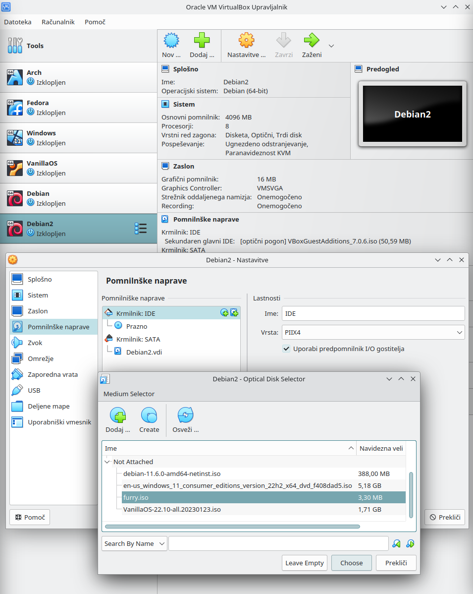
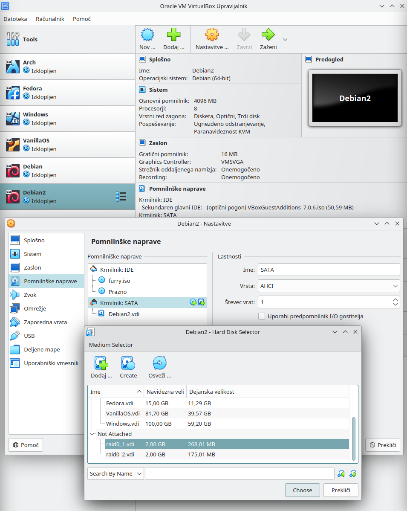

# 3. Lab: Analysis of disks with GNU/Linux

## Instructions

1. Review the Master Boot Record.
2. Attach and mount virtual disks.
3. Attach and mount of RAID disks.
4. Attach and mount LVM disks.

## More information

## Additional instructions

### Overview of the Master Boot Record

To view the [Master Boot Record (MBR)](https://en.wikipedia.org/wiki/Master_boot_record) or of the first sector on the disk, which contains the bootloader and the partition table, we will use the [`radare2`](https://github.com/radareorg/radare2) tool, which we install from their repository.

    apt update
    apt install git
    git clone https://github.com/radareorg/radare2
    radare2/sys/install.sh

Now we run `radare2` over the desired disk, for example `/dev/sda`, type the string `px 512` and print the first 512B of our disk. The first column `- offset -` shows the offset from the start of the disk in hexadecimal format, then the columns ` 0 1 2 3 4 5 6 7 8 9 A B C D E F` follow, which show the stored data at certain offsets in hexadecimal format and the last column `0123456789ABCDEF` shows stored data at certain intervals with [ASCII characters](https://en.wikipedia.org/wiki/ASCII). The first 446B represents the bootloader, then follows 64B of the partition table (from `0x000001be` onwards, we see that we have two partitions) and final 2B represent the valid MBR signature (from `0x000001fe` onwards, `55aa`).

    r2 /dev/sda
    px 512

    - offset -   0 1  2 3  4 5  6 7  8 9  A B  C D  E F  0123456789ABCDEF
    0x00000000  eb63 9010 8ed0 bc00 b0b8 0000 8ed8 8ec0  .c..............
    0x00000010  fbbe 007c bf00 06b9 0002 f3a4 ea21 0600  ...|.........!..
    0x00000020  00be be07 3804 750b 83c6 1081 fefe 0775  ....8.u........u
    0x00000030  f3eb 16b4 02b0 01bb 007c b280 8a74 018b  .........|...t..
    0x00000040  4c02 cd13 ea00 7c00 00eb fe00 0000 0000  L.....|.........
    0x00000050  0000 0000 0000 0000 0000 0080 0100 0000  ................
    0x00000060  0000 0000 fffa 9090 f6c2 8074 05f6 c270  ...........t...p
    0x00000070  7402 b280 ea79 7c00 0031 c08e d88e d0bc  t....y|..1......
    0x00000080  0020 fba0 647c 3cff 7402 88c2 52be 807d  . ..d|<.t...R..}
    0x00000090  e817 01be 057c b441 bbaa 55cd 135a 5272  .....|.A..U..ZRr
    0x000000a0  3d81 fb55 aa75 3783 e101 7432 31c0 8944  =..U.u7...t21..D
    0x000000b0  0440 8844 ff89 4402 c704 1000 668b 1e5c  .@.D..D.....f..\
    0x000000c0  7c66 895c 0866 8b1e 607c 6689 5c0c c744  |f.\.f..`|f.\..D
    0x000000d0  0600 70b4 42cd 1372 05bb 0070 eb76 b408  ..p.B..r...p.v..
    0x000000e0  cd13 730d 5a84 d20f 83d8 00be 8b7d e982  ..s.Z........}..
    0x000000f0  0066 0fb6 c688 64ff 4066 8944 040f b6d1  .f....d.@f.D....
    0x00000100  c1e2 0288 e888 f440 8944 080f b6c2 c0e8  .......@.D......
    0x00000110  0266 8904 66a1 607c 6609 c075 4e66 a15c  .f..f.`|f..uNf.\
    0x00000120  7c66 31d2 66f7 3488 d131 d266 f774 043b  |f1.f.4..1.f.t.;
    0x00000130  4408 7d37 fec1 88c5 30c0 c1e8 0208 c188  D.}7....0.......
    0x00000140  d05a 88c6 bb00 708e c331 dbb8 0102 cd13  .Z....p..1......
    0x00000150  721e 8cc3 601e b900 018e db31 f6bf 0080  r...`......1....
    0x00000160  8ec6 fcf3 a51f 61ff 265a 7cbe 867d eb03  ......a.&Z|..}..
    0x00000170  be95 7de8 3400 be9a 7de8 2e00 cd18 ebfe  ..}.4...}.......
    0x00000180  4752 5542 2000 4765 6f6d 0048 6172 6420  GRUB .Geom.Hard 
    0x00000190  4469 736b 0052 6561 6400 2045 7272 6f72  Disk.Read. Error
    0x000001a0  0d0a 00bb 0100 b40e cd10 ac3c 0075 f4c3  ...........<.u..
    0x000001b0  0000 0000 0000 0000 8988 f444 0000 8004  ...........D....
    0x000001c0  0104 83fe c2ff 0008 0000 0070 a103 00fe  ...........p....
    0x000001d0  c2ff 05fe c2ff fe7f a103 0278 1e00 0000  ...........x....
    0x000001e0  0000 0000 0000 0000 0000 0000 0000 0000  ................
    0x000001f0  0000 0000 0000 0000 0000 0000 0000 55aa  ..............U.

    q

With [`gdisk`](https://linux.die.net/man/8/gdisk) we can change the name of the partition and then find it with `radare2`. We do this by first writing out the partitions on disk with `p`, then starting partition editing with `c`, selecting the first partition with `1`, entering the new partition name `DF Linux`, writing the changes to disk with `w` and confirm the change with `Y`. We can see that this introduced a GPT partition table and protected the existing MBR, since MBR does not offer arbitrary partition naming. The new name of our partition can now be found at the offset `0x00000438`.

    gdisk /dev/sda

    Partition table scan:
      MBR: MBR only
      BSD: not present
      APM: not present
      GPT: not present

    p

    Disk /dev/sda: 209715200 sectors, 100.0 GiB
    Model: VBOX HARDDISK   
    Sector size (logical/physical): 512/512 bytes
    Disk identifier (GUID): 83372426-9E64-49CF-805D-9F6AF5CB8B15
    Partition table holds up to 128 entries
    Main partition table begins at sector 2 and ends at sector 33
    First usable sector is 34, last usable sector is 209715166
    Partitions will be aligned on 2048-sector boundaries
    Total free space is 6077 sectors (3.0 MiB)

    Number  Start (sector)    End (sector)  Size       Code  Name
    1            2048       207714303   99.0 GiB    8300  Linux filesystem
    5       207716352       209713151   975.0 MiB   8200  Linux swap

    c

    Partition number (1-5): 1
    Enter name: DF Linux

    w

    Y

    gdisk /dev/sda

    Partition table scan:
      MBR: protective
      BSD: not present
      APM: not present
      GPT: present

    p

    Disk /dev/sda: 209715200 sectors, 100.0 GiB
    Model: VBOX HARDDISK   
    Sector size (logical/physical): 512/512 bytes
    Disk identifier (GUID): 3057242F-46B2-4801-81B5-9422067A9E53
    Partition table holds up to 128 entries
    Main partition table begins at sector 2 and ends at sector 33
    First usable sector is 34, last usable sector is 209715166
    Partitions will be aligned on 2048-sector boundaries
    Total free space is 6077 sectors (3.0 MiB)

    Number  Start (sector)    End (sector)  Size       Code  Name
    1            2048       207714303   99.0 GiB    8300  DF Linux
    5       207716352       209713151   975.0 MiB   8200  Linux swap

    q

    r2 /dev/sda
    px 2042

    - offset -   0 1  2 3  4 5  6 7  8 9  A B  C D  E F  0123456789ABCDEF
    0x00000000  eb63 9010 8ed0 bc00 b0b8 0000 8ed8 8ec0  .c..............
    0x00000010  fbbe 007c bf00 06b9 0002 f3a4 ea21 0600  ...|.........!..
    0x00000020  00be be07 3804 750b 83c6 1081 fefe 0775  ....8.u........u
    0x00000030  f3eb 16b4 02b0 01bb 007c b280 8a74 018b  .........|...t..
    0x00000040  4c02 cd13 ea00 7c00 00eb fe00 0000 0000  L.....|.........
    0x00000050  0000 0000 0000 0000 0000 0080 0100 0000  ................
    0x00000060  0000 0000 fffa 9090 f6c2 8074 05f6 c270  ...........t...p
    0x00000070  7402 b280 ea79 7c00 0031 c08e d88e d0bc  t....y|..1......
    0x00000080  0020 fba0 647c 3cff 7402 88c2 52be 807d  . ..d|<.t...R..}
    0x00000090  e817 01be 057c b441 bbaa 55cd 135a 5272  .....|.A..U..ZRr
    0x000000a0  3d81 fb55 aa75 3783 e101 7432 31c0 8944  =..U.u7...t21..D
    0x000000b0  0440 8844 ff89 4402 c704 1000 668b 1e5c  .@.D..D.....f..\
    0x000000c0  7c66 895c 0866 8b1e 607c 6689 5c0c c744  |f.\.f..`|f.\..D
    0x000000d0  0600 70b4 42cd 1372 05bb 0070 eb76 b408  ..p.B..r...p.v..
    0x000000e0  cd13 730d 5a84 d20f 83d8 00be 8b7d e982  ..s.Z........}..
    0x000000f0  0066 0fb6 c688 64ff 4066 8944 040f b6d1  .f....d.@f.D....
    0x00000100  c1e2 0288 e888 f440 8944 080f b6c2 c0e8  .......@.D......
    0x00000110  0266 8904 66a1 607c 6609 c075 4e66 a15c  .f..f.`|f..uNf.\
    0x00000120  7c66 31d2 66f7 3488 d131 d266 f774 043b  |f1.f.4..1.f.t.;
    0x00000130  4408 7d37 fec1 88c5 30c0 c1e8 0208 c188  D.}7....0.......
    0x00000140  d05a 88c6 bb00 708e c331 dbb8 0102 cd13  .Z....p..1......
    0x00000150  721e 8cc3 601e b900 018e db31 f6bf 0080  r...`......1....
    0x00000160  8ec6 fcf3 a51f 61ff 265a 7cbe 867d eb03  ......a.&Z|..}..
    0x00000170  be95 7de8 3400 be9a 7de8 2e00 cd18 ebfe  ..}.4...}.......
    0x00000180  4752 5542 2000 4765 6f6d 0048 6172 6420  GRUB .Geom.Hard 
    0x00000190  4469 736b 0052 6561 6400 2045 7272 6f72  Disk.Read. Error
    0x000001a0  0d0a 00bb 0100 b40e cd10 ac3c 0075 f4c3  ...........<.u..
    0x000001b0  0000 0000 0000 0000 0000 0000 0000 0000  ................
    0x000001c0  0200 eeff ffff 0100 0000 ffff 7f0c 0000  ................
    0x000001d0  0000 0000 0000 0000 0000 0000 0000 0000  ................
    0x000001e0  0000 0000 0000 0000 0000 0000 0000 0000  ................
    0x000001f0  0000 0000 0000 0000 0000 0000 0000 55aa  ..............U.
    0x00000200  4546 4920 5041 5254 0000 0100 5c00 0000  EFI PART....\...
    0x00000210  5d25 996d 0000 0000 0100 0000 0000 0000  ]%.m............
    0x00000220  ffff 7f0c 0000 0000 2200 0000 0000 0000  ........".......
    0x00000230  deff 7f0c 0000 0000 2f24 5730 b246 0148  ......../$W0.F.H
    0x00000240  81b5 9422 067a 9e53 0200 0000 0000 0000  ...".z.S........
    0x00000250  8000 0000 8000 0000 7ca2 0c7b 0000 0000  ........|..{....
    0x00000260  0000 0000 0000 0000 0000 0000 0000 0000  ................
    0x00000270  0000 0000 0000 0000 0000 0000 0000 0000  ................
    0x00000280  0000 0000 0000 0000 0000 0000 0000 0000  ................
    0x00000290  0000 0000 0000 0000 0000 0000 0000 0000  ................
    0x000002a0  0000 0000 0000 0000 0000 0000 0000 0000  ................
    0x000002b0  0000 0000 0000 0000 0000 0000 0000 0000  ................
    0x000002c0  0000 0000 0000 0000 0000 0000 0000 0000  ................
    0x000002d0  0000 0000 0000 0000 0000 0000 0000 0000  ................
    0x000002e0  0000 0000 0000 0000 0000 0000 0000 0000  ................
    0x000002f0  0000 0000 0000 0000 0000 0000 0000 0000  ................
    0x00000300  0000 0000 0000 0000 0000 0000 0000 0000  ................
    0x00000310  0000 0000 0000 0000 0000 0000 0000 0000  ................
    0x00000320  0000 0000 0000 0000 0000 0000 0000 0000  ................
    0x00000330  0000 0000 0000 0000 0000 0000 0000 0000  ................
    0x00000340  0000 0000 0000 0000 0000 0000 0000 0000  ................
    0x00000350  0000 0000 0000 0000 0000 0000 0000 0000  ................
    0x00000360  0000 0000 0000 0000 0000 0000 0000 0000  ................
    0x00000370  0000 0000 0000 0000 0000 0000 0000 0000  ................
    0x00000380  0000 0000 0000 0000 0000 0000 0000 0000  ................
    0x00000390  0000 0000 0000 0000 0000 0000 0000 0000  ................
    0x000003a0  0000 0000 0000 0000 0000 0000 0000 0000  ................
    0x000003b0  0000 0000 0000 0000 0000 0000 0000 0000  ................
    0x000003c0  0000 0000 0000 0000 0000 0000 0000 0000  ................
    0x000003d0  0000 0000 0000 0000 0000 0000 0000 0000  ................
    0x000003e0  0000 0000 0000 0000 0000 0000 0000 0000  ................
    0x000003f0  0000 0000 0000 0000 0000 0000 0000 0000  ................
    0x00000400  af3d c60f 8384 7247 8e79 3d69 d847 7de4  .=....rG.y=i.G}.
    0x00000410  5d63 06a2 4adf 8049 8863 6fbd d3f8 d921  ]c..J..I.co....!
    0x00000420  0008 0000 0000 0000 ff77 610c 0000 0000  .........wa.....
    0x00000430  0000 0000 0000 0000 4400 4600 2000 4c00  ........D.F. .L.
    0x00000440  6900 6e00 7500 7800 0000 0000 0000 0000  i.n.u.x.........
    0x00000450  0000 0000 0000 0000 0000 0000 0000 0000  ................
    0x00000460  0000 0000 0000 0000 0000 0000 0000 0000  ................
    0x00000470  0000 0000 0000 0000 0000 0000 0000 0000  ................
    0x00000480  0000 0000 0000 0000 0000 0000 0000 0000  ................
    0x00000490  0000 0000 0000 0000 0000 0000 0000 0000  ................
    0x000004a0  0000 0000 0000 0000 0000 0000 0000 0000  ................
    0x000004b0  0000 0000 0000 0000 0000 0000 0000 0000  ................
    0x000004c0  0000 0000 0000 0000 0000 0000 0000 0000  ................
    0x000004d0  0000 0000 0000 0000 0000 0000 0000 0000  ................
    0x000004e0  0000 0000 0000 0000 0000 0000 0000 0000  ................
    0x000004f0  0000 0000 0000 0000 0000 0000 0000 0000  ................
    0x00000500  0000 0000 0000 0000 0000 0000 0000 0000  ................
    0x00000510  0000 0000 0000 0000 0000 0000 0000 0000  ................
    0x00000520  0000 0000 0000 0000 0000 0000 0000 0000  ................
    0x00000530  0000 0000 0000 0000 0000 0000 0000 0000  ................
    0x00000540  0000 0000 0000 0000 0000 0000 0000 0000  ................
    0x00000550  0000 0000 0000 0000 0000 0000 0000 0000  ................
    0x00000560  0000 0000 0000 0000 0000 0000 0000 0000  ................
    0x00000570  0000 0000 0000 0000 0000 0000 0000 0000  ................
    0x00000580  0000 0000 0000 0000 0000 0000 0000 0000  ................
    0x00000590  0000 0000 0000 0000 0000 0000 0000 0000  ................
    0x000005a0  0000 0000 0000 0000 0000 0000 0000 0000  ................
    0x000005b0  0000 0000 0000 0000 0000 0000 0000 0000  ................
    0x000005c0  0000 0000 0000 0000 0000 0000 0000 0000  ................
    0x000005d0  0000 0000 0000 0000 0000 0000 0000 0000  ................
    0x000005e0  0000 0000 0000 0000 0000 0000 0000 0000  ................
    0x000005f0  0000 0000 0000 0000 0000 0000 0000 0000  ................
    0x00000600  6dfd 5706 aba4 c443 84e5 0933 c84b 4f4f  m.W....C...3.KOO
    0x00000610  dd4b 5801 5069 db43 8293 ff5d d40f 0c4c  .KX.Pi.C...]...L
    0x00000620  0080 610c 0000 0000 fff7 7f0c 0000 0000  ..a.............
    0x00000630  0000 0000 0000 0000 4c00 6900 6e00 7500  ........L.i.n.u.
    0x00000640  7800 2000 7300 7700 6100 7000 0000 0000  x. .s.w.a.p.....
    0x00000650  0000 0000 0000 0000 0000 0000 0000 0000  ................
    0x00000660  0000 0000 0000 0000 0000 0000 0000 0000  ................
    0x00000670  0000 0000 0000 0000 0000 0000 0000 0000  ................
    0x00000680  0000 0000 0000 0000 0000 0000 0000 0000  ................
    0x00000690  0000 0000 0000 0000 0000 0000 0000 0000  ................
    0x000006a0  0000 0000 0000 0000 0000 0000 0000 0000  ................
    0x000006b0  0000 0000 0000 0000 0000 0000 0000 0000  ................
    0x000006c0  0000 0000 0000 0000 0000 0000 0000 0000  ................
    0x000006d0  0000 0000 0000 0000 0000 0000 0000 0000  ................
    0x000006e0  0000 0000 0000 0000 0000 0000 0000 0000  ................
    0x000006f0  0000 0000 0000 0000 0000 0000 0000 0000  ................
    0x00000700  0000 0000 0000 0000 0000 0000 0000 0000  ................
    0x00000710  0000 0000 0000 0000 0000 0000 0000 0000  ................
    0x00000720  0000 0000 0000 0000 0000 0000 0000 0000  ................
    0x00000730  0000 0000 0000 0000 0000 0000 0000 0000  ................
    0x00000740  0000 0000 0000 0000 0000 0000 0000 0000  ................
    0x00000750  0000 0000 0000 0000 0000 0000 0000 0000  ................
    0x00000760  0000 0000 0000 0000 0000 0000 0000 0000  ................
    0x00000770  0000 0000 0000 0000 0000 0000 0000 0000  ................
    0x00000780  0000 0000 0000 0000 0000 0000 0000 0000  ................
    0x00000790  0000 0000 0000 0000 0000 0000 0000 0000  ................
    0x000007a0  0000 0000 0000 0000 0000 0000 0000 0000  ................
    0x000007b0  0000 0000 0000 0000 0000 0000 0000 0000  ................
    0x000007c0  0000 0000 0000 0000 0000 0000 0000 0000  ................
    0x000007d0  0000 0000 0000 0000 0000 0000 0000 0000  ................
    0x000007e0  0000 0000 0000 0000 0000 0000 0000 0000  ................
    0x000007f0  0000 0000 0000 0000 0000 0000 0000 0000  ................

Now we need to add a new partition and fix the bootloader so that our operating system will be able to boot from the GPT partition table. We run the `gdisk` tool on the operating system disk, select the `n` option to create a new partition and select the value `2` for the partition number. For the first sector of the partition, select sector 34, for the last sector of the partition, select sector 2047, then select the code for the `BIOS boot` partition, which is `ef02`, or search for it by selecting the `l` option. Write the changes to the disk with `w` option and confirm with `Y`. Finally, reinstall the bootloader with the command [`grub-install`](https://linux.die.net/man/8/grub-install).

    gdisk /dev/sda

    GPT fdisk (gdisk) version 1.0.6

    Partition table scan:
    MBR: protective
    BSD: not present
    APM: not present
    GPT: present

    Found valid GPT with protective MBR; using GPT.

    p

    Disk /dev/sda: 209715200 sectors, 100.0 GiB
    Model: VBOX HARDDISK   
    Sector size (logical/physical): 512/512 bytes
    Disk identifier (GUID): 7A51BD7B-5A21-4AA2-8908-0C3E3A246C2C
    Partition table holds up to 128 entries
    Main partition table begins at sector 2 and ends at sector 33
    First usable sector is 34, last usable sector is 209715166
    Partitions will be aligned on 2048-sector boundaries
    Total free space is 6077 sectors (3.0 MiB)

    Number  Start (sector)    End (sector)  Size       Code  Name
    1            2048       207714303   99.0 GiB    8300  DF Linux
    5       207716352       209713151   975.0 MiB   8200  Linux swap

    n

    Partition number (2-128, default 2): 2
    First sector (34-209715166, default = 207714304) or {+-}size{KMGTP}: 34
    Last sector (34-2047, default = 2047) or {+-}size{KMGTP}: 2047
    Current type is 8300 (Linux filesystem)
    Hex code or GUID (L to show codes, Enter = 8300): ef02
    Changed type of partition to 'BIOS boot partition'

    w

    Y

    grub-install /dev/sda

    Installing for i386-pc platform.
    Installation finished. No error reported.

    gdisk /dev/sda

    Partition table scan:
    MBR: protective
    BSD: not present
    APM: not present
    GPT: present

    Found valid GPT with protective MBR; using GPT.

    p

    Disk /dev/sda: 62914560 sectors, 30.0 GiB
    Model: VBOX HARDDISK   
    Sector size (logical/physical): 512/512 bytes
    Disk identifier (GUID): A1B0CAE2-6806-49ED-818B-7F8AF663882C
    Partition table holds up to 128 entries
    Main partition table begins at sector 2 and ends at sector 33
    First usable sector is 34, last usable sector is 62914526
    Partitions will be aligned on 2-sector boundaries
    Total free space is 4063 sectors (2.0 MiB)

    Number  Start (sector)    End (sector)  Size       Code  Name
    1            2048        60913663   29.0 GiB    8300  DF Linux
    2              34            2047   1007.0 KiB  EF02  BIOS boot partition
    5        60915712        62912511   975.0 MiB   8200  Linux swap

    q

    r2 /dev/sda
    px 2042

    - offset -   0 1  2 3  4 5  6 7  8 9  A B  C D  E F  0123456789ABCDEF
    0x00000000  eb63 9010 8ed0 bc00 b0b8 0000 8ed8 8ec0  .c..............
    0x00000010  fbbe 007c bf00 06b9 0002 f3a4 ea21 0600  ...|.........!..
    0x00000020  00be be07 3804 750b 83c6 1081 fefe 0775  ....8.u........u
    0x00000030  f3eb 16b4 02b0 01bb 007c b280 8a74 018b  .........|...t..
    0x00000040  4c02 cd13 ea00 7c00 00eb fe00 0000 0000  L.....|.........
    0x00000050  0000 0000 0000 0000 0000 0080 2200 0000  ............"...
    0x00000060  0000 0000 fffa 9090 f6c2 8074 05f6 c270  ...........t...p
    0x00000070  7402 b280 ea79 7c00 0031 c08e d88e d0bc  t....y|..1......
    0x00000080  0020 fba0 647c 3cff 7402 88c2 52be 807d  . ..d|<.t...R..}
    0x00000090  e817 01be 057c b441 bbaa 55cd 135a 5272  .....|.A..U..ZRr
    0x000000a0  3d81 fb55 aa75 3783 e101 7432 31c0 8944  =..U.u7...t21..D
    0x000000b0  0440 8844 ff89 4402 c704 1000 668b 1e5c  .@.D..D.....f..\
    0x000000c0  7c66 895c 0866 8b1e 607c 6689 5c0c c744  |f.\.f..`|f.\..D
    0x000000d0  0600 70b4 42cd 1372 05bb 0070 eb76 b408  ..p.B..r...p.v..
    0x000000e0  cd13 730d 5a84 d20f 83d8 00be 8b7d e982  ..s.Z........}..
    0x000000f0  0066 0fb6 c688 64ff 4066 8944 040f b6d1  .f....d.@f.D....
    0x00000100  c1e2 0288 e888 f440 8944 080f b6c2 c0e8  .......@.D......
    0x00000110  0266 8904 66a1 607c 6609 c075 4e66 a15c  .f..f.`|f..uNf.\
    0x00000120  7c66 31d2 66f7 3488 d131 d266 f774 043b  |f1.f.4..1.f.t.;
    0x00000130  4408 7d37 fec1 88c5 30c0 c1e8 0208 c188  D.}7....0.......
    0x00000140  d05a 88c6 bb00 708e c331 dbb8 0102 cd13  .Z....p..1......
    0x00000150  721e 8cc3 601e b900 018e db31 f6bf 0080  r...`......1....
    0x00000160  8ec6 fcf3 a51f 61ff 265a 7cbe 867d eb03  ......a.&Z|..}..
    0x00000170  be95 7de8 3400 be9a 7de8 2e00 cd18 ebfe  ..}.4...}.......
    0x00000180  4752 5542 2000 4765 6f6d 0048 6172 6420  GRUB .Geom.Hard 
    0x00000190  4469 736b 0052 6561 6400 2045 7272 6f72  Disk.Read. Error
    0x000001a0  0d0a 00bb 0100 b40e cd10 ac3c 0075 f4c3  ...........<.u..
    0x000001b0  0000 0000 0000 0000 0000 0000 0000 0000  ................
    0x000001c0  0200 eeff ffff 0100 0000 ffff bf03 0000  ................
    0x000001d0  0000 0000 0000 0000 0000 0000 0000 0000  ................
    0x000001e0  0000 0000 0000 0000 0000 0000 0000 0000  ................
    0x000001f0  0000 0000 0000 0000 0000 0000 0000 55aa  ..............U.
    0x00000200  4546 4920 5041 5254 0000 0100 5c00 0000  EFI PART....\...
    0x00000210  97d1 57d6 0000 0000 0100 0000 0000 0000  ..W.............
    0x00000220  ffff bf03 0000 0000 2200 0000 0000 0000  ........".......
    0x00000230  deff bf03 0000 0000 e2ca b0a1 0668 ed49  .............h.I
    0x00000240  818b 7f8a f663 882c 0200 0000 0000 0000  .....c.,........
    0x00000250  8000 0000 8000 0000 902d dfa8 0000 0000  .........-......
    0x00000260  0000 0000 0000 0000 0000 0000 0000 0000  ................
    0x00000270  0000 0000 0000 0000 0000 0000 0000 0000  ................
    0x00000280  0000 0000 0000 0000 0000 0000 0000 0000  ................
    0x00000290  0000 0000 0000 0000 0000 0000 0000 0000  ................
    0x000002a0  0000 0000 0000 0000 0000 0000 0000 0000  ................
    0x000002b0  0000 0000 0000 0000 0000 0000 0000 0000  ................
    0x000002c0  0000 0000 0000 0000 0000 0000 0000 0000  ................
    0x000002d0  0000 0000 0000 0000 0000 0000 0000 0000  ................
    0x000002e0  0000 0000 0000 0000 0000 0000 0000 0000  ................
    0x000002f0  0000 0000 0000 0000 0000 0000 0000 0000  ................
    0x00000300  0000 0000 0000 0000 0000 0000 0000 0000  ................
    0x00000310  0000 0000 0000 0000 0000 0000 0000 0000  ................
    0x00000320  0000 0000 0000 0000 0000 0000 0000 0000  ................
    0x00000330  0000 0000 0000 0000 0000 0000 0000 0000  ................
    0x00000340  0000 0000 0000 0000 0000 0000 0000 0000  ................
    0x00000350  0000 0000 0000 0000 0000 0000 0000 0000  ................
    0x00000360  0000 0000 0000 0000 0000 0000 0000 0000  ................
    0x00000370  0000 0000 0000 0000 0000 0000 0000 0000  ................
    0x00000380  0000 0000 0000 0000 0000 0000 0000 0000  ................
    0x00000390  0000 0000 0000 0000 0000 0000 0000 0000  ................
    0x000003a0  0000 0000 0000 0000 0000 0000 0000 0000  ................
    0x000003b0  0000 0000 0000 0000 0000 0000 0000 0000  ................
    0x000003c0  0000 0000 0000 0000 0000 0000 0000 0000  ................
    0x000003d0  0000 0000 0000 0000 0000 0000 0000 0000  ................
    0x000003e0  0000 0000 0000 0000 0000 0000 0000 0000  ................
    0x000003f0  0000 0000 0000 0000 0000 0000 0000 0000  ................
    0x00000400  af3d c60f 8384 7247 8e79 3d69 d847 7de4  .=....rG.y=i.G}.
    0x00000410  97db 390e 48e0 9147 b43e 16ba 9021 6f6f  ..9.H..G.>...!oo
    0x00000420  0008 0000 0000 0000 ff77 a103 0000 0000  .........w......
    0x00000430  0000 0000 0000 0000 4400 4600 2000 4c00  ........D.F. .L.
    0x00000440  6900 6e00 7500 7800 0000 0000 0000 0000  i.n.u.x.........
    0x00000450  0000 0000 0000 0000 0000 0000 0000 0000  ................
    0x00000460  0000 0000 0000 0000 0000 0000 0000 0000  ................
    0x00000470  0000 0000 0000 0000 0000 0000 0000 0000  ................
    0x00000480  4861 6821 4964 6f6e 744e 6565 6445 4649  Hah!IdontNeedEFI
    0x00000490  6d6e 8e3a 0ff7 f14c abf2 34af 5884 50f2  mn.:...L..4.X.P.
    0x000004a0  2200 0000 0000 0000 ff07 0000 0000 0000  "...............
    0x000004b0  0000 0000 0000 0000 4200 4900 4f00 5300  ........B.I.O.S.
    0x000004c0  2000 6200 6f00 6f00 7400 2000 7000 6100   .b.o.o.t. .p.a.
    0x000004d0  7200 7400 6900 7400 6900 6f00 6e00 0000  r.t.i.t.i.o.n...
    0x000004e0  0000 0000 0000 0000 0000 0000 0000 0000  ................
    0x000004f0  0000 0000 0000 0000 0000 0000 0000 0000  ................
    0x00000500  0000 0000 0000 0000 0000 0000 0000 0000  ................
    0x00000510  0000 0000 0000 0000 0000 0000 0000 0000  ................
    0x00000520  0000 0000 0000 0000 0000 0000 0000 0000  ................
    0x00000530  0000 0000 0000 0000 0000 0000 0000 0000  ................
    0x00000540  0000 0000 0000 0000 0000 0000 0000 0000  ................
    0x00000550  0000 0000 0000 0000 0000 0000 0000 0000  ................
    0x00000560  0000 0000 0000 0000 0000 0000 0000 0000  ................
    0x00000570  0000 0000 0000 0000 0000 0000 0000 0000  ................
    0x00000580  0000 0000 0000 0000 0000 0000 0000 0000  ................
    0x00000590  0000 0000 0000 0000 0000 0000 0000 0000  ................
    0x000005a0  0000 0000 0000 0000 0000 0000 0000 0000  ................
    0x000005b0  0000 0000 0000 0000 0000 0000 0000 0000  ................
    0x000005c0  0000 0000 0000 0000 0000 0000 0000 0000  ................
    0x000005d0  0000 0000 0000 0000 0000 0000 0000 0000  ................
    0x000005e0  0000 0000 0000 0000 0000 0000 0000 0000  ................
    0x000005f0  0000 0000 0000 0000 0000 0000 0000 0000  ................
    0x00000600  6dfd 5706 aba4 c443 84e5 0933 c84b 4f4f  m.W....C...3.KOO
    0x00000610  6ae6 f226 2ac8 9b40 82c9 7edc 0ab0 a069  j..&*..@..~....i
    0x00000620  0080 a103 0000 0000 fff7 bf03 0000 0000  ................
    0x00000630  0000 0000 0000 0000 4c00 6900 6e00 7500  ........L.i.n.u.
    0x00000640  7800 2000 7300 7700 6100 7000 0000 0000  x. .s.w.a.p.....
    0x00000650  0000 0000 0000 0000 0000 0000 0000 0000  ................
    0x00000660  0000 0000 0000 0000 0000 0000 0000 0000  ................
    0x00000670  0000 0000 0000 0000 0000 0000 0000 0000  ................
    0x00000680  0000 0000 0000 0000 0000 0000 0000 0000  ................
    0x00000690  0000 0000 0000 0000 0000 0000 0000 0000  ................
    0x000006a0  0000 0000 0000 0000 0000 0000 0000 0000  ................
    0x000006b0  0000 0000 0000 0000 0000 0000 0000 0000  ................
    0x000006c0  0000 0000 0000 0000 0000 0000 0000 0000  ................
    0x000006d0  0000 0000 0000 0000 0000 0000 0000 0000  ................
    0x000006e0  0000 0000 0000 0000 0000 0000 0000 0000  ................
    0x000006f0  0000 0000 0000 0000 0000 0000 0000 0000  ................
    0x00000700  0000 0000 0000 0000 0000 0000 0000 0000  ................
    0x00000710  0000 0000 0000 0000 0000 0000 0000 0000  ................
    0x00000720  0000 0000 0000 0000 0000 0000 0000 0000  ................
    0x00000730  0000 0000 0000 0000 0000 0000 0000 0000  ................
    0x00000740  0000 0000 0000 0000 0000 0000 0000 0000  ................
    0x00000750  0000 0000 0000 0000 0000 0000 0000 0000  ................
    0x00000760  0000 0000 0000 0000 0000 0000 0000 0000  ................
    0x00000770  0000 0000 0000 0000 0000 0000 0000 0000  ................
    0x00000780  0000 0000 0000 0000 0000 0000 0000 0000  ................
    0x00000790  0000 0000 0000 0000 0000 0000 0000 0000  ................
    0x000007a0  0000 0000 0000 0000 0000 0000 0000 0000  ................
    0x000007b0  0000 0000 0000 0000 0000 0000 0000 0000  ................
    0x000007c0  0000 0000 0000 0000 0000 0000 0000 0000  ................
    0x000007d0  0000 0000 0000 0000 0000 0000 0000 0000  ................
    0x000007e0  0000 0000 0000 0000 0000 0000 0000 0000  ................
    0x000007f0  0000 0000 0000 0000 0000                 ..........

### Attaching and mounting of virtual disks

We download the following files from the [website](https://polz.si/dsrf/):

- `furry.iso`
- `raid0_1.vdi`
- `raid0_2.vdi`

To add virtual disks to our virtual machine, select the virtual machine and click on the `Settings...` button in the bar above. In the window that opens, select the `Storage` tab from the column on the left. Then we select `Controller: IDE` and add the CD by clicking on the button with the CD and the green plus sign and follow the file selection wizard where we select `furry.iso`.

We add virtual disks by selecting `Controller:SATA` and adding a disk by clicking on the disk button with the green plus sign and following the file selection wizard where we select `raid0_1.vdi`. Add the virtual disk `raid0_2.vdi` using the same procedure.

Now in the tab `Storage` under `Controller: IDE` we have added the `furry.iso` CD and under `Controller:SATA` we have added virtual disks `raid0_1.vdi` and `raid0_2.vdi`.

Now we start our virtual machine. In GNU/Linux operating systems, attached disks can be accessed via the `/dev/NAME_OF_THE_DISK` directory, where the name of the disk is usually `sdX`, where `X` is replaced by a consecutive letter of the alphabet.

    cd /dev
    ls /dev
    cd /dev/sda

We find out which path in the file system individual disks (`sdX`) and partitions (`sdXN`) are mounted to via the directory `/dev/NAME_OF_THE_DISK_OR_PARTITION/by-path`.

    ls -al /dev/sda/by-path
    cd /dev/sda/by-path 

Mounted disks (`sdX`) and partitions (`sdXN`) can also be listed with the `lsblk` command.

    lsblk

    NAME   MAJ:MIN RM  SIZE RO TYPE MOUNTPOINT
    sda      8:0    0  100G  0 disk 
    ├─sda1   8:1    0   99G  0 part /
    ├─sda2   8:2    0    1K  0 part 
    └─sda5   8:5    0  975M  0 part [SWAP]
    sdb      8:16   0    2G  0 disk 
    ├─sdb1   8:17   0  300M  0 part 
    ├─sdb2   8:18   0  299M  0 part 
    ├─sdb3   8:19   0    1K  0 part 
    └─sdb5   8:21   0  1.4G  0 part 
    sdc      8:32   0    2G  0 disk 
    ├─sdc1   8:33   0  300M  0 part 
    ├─sdc2   8:34   0    1K  0 part 
    └─sdc5   8:37   0  1.7G  0 part 
    sr0     11:0    1  3.3M  0 rom 

In GNU/linux operating systems, we use tools such as: `mount`, `fdisk`, `gdisk`, `libguestfs`, `qemu-img`, `qemu-nbd`... Partitions are presented to the operating system as files. The data within the partitions is arranged in a tree structure representing the file system, which creates its header at the beginning of the partition and then the files follow.

Now we make copies of both virtual disks and the CD with the command [`cat`](https://www.man7.org/linux/man-pages/man1/cat.1.html) and calculate the integrity value of the disk with the command [`sha512sum `](https://man7.org/linux/man-pages/man1/sha512sum.1.html).

    sha512sum /dev/sdb >> sdb_hash.txt
    cat /dev/sdb > sdb_copy.img
    sha512sum sdb_copy.img >> sdb_hash.txt
    cat sdb_hash.txt

    d4b009680058854c20324d830f189a79c2318fc8474681a43d3a10559b1fbadeda855f9e9aab510c2bd98ed379a2800526f64c49add1eb21e68e0af5c3f76c3d  /dev/sdb
    d4b009680058854c20324d830f189a79c2318fc8474681a43d3a10559b1fbadeda855f9e9aab510c2bd98ed379a2800526f64c49add1eb21e68e0af5c3f76c3d  sdb_copy.img

    sha512sum /dev/sdc >> sdc_hash.txt
    cat /dev/sdc > sdc_copy.img
    sha512sum sdc_copy.img >> sdc_hash.txt
    cat sdc_hash.txt

    161c640b8d4db9784d288146c02d711cafdcf76d7dd4db01faa762d6e44ac5aff790938e2cc013d1264505c1ff722210f944f5047994fe0d0dbdbef87a91eca4  /dev/sdc
    161c640b8d4db9784d288146c02d711cafdcf76d7dd4db01faa762d6e44ac5aff790938e2cc013d1264505c1ff722210f944f5047994fe0d0dbdbef87a91eca4  sdc_copy.img

    sha512sum /dev/sr0 >> sr0_hash.txt
    cat /dev/sr0 > sr0_copy.img
    sha512sum sr0_copy.img >> sr0_hash.txt
    cat sr0_hash.txt

    1fc5046513087e4eead5966e4c4ff017da8c43325f3fef537648d395a313bcea332a8e9841c3a4c0c45b95ed8addf91adac89edecd91c6fdb1fa915e487a9b45  /dev/sr0
    1fc5046513087e4eead5966e4c4ff017da8c43325f3fef537648d395a313bcea332a8e9841c3a4c0c45b95ed8addf91adac89edecd91c6fdb1fa915e487a9b45  sr0_copy.img

Now shutdown our virtual computer and remove the `furry.iso` CD from the `Controller: IDE` by selecting it, clicking on the button with the disk on the right and selecting the `Remove disk from virtual drive` option. We also remove the virtual disks `raid0_1.vdi` and `raid0_2.vdi` from `Controller:SATA` by selecting each volume and pressing the button with a floppy disk and a red cross at the bottom left.

Then we restart our virtual machine. We start by mounting the CD image, which cannot be changed. Data is recorded using a dedicated [ISO9660 file system](https://en.wikipedia.org/wiki/ISO_9660). To mount the CD, use the command [`mount`](https://man7.org/linux/man-pages/man2/mount.2.html) and check which new files are now available to us.

    mkdir /mnt/sr0
    mount sr0_copy.img /mnt/sr0
    
    mount: /mnt/sr0: WARNING: source write-protected, mounted read-only.

    ls /mnt/sr0

    cute-cat-l.jpg	kitty1.jpeg  kitty2.jpeg  kitty3.jpeg  kitty4.jpg

ISO9660 limits the length of names that files can have, to get around this limit the [Joliet filesystem extension](https://en.wikipedia.org/wiki/ISO_9660#Joliet) is used by default. Now we will first unmount the currently mounted CD using the command [`umount`](https://man7.org/linux/man-pages/man8/umount.8.html) and then mount it again without the Joliet extension and check if we can now we access some other files. We will also add additional option to show hidden files.

    mount

    sysfs on /sys type sysfs (rw,nosuid,nodev,noexec,relatime)
    proc on /proc type proc (rw,nosuid,nodev,noexec,relatime)
    udev on /dev type devtmpfs (rw,nosuid,relatime,size=1987160k,nr_inodes=496790,mode=755)
    devpts on /dev/pts type devpts (rw,nosuid,noexec,relatime,gid=5,mode=620,ptmxmode=000)
    tmpfs on /run type tmpfs (rw,nosuid,nodev,noexec,relatime,size=402440k,mode=755)
    /dev/sda1 on / type ext4 (rw,relatime,errors=remount-ro)
    securityfs on /sys/kernel/security type securityfs (rw,nosuid,nodev,noexec,relatime)
    tmpfs on /dev/shm type tmpfs (rw,nosuid,nodev)
    tmpfs on /run/lock type tmpfs (rw,nosuid,nodev,noexec,relatime,size=5120k)
    cgroup2 on /sys/fs/cgroup type cgroup2 (rw,nosuid,nodev,noexec,relatime,nsdelegate,memory_recursiveprot)
    pstore on /sys/fs/pstore type pstore (rw,nosuid,nodev,noexec,relatime)
    none on /sys/fs/bpf type bpf (rw,nosuid,nodev,noexec,relatime,mode=700)
    systemd-1 on /proc/sys/fs/binfmt_misc type autofs (rw,relatime,fd=29,pgrp=1,timeout=0,minproto=5,maxproto=5,direct,pipe_ino=14377)
    tracefs on /sys/kernel/tracing type tracefs (rw,nosuid,nodev,noexec,relatime)
    hugetlbfs on /dev/hugepages type hugetlbfs (rw,relatime,pagesize=2M)
    debugfs on /sys/kernel/debug type debugfs (rw,nosuid,nodev,noexec,relatime)
    mqueue on /dev/mqueue type mqueue (rw,nosuid,nodev,noexec,relatime)
    fusectl on /sys/fs/fuse/connections type fusectl (rw,nosuid,nodev,noexec,relatime)
    configfs on /sys/kernel/config type configfs (rw,nosuid,nodev,noexec,relatime)
    tmpfs on /run/user/1000 type tmpfs (rw,nosuid,nodev,relatime,size=402436k,nr_inodes=100609,mode=700,uid=1000,gid=1000)
    gvfsd-fuse on /run/user/1000/gvfs type fuse.gvfsd-fuse (rw,nosuid,nodev,relatime,user_id=1000,group_id=1000)
    /root/sr0_copy.img on /mnt/sr0 type iso9660 (ro,relatime,norock,check=r,map=n,blocksize=2048,iocharset=utf8)

    umount /mnt/sr0

    mount -o nojoliet,unhide sr0_copy.img /mnt/sr0

    mount: /mnt/sr0: WARNING: source write-protected, mounted read-only.

    ls /mnt/sr0

    cat_pict.jpg  evil_cat.jpg  jojkj.png	kitty2.jpe  kitty4.jpg	sl_1___w.htm cute_cat.jpg  grumpy_c.jpg  kitty1.jpe	kitty3.jpe  sl_1___w

We see that file systems have their own switches or parameters that change how file systems work and respond to commands.

Now we will mount more virtual disks to our file system. They can be mounted with the `mount` command and attached with tools such as [`qemu-nbd`](https://www.mankier.com/8/qemu-nbd) and [`kpartx`](https: //linux.die.net/man/8/kpartx). First install both tools using the package manager on our operating system.

    apt update
    apt install qemu-utils kpartx

Let's enable `qemu-nbd` in our operating system with the kernel module adder and remover [`modprobe`](https://linux.die.net/man/8/modprobe).

    ls /dev

    autofs		    kmsg	       rtc	     tty16	tty38  tty6	     vcsa
    block		    log	           rtc0	     tty17	tty39  tty60	 vcsa1
    bsg		        loop0	       sda	     tty18	tty4   tty61	 vcsa2
    btrfs-control	loop1	       sda1	     tty19	tty40  tty62	 vcsa3
    bus		        loop2	       sda2	     tty2	tty41  tty63	 vcsa4
    cdrom		    loop3	       sda5	     tty20	tty42  tty7	     vcsa5
    char		    loop4	       sg0	     tty21	tty43  tty8	     vcsa6
    console		    loop5	       sg1	     tty22	tty44  tty9	     vcsu
    core		    loop6	       shm	     tty23	tty45  ttyS0	 vcsu1
    cpu		        loop7	       snapshot  tty24	tty46  ttyS1	 vcsu2
    cpu_dma_latency loop-control   snd	     tty25	tty47  ttyS2	 vcsu3
    cuse		    mapper         sr0	     tty26	tty48  ttyS3	 vcsu4
    disk		    mem	           stderr	 tty27	tty49  uhid	     vcsu5
    dri		        mqueue         stdin	 tty28	tty5   uinput	 vcsu6
    dvd		        net	           stdout	 tty29	tty50  urandom	 vfio
    fb0		        null	       tty	     tty3	tty51  vboxguest vga_arbiter
    fd		        nvram	       tty0	     tty30	tty52  vboxuser  vhci
    full		    port	       tty1	     tty31	tty53  vcs	     vhost-net
    fuse		    ppp	           tty10	 tty32	tty54  vcs1	     vhost-vsock
    hidraw0		    psaux	       tty11	 tty33	tty55  vcs2	     zero
    hpet		    ptmx	       tty12	 tty34	tty56  vcs3
    hugepages	    pts	           tty13	 tty35	tty57  vcs4
    initctl		    random         tty14	 tty36	tty58  vcs5
    input		    rfkill         tty15	 tty37	tty59  vcs6

    modprobe nbd max_part=32

    ls /dev

    autofs		    loop0	       nbd8	    stdout   tty30	tty54	   vcs3
    block		    loop1	       nbd9	    tty	     tty31	tty55	   vcs4
    bsg		        loop2	       net	    tty0	 tty32	tty56	   vcs5
    btrfs-control	loop3	       null	    tty1	 tty33	tty57	   vcs6
    bus		        loop4	       nvram	tty10	 tty34	tty58	   vcsa
    cdrom		    loop5	       port	    tty11	 tty35	tty59	   vcsa1
    char		    loop6	       ppp	    tty12	 tty36	tty6	   vcsa2
    console		    loop7	       psaux	tty13	 tty37	tty60	   vcsa3
    core		    loop-control   ptmx	    tty14	 tty38	tty61	   vcsa4
    cpu		        mapper         pts	    tty15	 tty39	tty62	   vcsa5
    cpu_dma_latency mem	           random	tty16	 tty4	tty63	   vcsa6
    cuse		    mqueue         rfkill	tty17	 tty40	tty7	   vcsu
    disk		    nbd0	       rtc	    tty18	 tty41	tty8	   vcsu1
    dri		        nbd1	       rtc0	    tty19	 tty42	tty9	   vcsu2
    dvd		        nbd10	       sda	    tty2	 tty43	ttyS0	   vcsu3
    fb0		        nbd11	       sda1	    tty20	 tty44	ttyS1	   vcsu4
    fd		        nbd12	       sda2	    tty21	 tty45	ttyS2	   vcsu5
    full		    nbd13	       sda5	    tty22	 tty46	ttyS3	   vcsu6
    fuse		    nbd14	       sg0	    tty23	 tty47	uhid	   vfio
    hidraw0		    nbd15	       sg1	    tty24	 tty48	uinput	   vga_arbiter
    hpet		    nbd2	       shm	    tty25	 tty49	urandom    vhci
    hugepages	    nbd3	       snapshot tty26	 tty5	vboxguest  vhost-net
    initctl		    nbd4	       snd	    tty27	 tty50	vboxuser   vhost-vsock
    input		    nbd5	       sr0	    tty28	 tty51	vcs	       zero
    kmsg		    nbd6	       stderr	tty29	 tty52	vcs1
    log		        nbd7	       stdin	tty3	 tty53	vcs2

Now attach the disk with the `qemu-nbd` command with the `-c` flag and list the currently attached and mounted disks with the `lsblk` command. If necessary, we can dettach the disk with the `qemu-nbd` command with the `-d` flag.

    qemu-nbd -c /dev/nbd0 sdb_copy.img

    WARNING: Image format was not specified for 'sdb_copy.img' and probing guessed raw.
         Automatically detecting the format is dangerous for raw images, write operations on block 0 will be restricted.
         Specify the 'raw' format explicitly to remove the restrictions.

    lsblk

    NAME     MAJ:MIN RM  SIZE RO TYPE MOUNTPOINT
    loop0      7:0    0  3.3M  0 loop /mnt/sr0
    sda        8:0    0  100G  0 disk 
    ├─sda1     8:1    0   99G  0 part /
    ├─sda2     8:2    0    1K  0 part 
    └─sda5     8:5    0  975M  0 part [SWAP]
    sr0       11:0    1 1024M  0 rom  
    nbd0      43:0    0    2G  0 disk 
    ├─nbd0p1  43:1    0  300M  0 part 
    ├─nbd0p2  43:2    0  299M  0 part 
    ├─nbd0p3  43:3    0    1K  0 part 
    └─nbd0p5  43:5    0  1.4G  0 part

The [`fdisk`](https://man7.org/linux/man-pages/man8/fdisk.8.html) command can be used to check partitions by selecting the `p` option. We find that we have an `LVM` partition and a `RAID` partition, which we cannot currently mount. The `Extended` partition represents a container for additional partitions and contains another `MBR`, thus enabling the use of four additional partitions. The last partition contains the `FAT32` file system, which can be mounted using the `mount` command.

    fdisk /dev/nbd0

    p

    Disk /dev/nbd0: 2 GiB, 2147483648 bytes, 4194304 sectors
    Units: sectors of 1 * 512 = 512 bytes
    Sector size (logical/physical): 512 bytes / 512 bytes
    I/O size (minimum/optimal): 512 bytes / 512 bytes
    Disklabel type: dos
    Disk identifier: 0x20fc8508

    Device      Boot   Start     End Sectors  Size Id Type
    /dev/nbd0p1       614400 1228799  614400  300M fd Linux raid autodetect
    /dev/nbd0p2         2048  614399  612352  299M 8e Linux LVM
    /dev/nbd0p3      1228800 4194303 2965504  1.4G  5 Extended
    /dev/nbd0p5      1230848 4194303 2963456  1.4G  c W95 FAT32 (LBA)

    q

    mkdir /mnt/nbd0p5
    mount /dev/nbd0p5 /mnt/nbd0p5

    ls /mnt/nbd0p5

    'Algorithm March (Original)-M8xtOinmByo.mp4'
    "Survival - 'Living Off The Land' 1955 US Navy Training Film-KzplUDaBMuw.mp4"

Now we can check the integrity value of the virtual disk `sdb_copy.img` and compare it with the value stored in `sdb_hash.txt`. We can see that the value has already changed.

    sha512sum sdb_copy.img

    6f85ba2d828ffecbbfb1f9f59916bae13673d441dacfaff686ede8f47f761cf3ecd91bde4c487be0aeab112e2e245b5640c0c30235abeebf6bac2cd7233ea6b1  sdb_copy.img

    cat sdb_hash.txt 
    
    d4b009680058854c20324d830f189a79c2318fc8474681a43d3a10559b1fbadeda855f9e9aab510c2bd98ed379a2800526f64c49add1eb21e68e0af5c3f76c3d  /dev/sdb
    d4b009680058854c20324d830f189a79c2318fc8474681a43d3a10559b1fbadeda855f9e9aab510c2bd98ed379a2800526f64c49add1eb21e68e0af5c3f76c3d  sdb_copy.img

To attach another disk, use the `kpartx` tool with the `-a` flag and list the currently attached disks with the `lsblk` command. If necessary, we can unmount the disk using the `kpartx` command with the `-d` flag.

    kpartx -a sdc_copy.img

    lsblk

    NAME      MAJ:MIN RM  SIZE RO TYPE MOUNTPOINT
    loop0       7:0    0  3.3M  0 loop /mnt/sr0
    loop1       7:1    0    2G  0 loop 
    ├─loop1p1 254:0    0  300M  0 part 
    ├─loop1p2 254:1    0    1K  0 part 
    └─loop1p5 254:2    0  1.7G  0 part 
    sda         8:0    0  100G  0 disk 
    ├─sda1      8:1    0   99G  0 part /
    ├─sda2      8:2    0    1K  0 part 
    └─sda5      8:5    0  975M  0 part [SWAP]
    sr0        11:0    1 1024M  0 rom  
    nbd0       43:0    0    2G  0 disk 
    ├─nbd0p1   43:1    0  300M  0 part 
    ├─nbd0p2   43:2    0  299M  0 part 
    ├─nbd0p3   43:3    0    1K  0 part 
    └─nbd0p5   43:5    0  1.4G  0 part /mnt/nbd0p5

We can check partitions with the `fdisk` command by selecting the `p` option. We find that we have `LVM`, `RAID` and `Extended` partitions which we cannot mount at the moment.

    fdisk /dev/loop1

    p

    Disk /dev/loop1: 2 GiB, 2147483648 bytes, 4194304 sectors
    Units: sectors of 1 * 512 = 512 bytes
    Sector size (logical/physical): 512 bytes / 512 bytes
    I/O size (minimum/optimal): 512 bytes / 512 bytes
    Disklabel type: dos
    Disk identifier: 0xb1b5b4b2

    Device       Boot  Start     End Sectors  Size Id Type
    /dev/loop1p1        2048  616447  614400  300M fd Linux raid autodetect
    /dev/loop1p2      616448 4194303 3577856  1.7G  5 Extended
    /dev/loop1p5      618496 4194303 3575808  1.7G 8e Linux LVM

    q

### Attaching and mounting of RAID disks

To work with RAID arrays, we need the tool [`mdadm`](https://linux.die.net/man/8/mdadm), which we install with the package manager of our operating system. Then we check the attached disk with the command `lsblk` to see if there has been any change.

    apt update
    apt install mdadm

    lsblk

    NAME      MAJ:MIN RM  SIZE RO TYPE MOUNTPOINT
    loop0       7:0    0  3.3M  0 loop /mnt/sr0
    loop1       7:1    0    2G  0 loop 
    ├─loop1p1 254:0    0  300M  0 part 
    ├─loop1p2 254:1    0    1K  0 part 
    └─loop1p5 254:2    0  1.7G  0 part 
    sda         8:0    0  100G  0 disk 
    ├─sda1      8:1    0   99G  0 part /
    ├─sda2      8:2    0    1K  0 part 
    └─sda5      8:5    0  975M  0 part [SWAP]
    sr0        11:0    1 1024M  0 rom  
    nbd0       43:0    0    2G  0 disk 
    ├─nbd0p1   43:1    0  300M  0 part 
    ├─nbd0p2   43:2    0  299M  0 part 
    ├─nbd0p3   43:3    0    1K  0 part 
    └─nbd0p5   43:5    0  1.4G  0 part /mnt/nbd0p5

The system did not automatically detect any RAID array, so let's try detecting it using the `mdadm` tool and recheck the attached disk with the `lsblk` command.

    mdadm --assemble /dev/md0

    mdadm: /dev/md0 has been started with 2 drives.

    mdadm --detail /dev/md0

    /dev/md0:
            Version : 1.2
        Creation Time : Tue Mar 11 19:06:23 2014
            Raid Level : raid0
            Array Size : 612352 (598.00 MiB 627.05 MB)
        Raid Devices : 2
        Total Devices : 2
        Persistence : Superblock is persistent

        Update Time : Tue Mar 11 19:06:23 2014
                State : clean 
        Active Devices : 2
    Working Devices : 2
        Failed Devices : 0
        Spare Devices : 0

                Layout : -unknown-
            Chunk Size : 512K

    Consistency Policy : none

                Name : razpadalcek:0
                UUID : c639acac:267a1605:f2b03f0e:230038f7
                Events : 0

        Number   Major   Minor   RaidDevice State
        0     254        0        0      active sync   /dev/dm-0
        1      43        1        1      active sync   /dev/nbd0p1

    lsblk

    NAME        MAJ:MIN RM  SIZE RO TYPE  MOUNTPOINT
    loop0         7:0    0  3.3M  0 loop  /mnt/sr0
    loop1         7:1    0    2G  0 loop  
    ├─loop1p1   254:0    0  300M  0 part  
    │ └─md0       9:0    0  598M  0 raid0 
    │   ├─md0p1 259:0    0  100M  0 part  
    │   └─md0p2 259:1    0  497M  0 part  
    ├─loop1p2   254:1    0    1K  0 part  
    └─loop1p5   254:2    0  1.7G  0 part  
    sda           8:0    0  100G  0 disk  
    ├─sda1        8:1    0   99G  0 part  /
    ├─sda2        8:2    0    1K  0 part  
    └─sda5        8:5    0  975M  0 part  [SWAP]
    sr0          11:0    1 1024M  0 rom   
    nbd0         43:0    0    2G  0 disk  
    ├─nbd0p1     43:1    0  300M  0 part  
    │ └─md0       9:0    0  598M  0 raid0 
    │   ├─md0p1 259:0    0  100M  0 part  
    │   └─md0p2 259:1    0  497M  0 part  
    ├─nbd0p2     43:2    0  299M  0 part  
    ├─nbd0p3     43:3    0    1K  0 part  
    └─nbd0p5     43:5    0  1.4G  0 part  /mnt/nbd0p5

Using the `mdadm` tool, we rebuilt the existing RAID 0 array under the name `/dev/md0`. With the command `fdisk` we can check the partitions in the RAID array by selecting the `p` option. We find that we have an `LVM` partition, which we cannot currently mount, and a partition with the familiar `Linux filesystem` file system, which we can mount.

    fdisk /dev/md0

    p

    Disk /dev/md0: 598 MiB, 627048448 bytes, 1224704 sectors
    Units: sectors of 1 * 512 = 512 bytes
    Sector size (logical/physical): 512 bytes / 512 bytes
    I/O size (minimum/optimal): 524288 bytes / 1048576 bytes
    Disklabel type: gpt
    Disk identifier: B7F76598-172A-4714-BC34-B9F014C55A39

    Device      Start     End Sectors  Size Type
    /dev/md0p1   2048  206847  204800  100M Linux filesystem
    /dev/md0p2 206848 1224670 1017823  497M Linux LVM

    q

    mkdir /mnt/md0p1
    mount /dev/md0p1 /mnt/md0p1

    ls /mnt/md0p1

    "dailamo dailamo video song from srikanth's movie mahatma-kSBWzQUWAjI.mp4"

### Attaching and mounting of LVM disks

To work with LVM logical disks, we need the tool [`lvm2`](https://linux.die.net/man/8/lvm), which we install with the package manager of our operating system. Then we check the attached disk with the command `lsblk` to see if there has been any change.

    apt update
    apt install lvm2

    lsblk

We obtain information about the `LVM` of logical disks with the command `pvdisplay`, it shows us physical disks and partitions (`Physical Volume`), which are arranged in groups of physical disks (`Volume Group`), which are shown by the command `vgdisplay` and inside groups, we can define logical disks (`Logical Volume`), which are displayed by the command `lvdisplay`.

    pvdisplay

    WARNING: PV /dev/nbd0p2 in VG joyjoy is using an old PV header, modify the VG to update.
    --- Physical volume ---
    PV Name               /dev/nbd0p2
    VG Name               joyjoy
    PV Size               299.00 MiB / not usable 3.00 MiB
    Allocatable           yes (but full)
    PE Size               4.00 MiB
    Total PE              74
    Free PE               0
    Allocated PE          74
    PV UUID               ELf5O8-UJCr-SUHD-JXza-67qJ-RMeI-ZQT3Mh
    
    WARNING: PV /dev/mapper/loop1p5 in VG happy is using an old PV header, modify the VG to update.
    WARNING: PV /dev/md0p2 in VG happy is using an old PV header, modify the VG to update.
    --- Physical volume ---
    PV Name               /dev/mapper/loop1p5
    VG Name               happy
    PV Size               <1.71 GiB / not usable 2.00 MiB
    Allocatable           yes (but full)
    PE Size               4.00 MiB
    Total PE              436
    Free PE               0
    Allocated PE          436
    PV UUID               LOyxVs-UtKI-0jIU-Clcm-Hb1L-ruGl-ZGns8c
    
    --- Physical volume ---
    PV Name               /dev/md0p2
    VG Name               happy
    PV Size               496.98 MiB / not usable 4.98 MiB
    Allocatable           yes (but full)
    PE Size               4.00 MiB
    Total PE              123
    Free PE               0
    Allocated PE          123
    PV UUID               pXyscH-UvqH-5lV6-Gn6U-TKGX-MTqH-hOrrPM

We can see that we have 3 partitions (`Physical Volume`): `/dev/nbd0p2`, `/dev/mapper/loop1p5` and `/dev/md0p2` which are included in the logical disks.

    vgdisplay

    WARNING: PV /dev/nbd0p2 in VG joyjoy is using an old PV header, modify the VG to update.
    --- Volume group ---
    VG Name               joyjoy
    System ID             
    Format                lvm2
    Metadata Areas        1
    Metadata Sequence No  2
    VG Access             read/write
    VG Status             resizable
    MAX LV                0
    Cur LV                1
    Open LV               0
    Max PV                0
    Cur PV                1
    Act PV                1
    VG Size               296.00 MiB
    PE Size               4.00 MiB
    Total PE              74
    Alloc PE / Size       74 / 296.00 MiB
    Free  PE / Size       0 / 0   
    VG UUID               SPcqO8-Awtf-N0MK-5g2y-F6Do-YO9g-v05FdI
    
    WARNING: PV /dev/mapper/loop1p5 in VG happy is using an old PV header, modify the VG to update.
    WARNING: PV /dev/md0p2 in VG happy is using an old PV header, modify the VG to update.
    --- Volume group ---
    VG Name               happy
    System ID             
    Format                lvm2
    Metadata Areas        2
    Metadata Sequence No  3
    VG Access             read/write
    VG Status             resizable
    MAX LV                0
    Cur LV                2
    Open LV               0
    Max PV                0
    Cur PV                2
    Act PV                2
    VG Size               2.18 GiB
    PE Size               4.00 MiB
    Total PE              559
    Alloc PE / Size       559 / 2.18 GiB
    Free  PE / Size       0 / 0   
    VG UUID               U6IpQJ-JTs5-FoLT-Oi6S-Q2lf-dCTO-iwC91f

We can also see that the partitions are divided into two groups (`Volume Group`), namely the partitions `/dev/mapper/loop1p5` and `/dev/md0p2` are members of the `happy` group, and the partition `/dev/nbd0p2` is member of the `joyjoy` group.

    lvdisplay

    WARNING: PV /dev/nbd0p2 in VG joyjoy is using an old PV header, modify the VG to update.
    --- Logical volume ---
    LV Path                /dev/joyjoy/ren
    LV Name                ren
    VG Name                joyjoy
    LV UUID                VJMlcK-pZDE-bavi-PSB2-2Zne-Vvd3-0M2FL7
    LV Write Access        read/write
    LV Creation host, time razpadalcek, 2014-03-12 07:30:36 +0100
    LV Status              NOT available
    LV Size                296.00 MiB
    Current LE             74
    Segments               1
    Allocation             inherit
    Read ahead sectors     auto
    
    WARNING: PV /dev/mapper/loop1p5 in VG happy is using an old PV header, modify the VG to update.
    WARNING: PV /dev/md0p2 in VG happy is using an old PV header, modify the VG to update.
    --- Logical volume ---
    LV Path                /dev/happy/stimpy
    LV Name                stimpy
    VG Name                happy
    LV UUID                3SEwn6-eI05-1ef8-6I8j-EJtU-e79q-YaGQ1K
    LV Write Access        read/write
    LV Creation host, time razpadalcek, 2014-03-12 07:45:03 +0100
    LV Status              NOT available
    LV Size                500.00 MiB
    Current LE             125
    Segments               1
    Allocation             inherit
    Read ahead sectors     auto
    
    --- Logical volume ---
    LV Path                /dev/happy/bmo
    LV Name                bmo
    VG Name                happy
    LV UUID                C94u1d-mp2T-6HjY-wSdC-sa2Y-acnu-evlaco
    LV Write Access        read/write
    LV Creation host, time razpadalcek, 2014-03-12 07:47:11 +0100
    LV Status              NOT available
    LV Size                <1.70 GiB
    Current LE             434
    Segments               2
    Allocation             inherit
    Read ahead sectors     auto

We also see one logical disk (`Logical Volume`) `ren` created within the group `joyjoy`, and within the group `happy` we have two logical disks `stimpy` and `bmo`. Logical disk `bmo` spans partition `md0p2` and part of partition `loop1p5`, logical disk `stimpy` spans part of partition `loop1p5` and logical disk `ren` spans partition `nbd0p2`. We can connect all logical disks at once with the `vgchange` command and check the attached disk with the `lsblk` command.

    vgchange -a y

    WARNING: PV /dev/nbd0p2 in VG joyjoy is using an old PV header, modify the VG to update.
    1 logical volume(s) in volume group "joyjoy" now active
    WARNING: PV /dev/mapper/loop1p5 in VG happy is using an old PV header, modify the VG to update.
    WARNING: PV /dev/md0p2 in VG happy is using an old PV header, modify the VG to update.
    2 logical volume(s) in volume group "happy" now active

    lsblk

    NAME              MAJ:MIN RM  SIZE RO TYPE  MOUNTPOINT
    loop0               7:0    0  3.3M  0 loop  /mnt/sr0
    loop1               7:1    0    2G  0 loop  
    ├─loop1p1         254:0    0  300M  0 part  
    │ └─md0             9:0    0  598M  0 raid0 
    │   ├─md0p1       259:0    0  100M  0 part  /mnt/md0p1
    │   └─md0p2       259:1    0  497M  0 part  
    │     └─happy-bmo 254:5    0  1.7G  0 lvm   /mnt/bmo
    ├─loop1p2         254:1    0    1K  0 part  
    └─loop1p5         254:2    0  1.7G  0 part  
      ├─happy-stimpy  254:4    0  500M  0 lvm   /mnt/stimpy
      └─happy-bmo     254:5    0  1.7G  0 lvm   /mnt/bmo
    sda                 8:0    0  100G  0 disk  
    ├─sda1              8:1    0   99G  0 part  /
    ├─sda2              8:2    0    1K  0 part  
    └─sda5              8:5    0  975M  0 part  [SWAP]
    sr0                11:0    1 1024M  0 rom   
    nbd0               43:0    0    2G  0 disk  
    ├─nbd0p1           43:1    0  300M  0 part  
    │ └─md0             9:0    0  598M  0 raid0 
    │   ├─md0p1       259:0    0  100M  0 part  /mnt/md0p1
    │   └─md0p2       259:1    0  497M  0 part  
    │     └─happy-bmo 254:5    0  1.7G  0 lvm   /mnt/bmo
    ├─nbd0p2           43:2    0  299M  0 part  
    │ └─joyjoy-ren    254:3    0  296M  0 lvm   /mnt/ren
    ├─nbd0p3           43:3    0    1K  0 part  
    └─nbd0p5           43:5    0  1.4G  0 part  /mnt/nbd0p5

Now connect all three logical drives with the `mount` command and check which new files we can now access.

    mkdir /mnt/ren
    mount /dev/joyjoy/ren /mnt/ren

    ls /mnt/ren

    lost+found										       'Волга-Волга   Молодежная-P4f410gVNiE.mp4'
    'Po pi po ~ Miku Hatsune Vegetable Juice Dance (English subtitles, Download)-T0-2lzA7_Cg.mp4'

    mkdir /mnt/stimpy
    mount /dev/happy/stimpy /mnt/stimpy

    ls /mnt/stimpy

    '[HD_HQ Music Video] T-ara - Bo Peep Bo Peep-9403-9CptH8.mp4'

    mkdir /mnt/bmo
    mount /dev/happy/bmo /mnt/bmo

    ls /mnt/bmo

    '[HD_HQ Music Video] T-ara - Bo Peep Bo Peep-9403-9CptH8.mp4'  'Ken Ashcorp - 20 Percent Cooler-u6xRSafBV8o.mp4'   lost+found

All currently attached disks, partitions, file systems, RAID arrays and LVM logical disks can also be displayed with a detailed output of the `lsblk` command.

    lsblk -f

    NAME              FSTYPE            FSVER            LABEL         UUID                                   FSAVAIL FSUSE% MOUNTPOINT
    loop0             iso9660           Joliet Extension CDROM         2014-03-11-17-03-58-00                       0   100% /mnt/sr0
    loop1                                                                                                                    
    ├─loop1p1         linux_raid_member 1.2              razpadalcek:0 c639acac-267a-1605-f2b0-3f0e230038f7                  
    │ └─md0                                                                                                                  
    │   ├─md0p1       ntfs                                             0D5AF5EB6D625788                            6M    94% /mnt/md0p1
    │   └─md0p2       LVM2_member       LVM2 001                       pXyscH-UvqH-5lV6-Gn6U-TKGX-MTqH-hOrrPM                
    │     └─happy-bmo ext4              1.0                            2169f641-3fc0-4b11-adda-2ef58ff9cc23      1.5G     5% /mnt/bmo
    ├─loop1p2                                                                                                                
    └─loop1p5         LVM2_member       LVM2 001                       LOyxVs-UtKI-0jIU-Clcm-Hb1L-ruGl-ZGns8c                
      ├─happy-stimpy  btrfs                                            0e4f1042-3865-4285-8e94-d532cbb3a6ab      426M    14% /mnt/stimpy
      └─happy-bmo     ext4              1.0                            2169f641-3fc0-4b11-adda-2ef58ff9cc23      1.5G     5% /mnt/bmo
    sda                                                                                                                      
    ├─sda1            ext4              1.0                            6a286179-47aa-4c52-b942-5198b263c2f3     83.2G     9% /
    ├─sda2                                                                                                                   
    └─sda5            swap              1                              2b7cf7ee-8008-43c0-b786-6757301b91db                  [SWAP]
    sr0                                                                                                                      
    nbd0                                                                                                                     
    ├─nbd0p1          linux_raid_member 1.2              razpadalcek:0 c639acac-267a-1605-f2b0-3f0e230038f7                  
    │ └─md0                                                                                                                  
    │   ├─md0p1       ntfs                                             0D5AF5EB6D625788                            6M    94% /mnt/md0p1
    │   └─md0p2       LVM2_member       LVM2 001                       pXyscH-UvqH-5lV6-Gn6U-TKGX-MTqH-hOrrPM                
    │     └─happy-bmo ext4              1.0                            2169f641-3fc0-4b11-adda-2ef58ff9cc23      1.5G     5% /mnt/bmo
    ├─nbd0p2          LVM2_member       LVM2 001                       ELf5O8-UJCr-SUHD-JXza-67qJ-RMeI-ZQT3Mh                
    │ └─joyjoy-ren    ext3              1.0                            4aeb7302-7cca-4f85-bb68-701d8cb59288    238.4M     8% /mnt/ren
    ├─nbd0p3                                                                                                                 
    └─nbd0p5          vfat              FAT32                          F1E7-2C1C                                 1.4G     3% /mnt/nbd0p5
