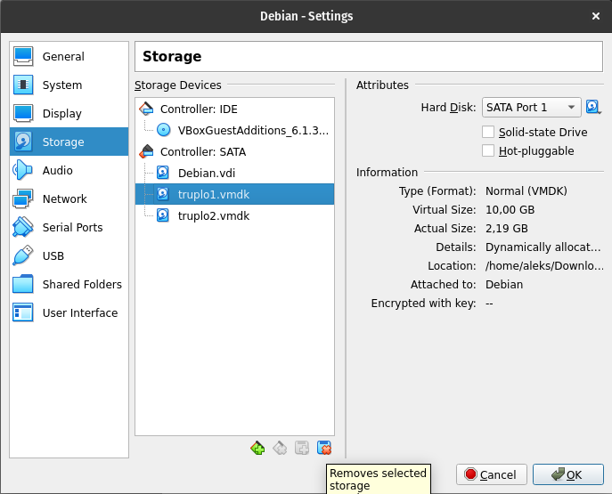
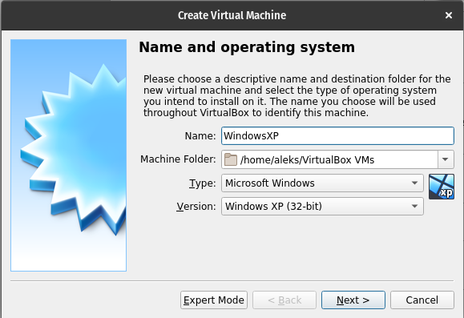
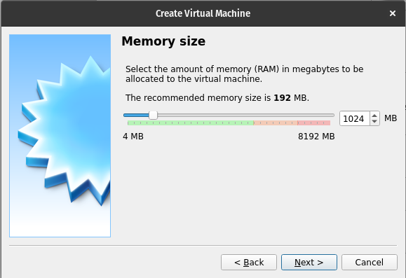
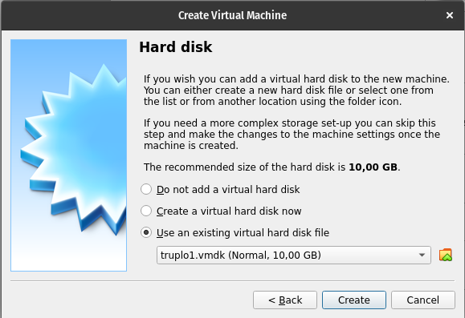
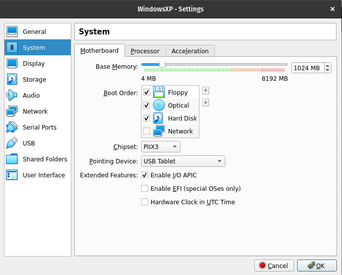
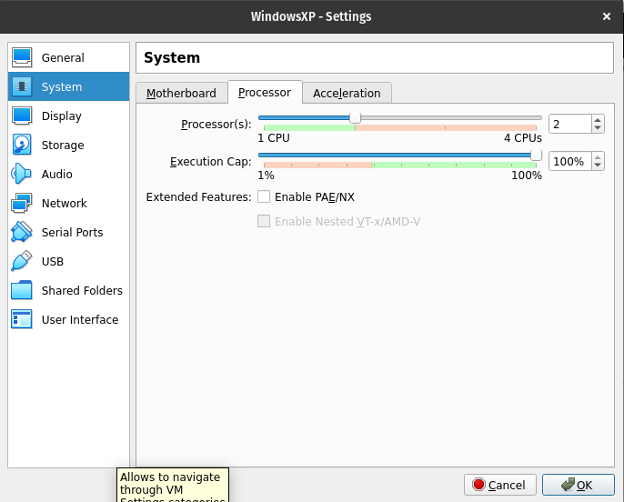
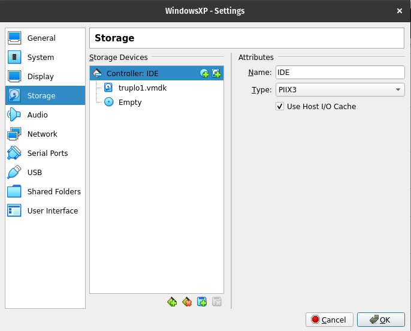
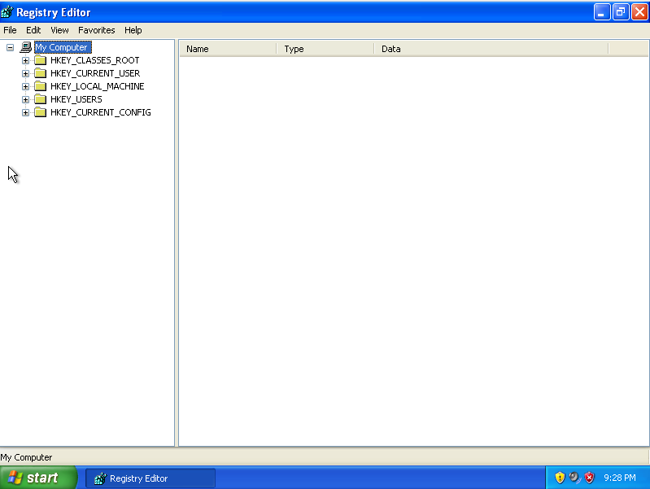
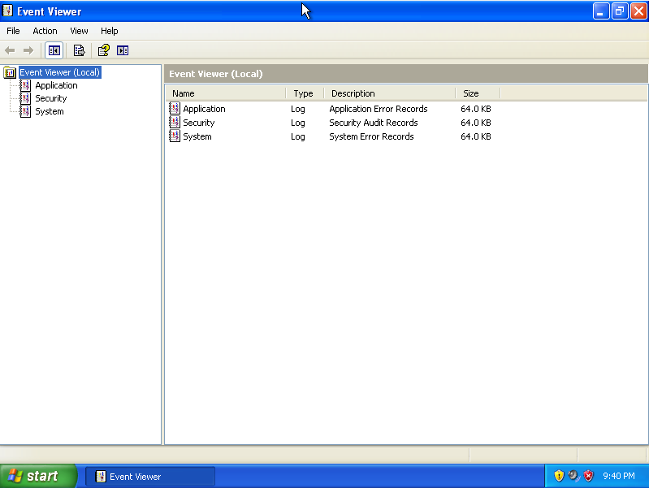
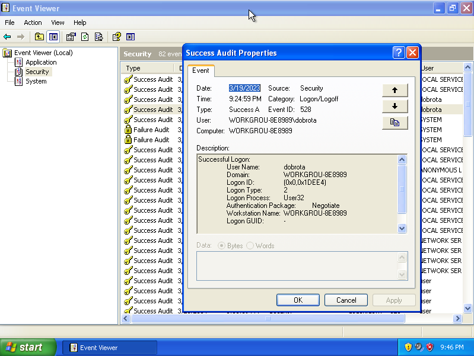

# 5. Lab: Windows registry and logs

## Instructions

1. Compare the registry between the two specified virtual computers.
2. Analyze the logs and find out:
     - Who are the users on the system?
     - Open the log on a switched off computer.

## More information

## Detailed instructions

### 1. Registry analysis

The first widely used version of Windows that was good enough to use was [`Windows 3.x`](https://en.wikipedia.org/wiki/Windows_3.1x), which spread rapidly between users.

Each program has its own settings, which under `Windows 3.x` it had to take care of itself. Settings were usually stored in plain text (or binary data) files with the extension [`.ini`](https://en.wikipedia.org/wiki/INI_file) scattered throughout the file system because the location was determined by the programs themselves.

Then the developers of the Windows operating system decided to improve the situation with settings, namely with binary files, which are unified and stored in one place and enable their management through a graphical interface. This is how the [Windows registry (English registry)](https://en.wikipedia.org/wiki/Windows_Registry) was created, which represents a repository or a database where all settings of the operating system and programs are stored, where each setting has its own record.

The registry is closed-source, and the standard way of managing the registry is also not described anywhere. It can be managed via the Windows command line or the Windows GUI `regedit`. Over time, people have figured out how the registry is built, for example in the following [article](http://sentinelchicken.com/data/TheWindowsNTRegistryFileFormat.pdf).

When we have multiple users on an operating system, we still have most of our shared settings in a normal shared registry. The specific settings of individual users are stored in a separate register. Also, we have a separate registry for usernames and passwords. Still, all registers are in the same format and displayed within one interface.

Download the archive [`truplo.zip`](https://polaris.fri.uni-lj.si/truplo.zip) from the website, which contains two virtual disks of the operating system [Windows XP](https://en.wikipedia.org/wiki/Windows_XP) and differ only in one operating system startup. We want to find out how much data is changed when the operating system is started. First, we unpack `truplo.zip`, which contains `truplo1.vmdk` and `truplo2.vmdk`, and add the first one to our virtual machine. Now we start our virtual machine.

    lsblk

    NAME   MAJ:MIN RM  SIZE RO TYPE MOUNTPOINT
    sda      8:0    0   20G  0 disk 
    ├─sda1   8:1    0   19G  0 part /
    ├─sda2   8:2    0    1K  0 part 
    └─sda5   8:5    0  975M  0 part [SWAP]
    sdb      8:16   0   10G  0 disk 
    └─sdb1   8:17   0   10G  0 part 
    sr0     11:0    1 60.8M  0 rom  

    mkdir /mnt/truplo1
    mount /dev/sdb1 /mnt/truplo1
    ls /mnt/truplo1/

    AUTOEXEC.BAT		        hiberfil.sys    ntldr			            WINDOWS
    boot.ini		            IO.SYS	        pagefile.sys
    CONFIG.SYS		            MSDOS.SYS	    'Program Files'
    'Documents and Settings'    NTDETECT.COM    'System Volume Information'

The registry is located in the folder `WINDOWS/system32/config`, which is stored in files or [hives (Registry Hive)](https://learn.microsoft.com/en-us/windows/win32/sysinfo/registry-hives).

    ls /mnt/truplo1/WINDOWS/system32/config/
    
    AppEvent.Evt  SAM	        SECURITY.LOG  SysEvent.Evt	 system.sav
    default       SAM.LOG	    software	  system	 TempKey.LOG
    default.LOG   SecEvent.Evt  software.LOG  system.LOG	 userdiff
    default.sav   SECURITY	    software.sav  systemprofile  userdiff.LOG

Locations of individual parts of the registry:
- `HKEY_LOCAL_MACHINE\SYSTEM`: `\system32\config\system`
- `HKEY_LOCAL_MACHINE\SAM`: `\system32\config\SAM`
- `HKEY_LOCAL_MACHINE\SECURITY`: `\system32\config\security`
- `HKEY_LOCAL_MACHINE\SOFTWARE`: `\system32\config\software`
- `HKEY_USERS` : `\Documents and Setting\USER_PROFILE\NTUSER.DAT`
- `HKEY_USERS.DEFAULT` : `\system32\config\default`

The files are binary and we can't just read them.

    cd /mnt/truplo1/WINDOWS/system32/config/
    less default
    q

To read registry files we need a special tool, such as [`hivex`](https://linux.die.net/man/3/hivex) and [`reglookup`](https://linux.die.net/man/1/reglookup). We install them through the package manager of our operating system.

    apt update
    apt install libhivex-bin reglookup

The [`hivexml`](https://linux.die.net/man/1/hivexml) command can be used to convert system-wide registry binaries into [`XML`](https://en.wikipedia.org/wiki/XML) files. Using the [`reglookup`](https://linux.die.net/man/1/reglookup) tool, we convert registry binary files into text files.

    hivexml system > system.xml
    hivexml SAM > sam.xml
    hivexml software > software.xml
    hivexml default > default.xml

    apt update
    apt instal libxml2-utils

    cat system.xml | xmllint --format -
    cat sam.xml | xmllint --format -
    cat software.xml | xmllint --format --recover -
    cat default.xml | xmllint --format -

    reglookup system
    reglookup sam
    reglookup software
    reglookup default

The user-specific registry is located in the `Documents and Settings/USER_PROFILE/NTUSER.DAT` file, which can also be opened with `hivexml` and `reglookup`.

    cd /mnt/truplo1/Documents\ and\ Settings/USER_PROFILE/
    hivexml system > system.xml
    hivexml NTUSER.DAT > NTUSER.DAT.xml
    cat NTUSER.DAT.xml | xmllint --format -

    reglookup NTUSER.DAT

We have a huge number of settings that we need to be able to search for, here we can help ourselves with lists of useful entries in the registry such as [Forensics Wiki](https://forensics.wiki/windows_registry/).

    reglookup NTUSER.DAT | grep "/Internet Explorer/Main/Start Page" | less

    /Software/Microsoft/Internet Explorer/Main/Start Page,SZ,http://www.microsoft.com/isapi/redir.dll?prd=ie&pver=6&ar=msnhome,

Now let's make a copy of the entire shared registry in the folder `WINDOWS/system32/config`.

    cd /mnt/truplo1/WINDOWS/system32/config/

    for i in default SAM SECURITY software system; do reglookup $i >> /home/aleks/register1.txt ; done 

Then we stop our virtual computer and connect the virtual disk `truplo2.vmdk` and make a copy of the entire registry in the folder `WINDOWS/system32/config` from it and compare the copies of both registries with the command [`diff`](https://www.man7.org/linux/man-pages/man1/diff.1.html) to see the difference in logs caused by one reboot.

    lsblk

    NAME   MAJ:MIN RM  SIZE RO TYPE MOUNTPOINT
    sda      8:0    0   20G  0 disk 
    ├─sda1   8:1    0   19G  0 part /
    ├─sda2   8:2    0    1K  0 part 
    └─sda5   8:5    0  975M  0 part [SWAP]
    sdb      8:16   0   10G  0 disk 
    └─sdb1   8:17   0   10G  0 part 
    sdc      8:16   0   10G  0 disk 
    └─sdc1   8:17   0   10G  0 part 
    sr0     11:0    1 60.8M  0 rom  

    mkdir /mnt/truplo2
    mount /dev/sdc1 /mnt/truplo2

    cd /mnt/truplo2/WINDOWS/system32/config/

    for i in default SAM SECURITY software system; do reglookup $i >> /home/aleks/register2.txt ; done

    cd /home/aleks
    diff register1.txt register2.txt

    diff register1.txt register2.txt | wc -l 
    
    2846

We can see that the difference between the two registers has 2846 lines, where each individual difference occupies 4 lines, so restarting changes about 711 records in the register.

We stop the virtual machine and remove the virtual disks `truplo1.vmdk` and `truplo2.vmdk` by clicking on the selected virtual machine the `Settings` button in the line above. In the window that opens, select the `Storage devices` tab from the column on the left, and remove the selected virtual disks by clicking on the floppy disk icon with the red cross.

Let's create a new virtual computer to run the `Windows XP` operating system on the `truplo1.vmdk` virtual disk. We click on the `New` button in the line above. In the first window, specify the `Name`, `Computer folder`, `Type` and `Version` of the new virtual computer. For example, we select `WindowsXP` as the name, `/home/USER/VirtualBox VMs` as the folder in which the virtual computer will be stored, `Microsoft Windows` as the type, and `Windows XP (32-bit)` as the version. Press the `Next` button.

We select `1024MB` for the memory size and press the `Next` button.

For the virtual disk, select the `Use an existing virtual disk` option and press the `Create` button.

For the newly created virtual computer, click on the `Settings` button in the row above. In the window that opens, select the `System` tab from the column on the left, and under the `Motherboard` tab, in the `Chipset:` field, select the value `PIIX3` and under `Extended features` enable `Enable I/O APIC`. Under the `Processor`tab, select at least 2 cores. Under the tab `Memory devices` select `Controller: IDE` and in the field `Type:` select the `PIIX3` option and press the `OK` button. Now we start our new virtual machine.

Log in with the username `dobrota` and the password `sirota`. The graphical interface for managing the registry can be reached by clicking on the `Start` menu, then `Run` and typing `regedit` and pressing `Enter`.

### 2. Analysis of logs

Logs in the operating system allow us to record events, warnings and errors that occur during execution. Instead of having a description of what happened, we have `Event ID` and `Event Type`, which enable pre-defined and structured notifications that also enable localization. The `Event ID` and `Event Type` lists vary from system to system and are specific to each individual system. To understand `Event ID` and `Event Type` correctly, we need a copy of the entire system with all [DLL (Dynamic-link library)](https://en.wikipedia.org/wiki/Dynamic-link_library) files. However, if we are on the system that created the events, then we can access them through the `Eventviewer` tool by clicking on the `Start` menu, then `Run` and typing `eventvwr` and pressing `Enter`.

The log is in [EVT](https://forensics.wiki/windows_event_log_%28evt%29/) format, where under the `Security` tab we find successful login in the `Success Audit` system for the user `dobrota`, which is presented by the column `User`. By right-clicking on an individual record in the log, we can access additional `Properties` details. The log is located in the `C:\Windows\system32\config` folder. The library [`libevt`](https://github.com/libyal/libevt) allows us to read `EVT` files.

Windows Vista and later Windows operating systems, however, use a log in [EVTX](https://forensics.wiki/windows_xml_event_log_%28evtx%29/) format, which stores data in the form of `XML` files. The library [`libevtx`](`https://github.com/libyal/libevtx) allows us to read `EVTX` files.

We stop the virtual machine and add the `truplo1.vmdk` virtual disk to our original `Linux` virtual machine and start it.

We connect the added virtual disk `truplo1.vmdk` to the file system and move to the folder `/WINDOWS/system32/config`, where we look for log files `.evt`.

    lsblk

    NAME   MAJ:MIN RM  SIZE RO TYPE MOUNTPOINT
    sda      8:0    0   20G  0 disk 
    ├─sda1   8:1    0   19G  0 part /
    ├─sda2   8:2    0    1K  0 part 
    └─sda5   8:5    0  975M  0 part [SWAP]
    sdb      8:16   0   10G  0 disk 
    └─sdb1   8:17   0   10G  0 part 
    sr0     11:0    1 60.8M  0 rom  

    mount /dev/sdb1 /mnt/truplo1

    cd /mnt/truplo1/WINDOWS/system32/config

    ls

    AppEvent.Evt  SAM	        SECURITY.LOG  SysEvent.Evt	 system.xml
    default       SAM.LOG	    software	  system	     TempKey.LOG
    default.LOG   sam.xml	    software.LOG  system.LOG	 userdiff
    default.sav   SecEvent.Evt  software.sav  systemprofile  userdiff.LOG
    default.xml   SECURITY	    software.xml  system.sav

To read the logs in `EVT` format, we use the [`grokevt`](https://manpages.ubuntu.com/manpages/trusty/man7/grokevt.7.html) tool, which is installed with the operating system package manager.

    apt update
    apt install grokevt
    
We move to the folder for setting the program `grokevt`, namely `/etc/grokevt/systems`. We copy the configuration example from `/usr/share/doc/grokevt/config-examples/example1/` to read the log into the current folder.

    cd /etc/grokevt/systems
    cp -r /usr/share/doc/grokevt/config-examples/example1/ .

    ls example1/

    drives	path-vars  system-registry

Now let's correct the settings for our example. In the `drives` folder, we create a file `c:`, which contains information about the location of the root directory of the C drive of our Windows system. From before, we can use the `/mnt/truplo1` folder or create a new one.

    echo /mnt/truplo1 > drives/c:

In the `path-vars` folder, check the settings of the system disk settings in the `%SystemDrive%` file and the path to the `Windows` folder of the operating system in the `%SystemRoot%` file. We find that the default settings are already set correctly.

    cat path-vars/%SystemRoot%

    c:\Windows

    cat path-vars/%SystemDrive% 
    
    C:

In the `system-registry` file, correct the location of Windows registry and log.

    echo /mnt/truplo1/WINDOWS/system32/config/system > system-registry

Now mount the disk and use `grokevt` to build a database from the Windows registry and log with the `grokevt-builddb` command.

    mount /dev/sdb1 /mnt/truplo1

    grokevt-builddb example1/ db/

    ls db/

    logs  messages	services  version

With the `grokevt-parselog` command, we check the sub-groups of the log that we have read. Now we can list individual sub-logs and search through them.

    grokevt-parselog -l db

    Security
    Application
    System

We can use the same command to find out when user `dobrota` used the system.

    grokevt-parselog db Security | grep dobrota

We can also find out which users have successfully logged into the operating system.

    grokevt-parselog db Security | grep SuccessAudit
