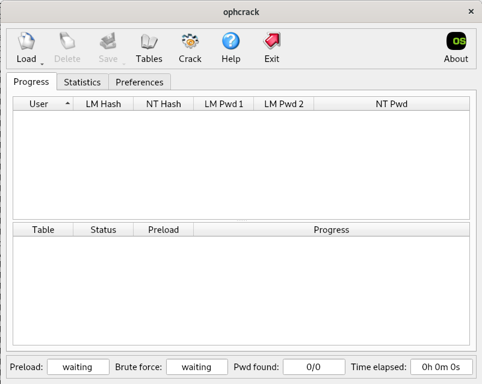
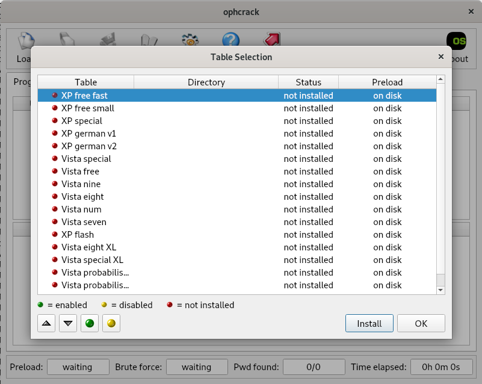
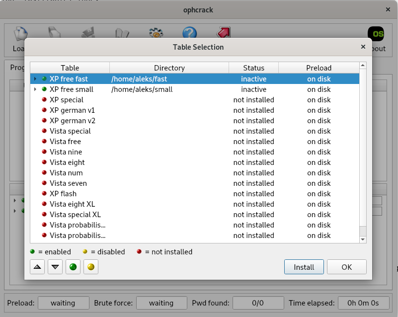
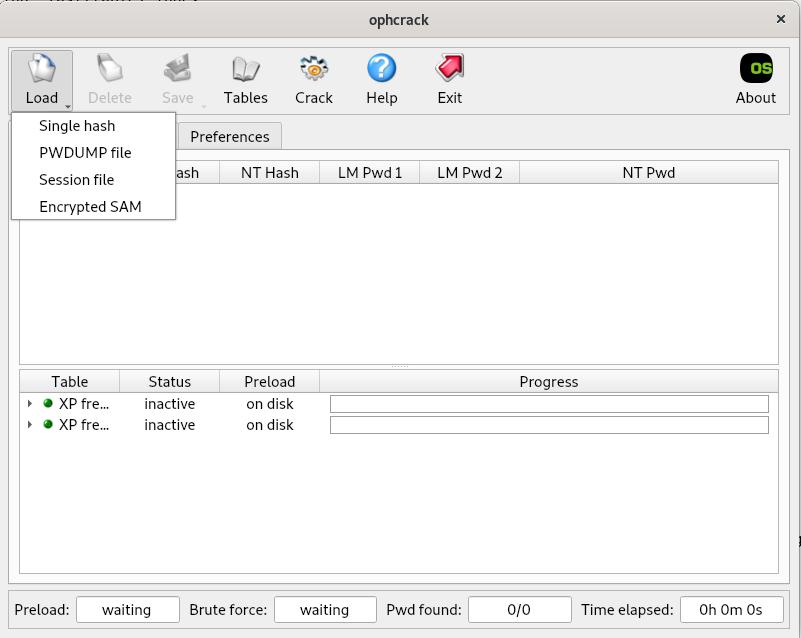
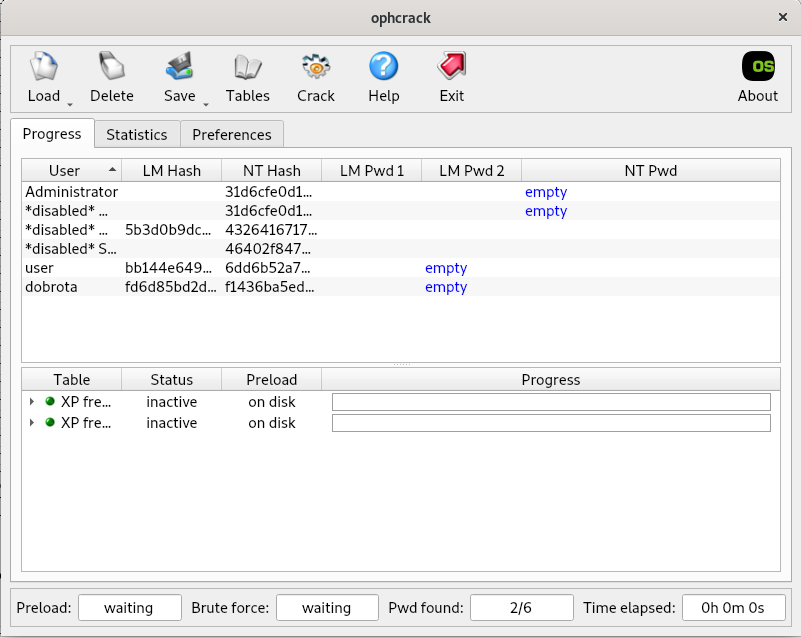
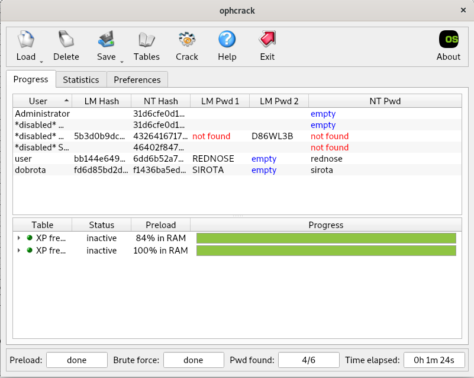

# 6. Lab: Finding Windows usernames and passwords

## Instructions

1. Determine the usernames and passwords for the specified Windows XP virtual disk.
2. Reset Windows XP user password.
3. Find the usernames and passwords for the given Linux virtual machine.

## More information

## Detailed instructions

### 1. Cracking passwords in Windows XP

To our virtual computer with the Linux operating system, we attach the `truplo1.vmdk` virtual disk using the `mount` command to the `/mnt/truplo1` folder, if it does not already exist, create it using the `mkdir` command. If we don't have a virtual disk, download the [`truplo.zip'](http://polz.si/dsrf/truplo.zip) archive that contains it from the website.

    lsblk

    NAME   MAJ:MIN RM  SIZE RO TYPE MOUNTPOINT
    sda      8:0    0   20G  0 disk 
    ├─sda1   8:1    0   19G  0 part /
    ├─sda2   8:2    0    1K  0 part 
    └─sda5   8:5    0  975M  0 part [SWAP]
    sdb      8:16   0   10G  0 disk 
    └─sdb1   8:17   0   10G  0 part 
    sr0     11:0    1 60.8M  0 rom  

    mkdir /mnt/truplo1
    mount /dev/sdb1 /mnt/truplo1

Windows 7 and older operating systems hide passwords in the file `C:\windows\system32\config\SAM`, you can read more about it [here](http://www.nirsoft.net/articles/saved_password_location.html) and [here](https://learn.microsoft.com/en-us/previous-versions//cc723740(v=technet.10)?redirectedfrom=MSDN). Passwords are not stored in text format, but in values from hash function of given passwords (Password -> H(Password) -> HPassword). Such an approach is not secure, so from Windows 8 onwards passwords are stored with an added salt (Password -> Salt -> H(Password + Salt) -> HPasswordSalt).

We find and crack passwords with a dedicated tool that uses [rainbow tables](https://en.wikipedia.org/wiki/Rainbow_table) to find passwords. Rainbow tables contain already calculated values of hash functions for frequently used passwords. The hashing function assures us with a high probability that two different inputs almost never map to the same output value. We install the tool with the mentioned functionality [`ophcrack`](https://manpages.org/ophcrack) and [`ophcrack-cli`](https://linuxcommandlibrary.com/man/ophcrack-cli) and the tool for opening archives [`unzip`](https://linux.die.net/man/1/unzip) with the package manager on our operating system.

    apt update
    apt install ophcrack ophcrack-cli unzip

Now we need the rainbow tables, which we get [here](https://ophcrack.sourceforge.io/tables.php). For our example, it is sufficient to download the tables [`XP free small`](http://sourceforge.net/projects/ophcrack/files/tables/XP%20free/tables_xp_free_small.zip/download) and [`XP free fast`] (http://sourceforge.net/projects/ophcrack/files/tables/XP%20free/tables_xp_free_fast.zip/download) and open them.

    cd /home/USER

    wget http://sourceforge.net/projects/ophcrack/files/tables/XP%20free/tables_xp_free_small.zip
    wget http://sourceforge.net/projects/ophcrack/files/tables/XP%20free/tables_xp_free_fast.zip

    unzip tables_xp_free_fast.zip -d fast
    unzip tables_xp_free_small.zip -d small

Then we run the `ophcrack` tool via the `Activities` button in the upper left corner. In the upper row of buttons, click on `Tables` and then select the tables that we downloaded from the web `XP free fast` and `XP free small`.

Click on the `Install` button at the bottom right of each one, and through the wizard, select the place where they are located and press the `Open` button.

After we have successfully selected both tables, press the `OK` button.

Now we click on the `Load` button, where we select `Encrypted SAM`.

Then, through the wizard, find the folder in which `SAM` is located, namely `/mnt/truplo1/WINDOWS/system32/config`, and press the `Open` button. Usernames, password values from [LM hashing function](https://en.wikipedia.org/wiki/LAN_Manager#Password_hashing_algorithm), and password values from[NT hashing function](https://en.wikipedia.org/wiki/NTLM).

Now press the `Crack` button and wait a bit for the tool to crack the passwords for the users found.

So we found two users, namely `user`, with the password `rednose` and `dobrota`, with the password `sirota`. Now we restart the virtual computer with the Windows XP operating system that we set up in the previous exercises and try to log in with the user names and their passwords.

### 2. Password reset

If we are not interested in specific passwords, we can just reset them and thus access the individual user account. For this we can use the [`chntpw`](https://manpages.org/chntpw/8) tool, which is installed with our operating system's package manager. Now mount the virtual disk of our virtual computer with the Windows XP operating system. Then we move to the folder `/mnt/truplo1/WINDOWS/system32/config` and reset the passwords. First, select option `1` to edit user data and passwords. Then we select the user `dobrota` by specifying his `RID`, which is `03ec`. Now we select the option `1` to reset the password to a blank password and press `q` twice to exit the program and `y` to save the changes.

    apt update
    apt install chntpw
    mount /dev/sdb1 /mnt/truplo1
    cd /mnt/truplo1/WINDOWS/system32/config
    chntpw -i SAM system SECURITY

    <>========<> chntpw Main Interactive Menu <>========<>

    Loaded hives: <SAM> <system> <SECURITY>

    1 - Edit user data and passwords
    2 - List groups
        - - -
    9 - Registry editor, now with full write support!
    q - Quit (you will be asked if there is something to save)

    What to do? [1] -> 1

    ===== chntpw Edit User Info & Passwords ====

    | RID -|---------- Username ------------| Admin? |- Lock? --|
    | 01f4 | Administrator                  | ADMIN  |          |
    | 03ec | dobrota                        | ADMIN  |          |
    | 01f5 | Guest                          |        | dis/lock |
    | 03e8 | HelpAssistant                  |        | dis/lock |
    | 03ea | SUPPORT_388945a0               |        | dis/lock |
    | 03eb | user                           | ADMIN  |          |

    Please enter user number (RID) or 0 to exit: [3eb] 03ec
    ================= USER EDIT ====================

    RID     : 1004 [03ec]
    Username: dobrota
    fullname: dobrota
    comment : 
    homedir : 

    00000221 = Users (which has 3 members)
    00000220 = Administrators (which has 3 members)

    Account bits: 0x0210 =
    [ ] Disabled        | [ ] Homedir req.    | [ ] Passwd not req. | 
    [ ] Temp. duplicate | [X] Normal account  | [ ] NMS account     | 
    [ ] Domain trust ac | [ ] Wks trust act.  | [ ] Srv trust act   | 
    [X] Pwd don't expir | [ ] Auto lockout    | [ ] (unknown 0x08)  | 
    [ ] (unknown 0x10)  | [ ] (unknown 0x20)  | [ ] (unknown 0x40)  | 

    Failed login count: 0, while max tries is: 0
    Total  login count: 2

    - - - - User Edit Menu:
    1 - Clear (blank) user password
    (2 - Unlock and enable user account) [seems unlocked already]
    3 - Promote user (make user an administrator)
    4 - Add user to a group
    5 - Remove user from a group
    q - Quit editing user, back to user select
    Select: [q] > 1
    Password cleared!
    ================= USER EDIT ====================

    RID     : 1004 [03ec]
    Username: dobrota
    fullname: dobrota
    comment : 
    homedir : 

    00000221 = Users (which has 3 members)
    00000220 = Administrators (which has 3 members)

    Account bits: 0x0210 =
    [ ] Disabled        | [ ] Homedir req.    | [ ] Passwd not req. | 
    [ ] Temp. duplicate | [X] Normal account  | [ ] NMS account     | 
    [ ] Domain trust ac | [ ] Wks trust act.  | [ ] Srv trust act   | 
    [X] Pwd don't expir | [ ] Auto lockout    | [ ] (unknown 0x08)  | 
    [ ] (unknown 0x10)  | [ ] (unknown 0x20)  | [ ] (unknown 0x40)  | 

    Failed login count: 0, while max tries is: 0
    Total  login count: 2
    ** No NT MD4 hash found. This user probably has a BLANK password!
    ** No LANMAN hash found either. Try login with no password!

    - - - - User Edit Menu:
    1 - Clear (blank) user password
    (2 - Unlock and enable user account) [seems unlocked already]
    3 - Promote user (make user an administrator)
    4 - Add user to a group
    5 - Remove user from a group
    q - Quit editing user, back to user select
    Select: [q] > q
        

    <>========<> chntpw Main Interactive Menu <>========<>

    Loaded hives: <SAM> <system> <SECURITY>

    1 - Edit user data and passwords
    2 - List groups
        - - -
    9 - Registry editor, now with full write support!
    q - Quit (you will be asked if there is something to save)

    What to do? [1] -> q

    Hives that have changed:
    #  Name
    0  <SAM>
    Write hive files? (y/n) [n] : y
    0  <SAM> - OK

Now let's try to log in with the `dobrota` user and an empty password.

### 3. Cracking Linux passwords

On Linux operating systems, user information is located in the file [`/etc/shadow`](https://linuxize.com/post/etc-shadow-file/) and only those can be cracked using the [John the Ripper](https://www.openwall.com/john/) tool. Each line specifies one user, namely in the format `UserName:EncryptedPassword:LastPasswordChange:MinimumPasswordAge:MaximumPasswordAge:WarningPeriod:InactivityPeriod:ExpiryPeriod:UnusedField`.

    cat /etc/shadow

    root:$y$j9T$bZLSEsD4PebYHL2ytt2eT.$/VJ8dekN/eEK/RhgNpFCK1tSJGg6USIJtHSQSNT2LI1:19424:0:99999:7:::
    daemon:*:19424:0:99999:7:::
    bin:*:19424:0:99999:7:::
    sys:*:19424:0:99999:7:::
    sync:*:19424:0:99999:7:::
    games:*:19424:0:99999:7:::
    man:*:19424:0:99999:7:::
    lp:*:19424:0:99999:7:::
    mail:*:19424:0:99999:7:::
    news:*:19424:0:99999:7:::
    uucp:*:19424:0:99999:7:::
    proxy:*:19424:0:99999:7:::
    www-data:*:19424:0:99999:7:::
    backup:*:19424:0:99999:7:::
    list:*:19424:0:99999:7:::
    irc:*:19424:0:99999:7:::
    gnats:*:19424:0:99999:7:::
    nobody:*:19424:0:99999:7:::
    _apt:*:19424:0:99999:7:::
    systemd-network:*:19424:0:99999:7:::
    systemd-resolve:*:19424:0:99999:7:::
    tss:*:19424:0:99999:7:::
    messagebus:*:19424:0:99999:7:::
    systemd-timesync:*:19424:0:99999:7:::
    avahi-autoipd:*:19424:0:99999:7:::
    usbmux:*:19424:0:99999:7:::
    rtkit:*:19424:0:99999:7:::
    dnsmasq:*:19424:0:99999:7:::
    avahi:*:19424:0:99999:7:::
    speech-dispatcher:!:19424:0:99999:7:::
    pulse:*:19424:0:99999:7:::
    saned:*:19424:0:99999:7:::
    colord:*:19424:0:99999:7:::
    geoclue:*:19424:0:99999:7:::
    Debian-gdm:*:19424:0:99999:7:::
    aleks:$y$j9T$DJnDTsvzSqd2GDXdvDf/e/$Xvs8zv2WqExAH4W.cedeGXY3f5tJQrsEk99ozl/de94:19424:0:99999:7:::
    systemd-coredump:!*:19424::::::
    vboxadd:!:19424::::::

The password is in the format `$HashingFunctionIdentifier$Salt$HashingFunctionValue`, where the identifier specifies the hashing function that our operating system uses to calculate the hashes for our passwords. All the hash functions we can use are listed [here](https://en.wikipedia.org/wiki/Crypt_(C)#Key_derivation_functions_supported_by_crypt).

Let's install the Linux password cracking tool `john` via the package manager. Now let's save the following examples of users and passwords to a file and try to crack the passwords.

    apt update
    apt install john

    nano unix_passwords

    student:$6$B18NDQmp$0c21HLddW7CxXh0W1S24TN4L.wfVkhqaXtf489ai/mT6n0Ov7osEb5.aKVxKyQ6j.38OMrKXv7AQ9jiUcVimA.:17948:0:99999:7:::
    test:$6$VdV5y2gl$YxpYuwcVZHSXiv0N4yzmF8PspBeIK8QLdGJZzYFuKRjkfc82DhaS5fQeuOt0q9APDPLeSMTzt8BtxI2Bwo/hH.:17948:0:99999:7:::
    john:$6$7CxX6vB2$BS5J1Ch4zwiIG2w/DJ48vwNm7V8iv/PGHBhfZoX9dYX8FqkX2WcbIuGy7W0AXhDme46jpOrM5QI/hFdby3ji40:17982:0:99999:7:::
    sam:$6$kawol/fc$b9zvgpBGB46Ju9YZlvYKbfsOBSzT/4xH.hZUbDRQTnHSn4BBqg1XNDlHmNyfYUPLqlGNF7uceviGc7hOznRCF0:17982:0:99999:7:::
    mike:$6$k51atM5t$drdibMMoXmGGQZuqoC/iXQFHdg6L8oNfGXwsXkVj0.r7RHBgTt0GZBvrQyfvlMqZOBrsUC43v8usx1tRiyfoF.:17982:0:99999:7:::
    bob:$6$ttp5oC25$mVVqVDAxa5ef0yqOcm1Gzp/1VNADPAgLSKhHsATHZI76j.kV/uXxBvxOjxmU3VRcvdPgAwkHY.aAfAJaweKKD/:17982:0:99999:7:::

    john unix_passwords

    Created directory: /root/.john
    Loaded 6 password hashes with 6 different salts (crypt, generic crypt(3) [?/64])
    Will run 2 OpenMP threads
    Press 'q' or Ctrl-C to abort, almost any other key for status
    test             (test)
    mike123          (mike)
    jennifer         (bob)
