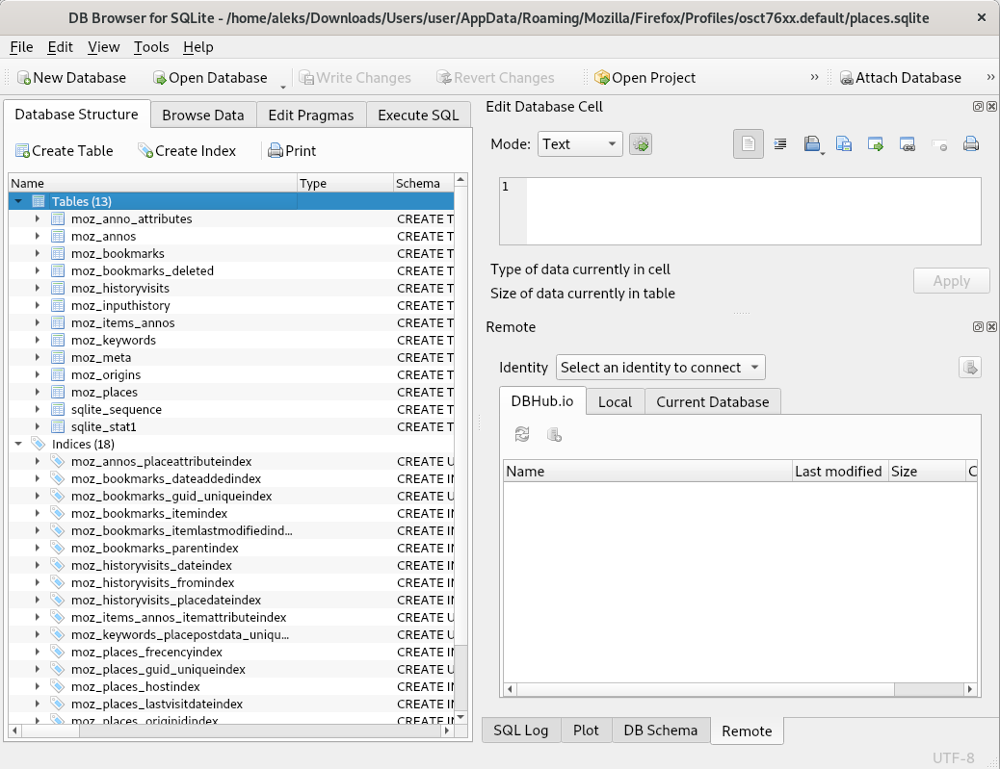
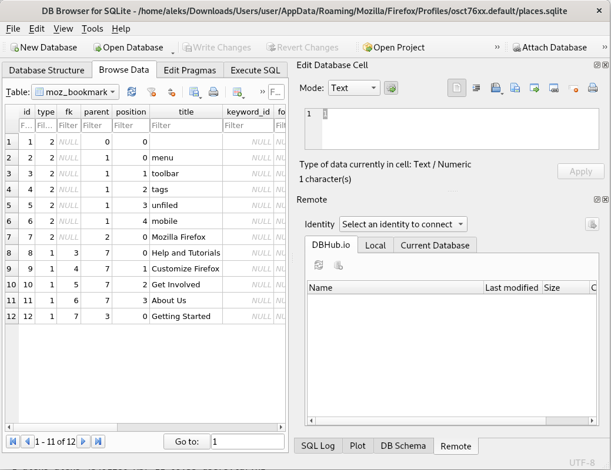

# 8. Lab: Browser history

## Instructions

1. Find out which web pages the user visited and when. The browsers used were Firefox, Chrome and Edge.

## More information

## Detailed instructions

### 1. History of browsers

Download the [archive](https://ucilnica.fri.uni-lj.si/mod/resource/view.php?id=28964) of user files from the Windows 10 system. Open the package with the [tar](https://linux.die.net/man/1/tar) command.

    ls /home/aleks/Downloads/
    
    users.tar.xz

    cd /home/aleks/Downloads/

    tar -xf users.tar.xz

    ls

    Users users.tar.xz

    chmod -R ugoa+rwx Users/

Mozilla Firefox stores most of the interesting data in [SQLite](https://sqlite.org/index.html) databases. [Browsing history](https://www.foxtonforensics.com/browser-history-examiner/firefox-history-location) is stored in the `places.sqlite` file found in:

- Windows XP: `C:\Documents and Settings\<USERNAME>\Application Data\Mozilla\Firefox\Profiles\<PROFILE>\places.sqlite`
- Windows Vista (and from Windows 7 onwards): `C:\Users\<USERNAME>\AppData\Roaming\Mozilla\Firefox\Profiles\<PROFILE>\places.sqlite`
- Linux: `~/.mozilla/firefox/<PROFILE>/places.sqlite`
- OS X: `/Users/<USERNAME>/Library/Application Support/Firefox/Profiles/<PROFILE>/places.sqlite`

To browse SQLite databases, use the command line tool [`sqlite3`](https://linux.die.net/man/1/sqlite3) or the graphical interface tool [`sqlitebrowser`](https://manpages.debian.org/stretch/sqlitebrowser/sqlitebrowser.1).

    apt update
    apt install sqlite3 sqlitebrowser

Open the program by pressing the `Activities` button in the upper left corner and then the `DB Browser for SQLite` program. Inside the program, now press the `Open Database` button and open the desired file, for example `Users\<USERNAME>\AppData\Roaming\Mozilla\Firefox\Profiles\<PROFILE>\places.sqlite`.

To view individual tables, go to the `Browse Data` tab and select the desired table in the `Table:` pull-down menu.

Google Chrome also stores [browsing history](https://www.foxtonforensics.com/browser-history-examiner/chrome-history-location) in SQLite databases. User files are located in:

- Linux: `~/.config/chromium/`
- Windows Vista (and from Windows 7 onwards): `C:\Users\<USERNAME>\AppData\Local\Google\Chrome\User Data\Default\History`
- Windows XP: `C:\Documents and Settings\<USERNAME>\Local Settings\Application Data\Google\Chrome\User Data\Default\History`

Browsing history can also be accessed using the tools such as `sqlite3` and `DB Browser for SQLite`.

Older versions of the Edge browser stored [browsing data](https://www.foxtonforensics.com/browser-history-examiner/microsoft-edge-history-location) in the [ESE](https://en.wikipedia.org/wiki/Extensible_Storage_Engine). The files are located in various places, including:

- Windows 10: `C:\Users\<USERNAME>\AppData\Local\Microsoft\Windows\WebCache\WebCacheV01.dat` and `C:\Users\<USERNAME>\AppData\Local\Packages\Microsoft.MicrosoftEdge_<ID >\AC\MicrosoftEdge\User\Default\`

ESE databases can be accessed with the [`libesedb`](https://github.com/libyal/libesedb) library and the attached program `esedbexport` that exports the data from `ESE` file to text files.

    apt update
    apt install libesedb-utils

    esedbexport Users/user/AppData/Local/Microsoft/Windows/WebCache/WebCacheV01.dat

    ls WebCacheV01.dat.export

    cat WebCacheV01.dat.export/HstsEntryEx_12.28

    EntryId	MinimizedRDomainHash	MinimizedRDomainLength	IncludeSubdomains	Expires	LastTimeUsed	RDomain
    1	0	8	161	9223372036854775807	9223372036854775807	:version
    2	7892179877542161243	8	1	132338501063171541	132023141063171541	com.bing.www
    3	8206197026885659483	13	1	132178686594739306	132023166594739306	com.microsoft.microsoftedgewelcome
    4	4111696929994500955	14	0	132180846605532453	132023166605532453	com.optimizely.cdn
    5	4111696929994500955	14	0	132180846610932334	132023166610932334	com.optimizely.cdn.a3698060313
    6	7958140503510412123	19	1	132338526699797182	132023166699797182	com.microsoftonline.login
    7	730144501395549019	8	0	132338526705329980	132023166705329980	com.live.login
    8	869098996354968411	10	0	132180846728611236	132023166728611236	com.ninite
    9	4705519305907956571	12	0	132178686825710943	132023166825710943	com.facebook.staticxx
    10	6309426421137861467	11	0	138334552017518691	132023166827518691	com.twitter.syndication
    11	2525412546616421211	20	1	132132034718165412	132023170718165412	com.google-analytics.www
    12	643614699373652827	20	0	132338530785579339	132023170785579339	com.youtube-nocookie.www
    13	4868819453617564507	9	0	138334555976204232	132023170786204232	com.twimg.syndication.cdn
    14	4868819453617564507	9	0	138334555979327907	132023170789327907	com.twimg.abs
    15	4868819453617564507	9	0	138334555979484229	132023170789484229	com.twimg.pbs
    16	4868819453617564507	9	0	138334555980643075	132023170790643075	com.twimg.ton
    17	7660453395351923547	20	0	132338530935249750	132023170935249750	com.googleapis.fonts
    18	4705519305907956571	12	0	132178690938806746	132023170938806746	com.facebook.graph
    19	476002679376767835	13	0	132178690960526172	132023170960526172	com.wordpress.public-api

Newer versions of the Edge browser are based on the Google Chrome browser and store data in the same way, namely at:

- Windows 10: `C:\Users\<USERNAME>\AppData\Local\Microsoft\Edge\User Data\Default\`

Let's look at the older web browser Internet Explorer 5, which stores data in:

- Windows XP: `C:\Documents and Settings\<USERNAME>\Local Settings\History\History.IE5\`
- Windows 7, 8, 10: `C:\Users\<USERNAME>\AppData\Local\Microsoft\Internet Explorer\Recovery`, `C:\Users\<USERNAME>\AppData\Local\Microsoft\Windows\WebCache` and `C:\Users\<USERNAME>\Favorites`

The history can be read using the [`pasco`](https://www.unix.com/man-page/debian/1/pasco) tool.

    apt update
    apt install pasco

    cd /mnt/Documents\ and\ Settings/user/Local\ Settings/History/History.IE5/
    pasco index.dat
