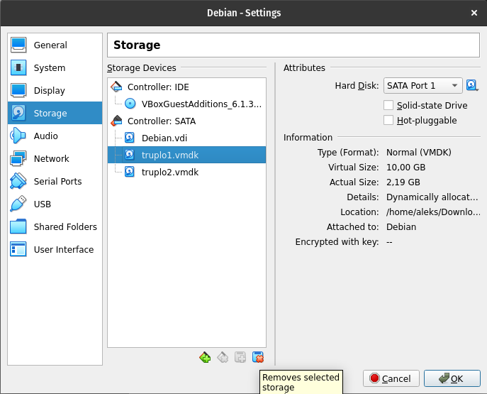
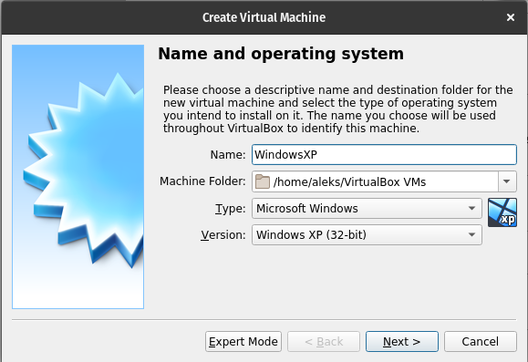
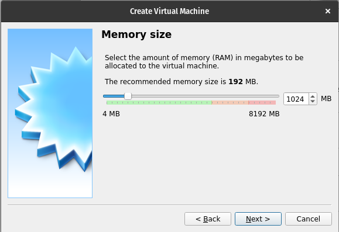
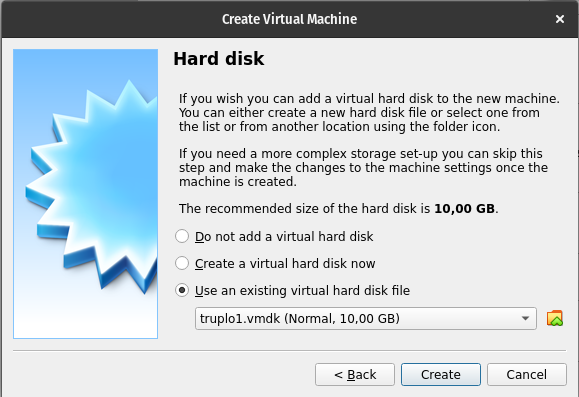
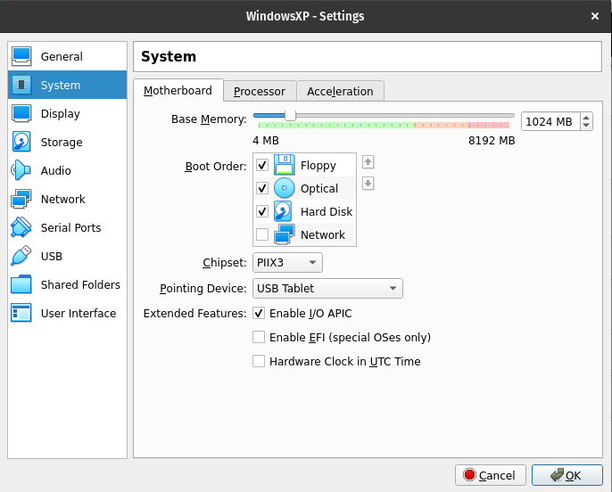
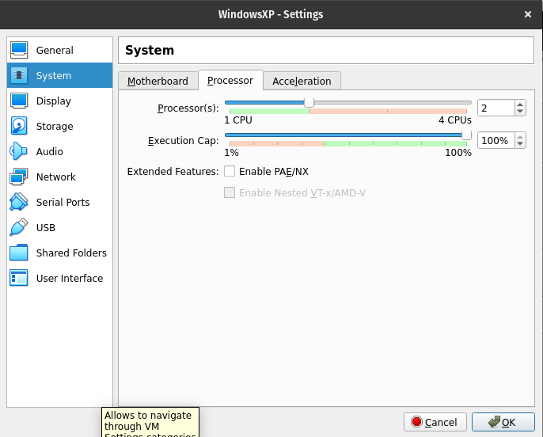
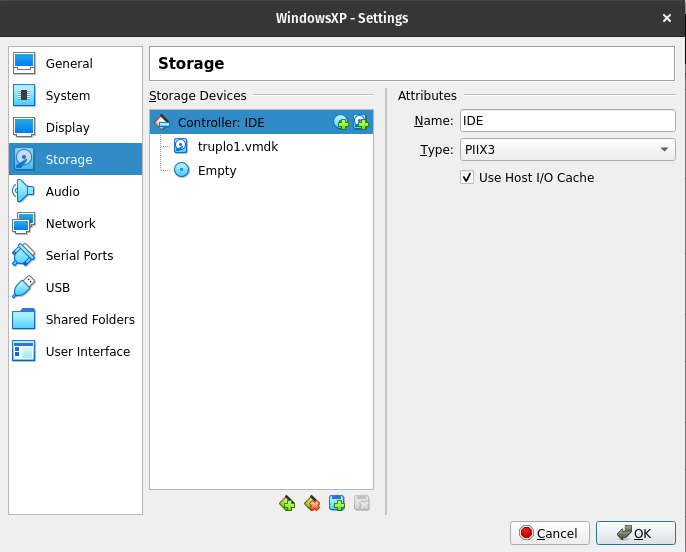
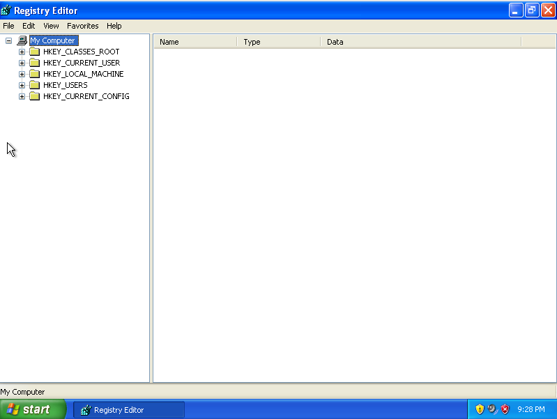
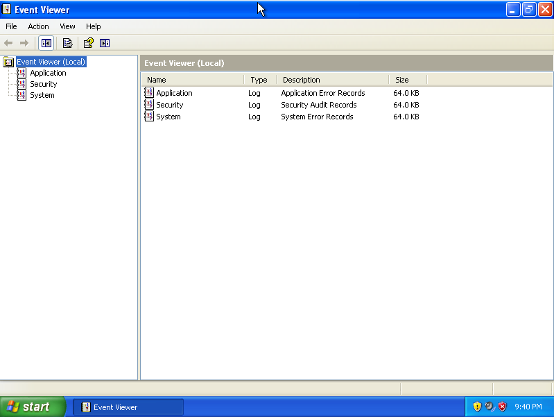
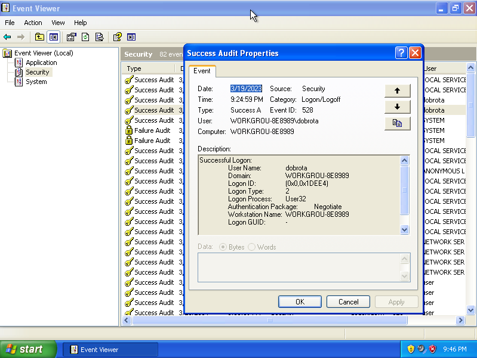

# 5. Vaja: Windows register in dnevniki

## Navodila

1. Primerjaj register med podanima navideznima računalnikoma.
2. Analiziraj dnevnike in ugotovi:
    - Kdo so uporabniki na sistemu?
    - Odpri log na izklopljenem računalniku.

## Dodatne informacije

## Podrobna navodila

### 1. Analiza registra

Prva splošno uporabljana različica operacijskega sistema Windows,ki je bila dovolj dobra za uporabo, je bila [`Windows 3.x`](https://en.wikipedia.org/wiki/Windows_3.1x), ki se je hitro razširila med uporabniki.

Vsak program ima svoje nastavitve, za katere je moral pod `Windows 3.x` poskrbeti sam. Nastavitve so bile običajno shranjene v datotekah s končnico [`.ini`](https://en.wikipedia.org/wiki/INI_file), ki so bile razpršene po celotnem datotečne sistemi, ker so lokacijo določali programi sami.

Nato so se razvijalci Windows operacijskega sistema odločili izboljšati situacijo z nastavitvami, in sicer z tekstovnimi datotekami, ki jih poenotimo in shranimo na eno mesto ter omogoči upravljanje z njimi preko grafičnega vmesnika. Tako je nastal [Windows register (angl. registry)](https://en.wikipedia.org/wiki/Windows_Registry), ki predstavlja repozitorij, kjer so shranjene vse nastavite operacijskega sistema in programov, kjer ima vsaka nastavitev svoj zapis.

Register je zaprtokoden ter prav tako ni nikjer opisan standardni način upravljanja z registrom. Z njim lahko upravljamo preko Windows ukazne vrstice ali Windows grafičnega vmesnika `regedit`. S časoma so ljudje ugotovili, kako je register zgrajen, na primer v naslednjem [članku](http://sentinelchicken.com/data/TheWindowsNTRegistryFileFormat.pdf).

Ko imamo več uporabnikov v operacijskem sistemu, imamo še vedno večino skupnih nastavitev v običajnem skupnem registru. Specifične nastavitve posameznih uporabnik pa so shranjene v ločenem registru. Prav tako, imamo ločen register za uporabniška imena in gesla. Še vedno pa so vsi registri v istem formatu in prikazani znotraj enega vmesnika.

S spletne strani prenesemo arhiv [`truplo.zip`](http://polz.si/dsrf/truplo.zip), ki vsebuje dva navidezna diska operacijskega sistema [Windows XP](https://en.wikipedia.org/wiki/Windows_XP) in razlikujeta se le v enem zagon operacijskega sistema. Želimo ugotoviti, koliko podatkov se spremeni pri zagonu operacijskega sistema. Najprej odpakiramo `truplo.zip`, ki vsebuje `truplo1.vmdk` in `truplo2.vmdk` ter prvega dodamo našemu navideznemu računalniku. Sedaj poženemo naš navidezni računalnik.

    lsblk

    NAME   MAJ:MIN RM  SIZE RO TYPE MOUNTPOINT
    sda      8:0    0   20G  0 disk 
    ├─sda1   8:1    0   19G  0 part /
    ├─sda2   8:2    0    1K  0 part 
    └─sda5   8:5    0  975M  0 part [SWAP]
    sdb      8:16   0   10G  0 disk 
    └─sdb1   8:17   0   10G  0 part 
    sr0     11:0    1 60.8M  0 rom  

    mkdir /mnt/truplo1
    mount /dev/sdb1 /mnt/truplo1
    ls /mnt/truplo1/

    AUTOEXEC.BAT		        hiberfil.sys    ntldr			            WINDOWS
    boot.ini		            IO.SYS	        pagefile.sys
    CONFIG.SYS		            MSDOS.SYS	    'Program Files'
    'Documents and Settings'    NTDETECT.COM    'System Volume Information'

Register se nahaja v mapi `WINDOWS/system32/config`, ki je shranjen v datotekah oz. [panjih (angl. Registry Hive)](https://learn.microsoft.com/en-us/windows/win32/sysinfo/registry-hives).

    ls /mnt/truplo1/WINDOWS/system32/config/

    AppEvent.Evt  SAM	        SECURITY.LOG  SysEvent.Evt	 system.sav
    default       SAM.LOG	    software	  system	 TempKey.LOG
    default.LOG   SecEvent.Evt  software.LOG  system.LOG	 userdiff
    default.sav   SECURITY	    software.sav  systemprofile  userdiff.LOG

Lokacije posameznih delov registra:
- `HKEY_LOCAL_MACHINE\SYSTEM`: `\system32\config\system`
- `HKEY_LOCAL_MACHINE\SAM`: `\system32\config\SAM`
- `HKEY_LOCAL_MACHINE\SECURITY`: `\system32\config\security`
- `HKEY_LOCAL_MACHINE\SOFTWARE`: `\system32\config\software`
- `HKEY_USERS` : `\Documents and Setting\User Profile\NTUSER.DAT`
- `HKEY_USERS.DEFAULT` : `\system32\config\default`

Datoteke so binarne in jih ne moremo kar prebrati.

    cd /mnt/truplo1/WINDOWS/system32/config/
    less default
    q

Za branje datotek registra rabimo posebno orodje, kot je na primer [`hivex`](https://linux.die.net/man/3/hivex) in [`reglookup`](https://linux.die.net/man/1/reglookup). Namestimo ju preko upravljalca paketov našega operacijskega sistema. 

    apt update
    apt install libhivex-bin reglookup

Z ukazom `hivexml` lahko pretvorimo binarne datoteke registra, ki je skupen celotnemu sistemu, v datoteke [`XML`](https://en.wikipedia.org/wiki/XML). Z orodjem `reglookup` pa binarne datoteke registra pretvorimo v tekstovne datoteke.

    hivexml system > system.xml
    hivexml SAM > sam.xml
    hivexml software > software.xml
    hivexml default > default.xml

    apt update
    apt instal libxml2-utils

    cat system.xml | xmllint --format -
    cat sam.xml | xmllint --format -
    cat software.xml | xmllint --format --recover -
    cat default.xml | xmllint --format -

    reglookup system
    reglookup sam
    reglookup software
    reglookup default

Register specifičen za uporabnike pa se nahaja v datoteki `Documents and Settings/user/NTUSER.DAT`, ki ga prav tako odpremo z orodjem `hivexml` in `reglookup`.

    cd /mnt/truplo1/Documents\ and\ Settings/user/
    hivexml system > system.xml
    hivexml NTUSER.DAT > NTUSER.DAT.xml
    cat NTUSER.DAT.xml | xmllint --format -

    reglookup NTUSER.DAT

Podanih imamo ogromno nastavitev, po katerih moramo znati iskati, tukaj si lahko pomagamo s seznami uporabnih zapisov v registru kot je [Forensics Wiki](https://forensics.wiki/windows_registry/).

    reglookup NTUSER.DAT | grep "/Internet Explorer/Main/Start Page" | less

    /Software/Microsoft/Internet Explorer/Main/Start Page,SZ,http://www.microsoft.com/isapi/redir.dll?prd=ie&pver=6&ar=msnhome,

Sedaj naredimo kopijo celotnega skupnega registra v mapi `WINDOWS/system32/config`.

    cd /mnt/truplo1/WINDOWS/system32/config/

    for i in default SAM SECURITY software system; do reglookup $i >> /home/aleks/register1.txt ; done 

Nato zaustavimo naš navidezni računalnik in priklopimo navidezni disk `truplo2.vmdk` ter naredimo kopijo celotnega registra v mapi `WINDOWS/system32/config` tudi na njem in primerjamo kopiji obeh registrov z ukazom [`diff`](https://www.man7.org/linux/man-pages/man1/diff.1.html), da vidimo razliko v zapisi, ki jih povzroči en ponovni zagon.

    lsblk

    NAME   MAJ:MIN RM  SIZE RO TYPE MOUNTPOINT
    sda      8:0    0   20G  0 disk 
    ├─sda1   8:1    0   19G  0 part /
    ├─sda2   8:2    0    1K  0 part 
    └─sda5   8:5    0  975M  0 part [SWAP]
    sdb      8:16   0   10G  0 disk 
    └─sdb1   8:17   0   10G  0 part 
    sdc      8:16   0   10G  0 disk 
    └─sdc1   8:17   0   10G  0 part 
    sr0     11:0    1 60.8M  0 rom  

    mkdir /mnt/truplo2
    mount /dev/sdc1 /mnt/truplo2

    cd /mnt/truplo2/WINDOWS/system32/config/

    for i in default SAM SECURITY software system; do reglookup $i >> /home/aleks/register2.txt ; done

    cd /home/aleks
    diff register1.txt register2.txt

    diff register1.txt register2.txt | wc -l 
    
    2846

Vidimo, da ima razlika med obema registroma `2846` vrstic, kjer vsaka posamezna razlika zavzame 4 vrstice, torej nam ponovni zagon spremeni okoli 711 zapisov v registru.

Zaustavimo navidezni računalnik in odstranimo navidezna diska `truplo1.vmdk` in `truplo2.vmdk`, tako da kliknem na izbranem navideznem računalniku gumb `Nastavitve` v vrstici zgoraj. V oknu, ki se nam odpre izberemo zavihek `Pomnilniške naprave` iz stolpca na levi, ter odstranim izbrane navidezne diske, tako do kliknemo na ikono diskete z rdečim križem.

Ustvarimo nov navidezni računalnik za zagon operacijskega sistema `Windows XP` na navideznem disku `truplo1.vmdk`. Kliknemo na gumb `Nov` v vrstici zgoraj. V prvem oknu določimo `Ime`, `Mapo računalnika`, `Tip` in `Verzijo` novega virtualnega računalnika. Na primer, za ime izberemo `WindowsXP`, za mapo v katerem bo shranjen navidezni računalnik izberemo `/home/USER/VirtualBox VMs`, za tip izberemo `Microsoft Windows` in za verzijo pa `Windows XP (32-bit)`. Pritisnemo gumb `Naprej`.

Izberemo `1024MB` za velikost pomnilnika in pritisnemo gumb `Naprej`.

Za navidezni disk izberemo možnost `Uporabi že obstoječi navidezni disk` in pritisnemo gumb `Ustvari`.

Pri novo ustvarjenem navideznem računalniku kliknemo na gumb `Nastavitve` v vrstici zgoraj. V oknu, ki se nam odpre izberemo zavihek `Sistem` iz stolpca na levi, ter pod zavihkom `Matična plošča` v polju `Vezni nabor:` izberemo vrednost `PIIX3` in pod `Razširjene značilnosti` omogočimo `Omogoči I/O APIC`. Pod zavihkom `Procesor` izberemo vsaj 2 jedri. Pod zavihkom `Pomnilniške naprave` izberemo `Kontroler: IDE` in v polju `Tip:` izberemo možnost `PIIX3` in pritisnemo na gumb `V redu`. Sedaj poženemo naš nov navidezni računalnik.

Se vpišemo z uporabniški imenom `dobrota` in geslom `sirota`. Do grafičnega vmesnika za upravljanje registra pridemo, tako da kliknemo na meni `Start`, nato `Run` in vpišemo `regedit` in pritisnemo `Enter`.

### 2. Analiza dnevnikov

Dnevniki v operacijskem sistemu nam omogočajo beleženje dogodkov, opozoril ter napak, ki se izvajajo tekom izvajanja. Namesto, da imamo opisano kaj se je zgodilo imamo podan `Event ID` in `Event Type`, ki omogočata v naprej definirana in strukturirana obvestila, ki tudi omogočajo lokalizacijo. Seznama `Event ID` in `Event Type` se razlikujeta od sistema do sistema in sta specifična vsakemu posameznemu sistemu. Da pravilno razberemo `Event ID` in `Event Type`, potrebujemo kopijo celotnega sistema z vsemi [DLL](https://en.wikipedia.org/wiki/Dynamic-link_library) datotekami. Če pa smo na sistemu, ki je dogodke ustvaril, potem lahko do njih dostopamo preko orodja `Eventviewer`, tako da kliknemo na meni `Start`, nato `Run` in vpišemo `eventvwr` in pritisnemo `Enter`.

Dnevnik je v formatu [EVT](https://forensics.wiki/windows_event_log_%28evt%29/), kjer pod zavihkom `Security` najdemo uspešne vpise v sistem `Success Audit` za uporabnika `dobrota`, ki je predstavljen v stolpcu `User`. Z desnim klikom na posamezen zapis v dnevniku lahko dostopamo do dodatni podrobnosti `Properties`. Dnevnik se nahaja v mapi `C:\Windows\system32\config`. Branje `EVT` datotek nam omogoča knjižnica [`libevt`](https://github.com/libyal/libevt).

Windows Vista in novejši operacijski sistemi Windows pa uporabljajo dnevnik v formatu [EVTX](https://forensics.wiki/windows_xml_event_log_%28evtx%29/), ki hrani podatke v obliki `XML` datotek. Branje `EVTX` datotek nam omogoča knjižnica [`libevtx`](https://github.com/libyal/libevtx).

Zaustavimo navidezni računalnik in navidezni disk `truplo1.vmdk` dodamo našem prvotnemu `Linux` navideznemu računalniku in ga zaženemo.

Dodan navidezni disk `truplo1.vmdk` priklopimo v datotečni sistem ter se prestavimo v mapo `/WINDOWS/system32/config`, kjer poiščemo dnevniške datoteke `.evt`.

    lsblk

    NAME   MAJ:MIN RM  SIZE RO TYPE MOUNTPOINT
    sda      8:0    0   20G  0 disk 
    ├─sda1   8:1    0   19G  0 part /
    ├─sda2   8:2    0    1K  0 part 
    └─sda5   8:5    0  975M  0 part [SWAP]
    sdb      8:16   0   10G  0 disk 
    └─sdb1   8:17   0   10G  0 part 
    sr0     11:0    1 60.8M  0 rom  

    mount /dev/sdb1 /mnt/truplo1

    cd /mnt/truplo1/WINDOWS/system32/config

    ls

    AppEvent.Evt  SAM	        SECURITY.LOG  SysEvent.Evt	 system.xml
    default       SAM.LOG	    software	  system	     TempKey.LOG
    default.LOG   sam.xml	    software.LOG  system.LOG	 userdiff
    default.sav   SecEvent.Evt  software.sav  systemprofile  userdiff.LOG
    default.xml   SECURITY	    software.xml  system.sav

Za branje dnevnikov v formatu `EVT` uporabimo orodje [`grokevt`](https://manpages.ubuntu.com/manpages/trusty/man7/grokevt.7.html), ki ga namestimo z upravljalcem paketom operacijskega sistema.

    apt update
    apt install grokevt
    
Premaknemo se v mapo za nastavitev programa `grokevt`, in sicer `/etc/grokevt/systems`. Kopiramo primer konfiguracije z `/usr/share/doc/grokevt/config-examples/example1/` za branje dnevnika v trenutno mapo.

    cd /etc/grokevt/systems
    cp -r /usr/share/doc/grokevt/config-examples/example1/ .

    ls example1/

    drives	path-vars  system-registry

Sedaj pravilno popravimo nastavitve za naš primer. V mapi `drives` ustvarimo datoteko `c:`, ki vsebuje podatek kje se nahaja korenski imenik C diska našega Windows sistem. Od prej lahko uporabimo kar mapo `/mnt/truplo1` ali pa ustvarimo novo.

    echo /mnt/truplo1 > drives/c:

V mapi `path-vars` preverimo nastavitve nastavitev sistemskega diska v datoteki `%SystemDrive%` in pot do mape `Windows` operacijskega sistema v datoteki `%SystemRoot%`. Ugotovimo, da so privzete nastavitve že pravilno nastavljene.

    cat path-vars/%SystemRoot%

    c:\Windows

    cat path-vars/%SystemDrive% 
    
    C:

V datoteki `system-registry` popravimo še lokacijo Windows registra in dnevnika.

    echo /mnt/truplo1/WINDOWS/system32/config/system > system-registry

Sedaj priklopimo disk in z `grokevt` zgradimo bazo podatkov iz Windows registra in dnevnika z z ukazom `grokevt-builddb`.

    mount /dev/sdb1 /mnt/truplo1

    grokevt-builddb example1/ db/

    ls db/

    logs  messages	services  version

Z ukazom `grokevt-parselog` preverimo pod skupine dnevnika, ki smo ga prebrali. Sedaj lahko posamezne pod dnevnike izpišemo in iščemo po njih.

    grokevt-parselog -l db

    Security
    Application
    System

Isti ukaz lahko uporabimo, da ugotovimo, kdaj je uporabnik `dobrota` uporabljal sistem.

    grokevt-parselog db Security | grep dobrota

Prav tako lahko ugotovimo, kateri uporabniki so se uspešno prijavili v operacijski sistem.

    grokevt-parselog db Security | grep SuccessAudit
