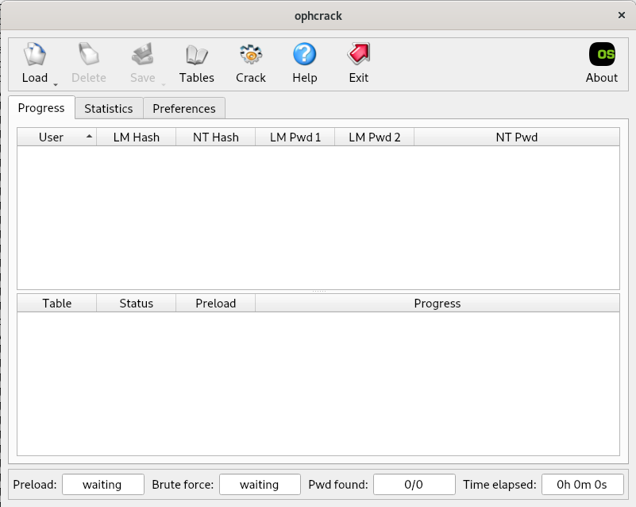

# 6. Vaja: Iskanje uporabniških imen in gesel

## Navodila

1. Za podani navidezni disk Windows XP operacijskega sistema ugotovite uporabniška imena in gesla.
2. Ponastavite geslo uporabnika Windows XP.
3. Za podani navidezni računalnik z operacijskim sistemom Linux ugotovite uporabniška imena in gesla.

## Dodatne informacije

## Podrobna navodila

### 1. Lomljenje gesel v Windows XP

V naš navidezni računalnik z operacijskim sistemom Linux priklopimo navidezni disk `truplo1.vmdk` z ukazom `mount` v mapo `/mnt/truplo1`, če je še nimamo jo ustvarimo z ukazom `mkdir`. Če navideznega diska nimamo, s spletne strani prenesemo arhiv [`truplo.zip`](http://polz.si/dsrf/truplo.zip), ki ga vsebuje.

    lsblk

    NAME   MAJ:MIN RM  SIZE RO TYPE MOUNTPOINT
    sda      8:0    0   20G  0 disk 
    ├─sda1   8:1    0   19G  0 part /
    ├─sda2   8:2    0    1K  0 part 
    └─sda5   8:5    0  975M  0 part [SWAP]
    sdb      8:16   0   10G  0 disk 
    └─sdb1   8:17   0   10G  0 part 
    sr0     11:0    1 60.8M  0 rom  

    mkdir /mnt/truplo1
    mount /dev/sdb1 /mnt/truplo1

Operacijski sistemi Windows 7 in starejši gesla skrivajo v datoteki `C:\windows\system32\config\SAM`, več o tem si lahko preberete [tukaj](http://www.nirsoft.net/articles/saved_password_location.html) in [tukaj](https://learn.microsoft.com/en-us/previous-versions//cc723740(v=technet.10)?redirectedfrom=MSDN). Gesla niso shranjena v tekstovni obliki, vendar so shranjene vrednosti zgoščevalne funkcije za podana gesla:

$$Geslo \rightarrow ZgoščevalnaFunkcija(Geslo) \rightarrow ZgoščenoGeslo$$

Tak pristop ni varen, saj dve enaki gesli vedno vrneta enako zgoščeno geslo. Od Windows 8 naprej se gesla shranjujejo z dodano javno naključno soljo, ki je rezultat [kriptografske zgoščevalne funkcije](https://en.wikipedia.org/wiki/Cryptographic_hash_function), poleg tega pa je sam postopek zgoščevanja gesel še dodatno upočasnjen: 

$$Geslo + (KritptografskaZgoščevalnaFunkcija \rightarrow Sol) \rightarrow ZgoščevalnaFunkcija(Geslo + Sol) \rightarrow ZgoščenoGesloSol$$

Gesla poiščemo in zlomimo z namenskim orodjem, ki za iskanje gesel uporablja [mavrične tabele](https://en.wikipedia.org/wiki/Rainbow_table). Mavrične tabele vsebujejo v naprej izračunane vrednosti zgoščevalne funkcije za pogosto uporabljena gesla. Zgoščevalna funkcija nam zagotavlja z visoko verjetnostjo, da se dva različna vhoda skoraj nikoli ne preslikata v isto izhodno vrednost. Namestimo orodje z omenjeno funkcionalnostjo [`ophcrack`](https://manpages.org/ophcrack) in [`ophcrack-cli`](https://linuxcommandlibrary.com/man/ophcrack-cli) ter orodje za odpiranje arhivov [`unzip`](https://linux.die.net/man/1/unzip) z upravljalcem paketov na našem operacijskem sistemu.

    apt update
    apt install ophcrack ophcrack-cli unzip

Sedaj potrebujemo še mavrične tabele, ki jih dobimo [tukaj](https://ophcrack.sourceforge.io/tables.php). Za naš primer zadostuje, če prenesemo tabele [`XP free small`](http://sourceforge.net/projects/ophcrack/files/tables/XP%20free/tables_xp_free_small.zip/download) in [`XP free fast`](http://sourceforge.net/projects/ophcrack/files/tables/XP%20free/tables_xp_free_fast.zip/download) ter jih odpremo.

    cd /home/USER

    wget http://sourceforge.net/projects/ophcrack/files/tables/XP%20free/tables_xp_free_small.zip
    wget http://sourceforge.net/projects/ophcrack/files/tables/XP%20free/tables_xp_free_fast.zip

    unzip tables_xp_free_fast.zip -d fast
    unzip tables_xp_free_small.zip -d small

Nato poženemo orodje `ophcrack` preko gumba `Activities`v zgornjem levem kotu. V zgornji vrstici gumbov kliknemo na `Tables` ter nato izberemo tabeli, ki smo jih prenesli s spleta `XP free fast` in `XP free small`.

Pri vsaki posebej kliknemo na gumb `Install` spodaj desno, ter preko čarovnika izberemo mesto, kjer se nahajajo in pritisnemo na gumb `Open`.

Ko smo uspešno izbrali obe tabeli nato še pritisnemo na gumb `OK`.

Sedaj kliknemo na gumb `Load`, kjer izberemo `Encrypted SAM`.

Nato preko čarovnik najdemo mapo v kateri se nahaja `SAM`, in sicer `/mnt/truplo1/WINDOWS/system32/config` ter pritisnemo na gumb `Open`. Izpišejo se nam uporabniška imena, vrednosti gesel [LM zgoščevalne funkcije](https://en.wikipedia.org/wiki/LAN_Manager#Password_hashing_algorithm), ter vrednosti gesel [NT zgoščevalne funkcije](https://en.wikipedia.org/wiki/NTLM). Primerjava obeh metod je predstavljena v naslednjem [članku](https://medium.com/@petergombos/lm-ntlm-net-ntlmv2-oh-my-a9b235c58ed4).

Sedaj pritisnemo na gumb `Crack` in malo počakamo, da nam orodje zlomi gesla za najdene uporabnike.

Našli smo torej dva uporabnika, in sicer `user`, z geslom `rednose` in `dobrota`, z geslom `sirota`. Sedaj ponovno poženemo navidezni računalnik z operacijskim sistemom Windows XP, ki smo ga postavili na prejšnjih vajah in se vanj poskusimo vpisati z uporabniškimi imeni in njihovimi gesli.

### 2. Ponastavitev gesla 

Če nas ne zanimajo specifična gesla, jih lahko kar ponastavimo in tako dostopamo do posameznega uporabniškega računa. Za to lahko uporabimo orodje [`chntpw`](https://manpages.org/chntpw/8), ki ga namestimo z upravljalcem paketov našega operacijskega sistema. Sedaj priklopimo navidezni disk našega navideznega računalnika z Windows XP operacijskim sistemom. Nato se prestavimo v mapo `/mnt/truplo1/WINDOWS/system32/config` ter ponastavimo gesla. Najprej izberemo možnost `1` za urejanje podatkov in gesel uporabnikov. Nato izberemo uporabnika `dobrota`, tako da podamo njegov `RID`, ki je `03ec`. Sedaj pa izberemo možnost `1`, da ponastavimo geslo na prazno geslo in dvakrat pritisnemo `q`, da zaključimo program in `y`, da shranimo spremembe.

    apt update
    apt install chntpw
    mount /dev/sdb1 /mnt/truplo1
    cd /mnt/truplo1/WINDOWS/system32/config
    chntpw -i SAM system SECURITY

    <>========<> chntpw Main Interactive Menu <>========<>

    Loaded hives: <SAM> <system> <SECURITY>

    1 - Edit user data and passwords
    2 - List groups
        - - -
    9 - Registry editor, now with full write support!
    q - Quit (you will be asked if there is something to save)

    What to do? [1] -> 1

    ===== chntpw Edit User Info & Passwords ====

    | RID -|---------- Username ------------| Admin? |- Lock? --|
    | 01f4 | Administrator                  | ADMIN  |          |
    | 03ec | dobrota                        | ADMIN  |          |
    | 01f5 | Guest                          |        | dis/lock |
    | 03e8 | HelpAssistant                  |        | dis/lock |
    | 03ea | SUPPORT_388945a0               |        | dis/lock |
    | 03eb | user                           | ADMIN  |          |

    Please enter user number (RID) or 0 to exit: [3eb] 03ec
    ================= USER EDIT ====================

    RID     : 1004 [03ec]
    Username: dobrota
    fullname: dobrota
    comment : 
    homedir : 

    00000221 = Users (which has 3 members)
    00000220 = Administrators (which has 3 members)

    Account bits: 0x0210 =
    [ ] Disabled        | [ ] Homedir req.    | [ ] Passwd not req. | 
    [ ] Temp. duplicate | [X] Normal account  | [ ] NMS account     | 
    [ ] Domain trust ac | [ ] Wks trust act.  | [ ] Srv trust act   | 
    [X] Pwd don't expir | [ ] Auto lockout    | [ ] (unknown 0x08)  | 
    [ ] (unknown 0x10)  | [ ] (unknown 0x20)  | [ ] (unknown 0x40)  | 

    Failed login count: 0, while max tries is: 0
    Total  login count: 2

    - - - - User Edit Menu:
    1 - Clear (blank) user password
    (2 - Unlock and enable user account) [seems unlocked already]
    3 - Promote user (make user an administrator)
    4 - Add user to a group
    5 - Remove user from a group
    q - Quit editing user, back to user select
    Select: [q] > 1
    Password cleared!
    ================= USER EDIT ====================

    RID     : 1004 [03ec]
    Username: dobrota
    fullname: dobrota
    comment : 
    homedir : 

    00000221 = Users (which has 3 members)
    00000220 = Administrators (which has 3 members)

    Account bits: 0x0210 =
    [ ] Disabled        | [ ] Homedir req.    | [ ] Passwd not req. | 
    [ ] Temp. duplicate | [X] Normal account  | [ ] NMS account     | 
    [ ] Domain trust ac | [ ] Wks trust act.  | [ ] Srv trust act   | 
    [X] Pwd don't expir | [ ] Auto lockout    | [ ] (unknown 0x08)  | 
    [ ] (unknown 0x10)  | [ ] (unknown 0x20)  | [ ] (unknown 0x40)  | 

    Failed login count: 0, while max tries is: 0
    Total  login count: 2
    ** No NT MD4 hash found. This user probably has a BLANK password!
    ** No LANMAN hash found either. Try login with no password!

    - - - - User Edit Menu:
    1 - Clear (blank) user password
    (2 - Unlock and enable user account) [seems unlocked already]
    3 - Promote user (make user an administrator)
    4 - Add user to a group
    5 - Remove user from a group
    q - Quit editing user, back to user select
    Select: [q] > q
        

    <>========<> chntpw Main Interactive Menu <>========<>

    Loaded hives: <SAM> <system> <SECURITY>

    1 - Edit user data and passwords
    2 - List groups
        - - -
    9 - Registry editor, now with full write support!
    q - Quit (you will be asked if there is something to save)

    What to do? [1] -> q

    Hives that have changed:
    #  Name
    0  <SAM>
    Write hive files? (y/n) [n] : y
    0  <SAM> - OK

Sedaj se poskusimo vpisati z uporabnikom `dobrota` in s praznim geslom.

### 3. Lomljenje gesel v Linux

Na operacijskih sistemih Linux se informacije o uporabnikih nahajajo v datoteki [`/etc/shadow`](https://linuxize.com/post/etc-shadow-file/) in za lomljene le teh lahko uporabimo orodje [John the Ripper](https://www.openwall.com/john/). Posamezna vrstica določa enega uporabnika, in sicer v formatu `UporabniškoIme:ŠifriranoGeslo:ZadnjaSpremembaGesla:MinimalnaStarostGesla:MaksimalnaStarostGesla:ČasOpozorila:ČasNeaktivnosti:ČasZapadlosti:NeuporabljenoPolje`.

    cat /etc/shadow

    root:$y$j9T$bZLSEsD4PebYHL2ytt2eT.$/VJ8dekN/eEK/RhgNpFCK1tSJGg6USIJtHSQSNT2LI1:19424:0:99999:7:::
    daemon:*:19424:0:99999:7:::
    bin:*:19424:0:99999:7:::
    sys:*:19424:0:99999:7:::
    sync:*:19424:0:99999:7:::
    games:*:19424:0:99999:7:::
    man:*:19424:0:99999:7:::
    lp:*:19424:0:99999:7:::
    mail:*:19424:0:99999:7:::
    news:*:19424:0:99999:7:::
    uucp:*:19424:0:99999:7:::
    proxy:*:19424:0:99999:7:::
    www-data:*:19424:0:99999:7:::
    backup:*:19424:0:99999:7:::
    list:*:19424:0:99999:7:::
    irc:*:19424:0:99999:7:::
    gnats:*:19424:0:99999:7:::
    nobody:*:19424:0:99999:7:::
    _apt:*:19424:0:99999:7:::
    systemd-network:*:19424:0:99999:7:::
    systemd-resolve:*:19424:0:99999:7:::
    tss:*:19424:0:99999:7:::
    messagebus:*:19424:0:99999:7:::
    systemd-timesync:*:19424:0:99999:7:::
    avahi-autoipd:*:19424:0:99999:7:::
    usbmux:*:19424:0:99999:7:::
    rtkit:*:19424:0:99999:7:::
    dnsmasq:*:19424:0:99999:7:::
    avahi:*:19424:0:99999:7:::
    speech-dispatcher:!:19424:0:99999:7:::
    pulse:*:19424:0:99999:7:::
    saned:*:19424:0:99999:7:::
    colord:*:19424:0:99999:7:::
    geoclue:*:19424:0:99999:7:::
    Debian-gdm:*:19424:0:99999:7:::
    aleks:$y$j9T$DJnDTsvzSqd2GDXdvDf/e/$Xvs8zv2WqExAH4W.cedeGXY3f5tJQrsEk99ozl/de94:19424:0:99999:7:::
    systemd-coredump:!*:19424::::::
    vboxadd:!:19424::::::

Geslo je v formatu `$IdentifikatorZgoščevalneFunkcije$Sol$VrednostZgoščevalneFunkcije`, kjer nam identifikator določi zgoščevalno funkcijo, ki jo uporablja naš operacijski sistem za izračun vrednosti za naša gesla. Vse zgoščevalne funkcije, ki jih lahko uporabimo so navedene [tukaj](https://en.wikipedia.org/wiki/Crypt_(C)#Key_derivation_functions_supported_by_crypt).

Namestimo orodje `john` za lomljene gesel Linux operacijskega sistema preko upravitelja paketov. Sedaj shranimo naslednje primere uporabnikov in gesel v datoteko ter poskusimo zlomiti gesla.

    apt update
    apt install john

    nano unix_passwords

    student:$6$B18NDQmp$0c21HLddW7CxXh0W1S24TN4L.wfVkhqaXtf489ai/mT6n0Ov7osEb5.aKVxKyQ6j.38OMrKXv7AQ9jiUcVimA.:17948:0:99999:7:::
    test:$6$VdV5y2gl$YxpYuwcVZHSXiv0N4yzmF8PspBeIK8QLdGJZzYFuKRjkfc82DhaS5fQeuOt0q9APDPLeSMTzt8BtxI2Bwo/hH.:17948:0:99999:7:::
    john:$6$7CxX6vB2$BS5J1Ch4zwiIG2w/DJ48vwNm7V8iv/PGHBhfZoX9dYX8FqkX2WcbIuGy7W0AXhDme46jpOrM5QI/hFdby3ji40:17982:0:99999:7:::
    sam:$6$kawol/fc$b9zvgpBGB46Ju9YZlvYKbfsOBSzT/4xH.hZUbDRQTnHSn4BBqg1XNDlHmNyfYUPLqlGNF7uceviGc7hOznRCF0:17982:0:99999:7:::
    mike:$6$k51atM5t$drdibMMoXmGGQZuqoC/iXQFHdg6L8oNfGXwsXkVj0.r7RHBgTt0GZBvrQyfvlMqZOBrsUC43v8usx1tRiyfoF.:17982:0:99999:7:::
    bob:$6$ttp5oC25$mVVqVDAxa5ef0yqOcm1Gzp/1VNADPAgLSKhHsATHZI76j.kV/uXxBvxOjxmU3VRcvdPgAwkHY.aAfAJaweKKD/:17982:0:99999:7:::

    john unix_passwords

    Created directory: /root/.john
    Loaded 6 password hashes with 6 different salts (crypt, generic crypt(3) [?/64])
    Will run 2 OpenMP threads
    Press 'q' or Ctrl-C to abort, almost any other key for status
    test             (test)
    mike123          (mike)
    jennifer         (bob)
