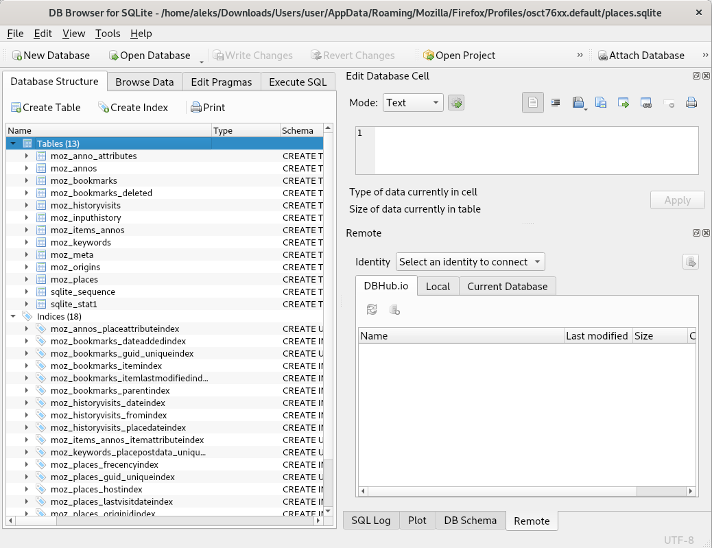
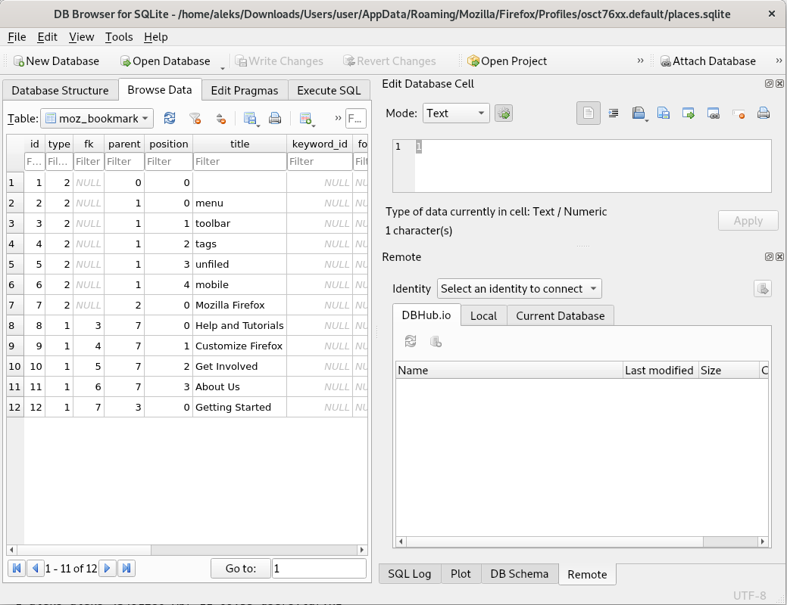

# 8. Vaja: Zgodovina brskalnikov

## Navodila

1. Ugotovite, katere spletne strani je obiskal uporabnik in kdaj. Uporabljeni brskalniki so bili Firefox, Chrome in Edge.

## Dodatne informacije

## Podrobna navodila

### 1. Zgodovina brskalnikov

Prenesite [arhiv](https://polaris.fri.uni-lj.si/users.tar.xz) uporabniških datotek s sistema z Windows 10. Odpremo paket z ukazom [tar](https://linux.die.net/man/1/tar).

    wget https://polaris.fri.uni-lj.si/users.tar.xz

    tar -xf users.tar.xz

    ls

    Users users.tar.xz

    chmod -R ugoa+rwx Users/

Mozilla Firefox hrani večino zanimivih podatkov v bazah [SQLite](https://sqlite.org/index.html). [Zgodovino brskanja](https://www.foxtonforensics.com/browser-history-examiner/firefox-history-location) hrani v datoteki `places.sqlite`, ki jo najdemo v:

- Windows XP: `C:\Documents and Settings\<USERNAME>\Application Data\Mozilla\Firefox\Profiles\<PROFILE>\places.sqlite`
- Windows Vista (in od Windows 7 naprej): `C:\Users\<USERNAME>\AppData\Roaming\Mozilla\Firefox\Profiles\<PROFILE>\places.sqlite`
- Linux: `~/.mozilla/firefox/<PROFILE>/places.sqlite`
- OS X: `/Users/<USERNAME>/Library/Application Support/Firefox/Profiles/<PROFILE>/places.sqlite`

Za pregledovanje SQLite podatkovnih baz uporabite orodje za ukazno vrstico [`sqlite3`](https://linux.die.net/man/1/sqlite3) ali orodje z grafičnim vmesnikom [`sqlitebrowser`](https://manpages.debian.org/stretch/sqlitebrowser/sqlitebrowser.1).

    apt update
    apt install sqlite3 sqlitebrowser

Program odpremo tako, da pritisnemo na gumb `Activities` v zgornjem levem kotu in nato na program `DB Browser for SQLite`. Znotraj programa sedaj pritisnemo na gumb `Open Database` in odpremo želeno datoteko, na primer `Users\<USERNAME>\AppData\Roaming\Mozilla\Firefox\Profiles\<PROFILE>\places.sqlite`.

Za pregledovanje posameznih tabel se prestavimo v zavihek `Browse Data` in v izvlečno spustnem meniju `Table:` izberemo želeno tabelo.

Tudi Google Chrome hrani [zgodovino brskanja](https://www.foxtonforensics.com/browser-history-examiner/chrome-history-location) v bazah SQLite. Uporabniške datoteke se nahajajo v:

- Linux: `~/.config/chromium/`
- Windows Vista (in od Windows 7 naprej): `C:\Users\<USERNAME>\AppData\Local\Google\Chrome\User Data\Default\History`
- Windows XP: `C:\Documents and Settings\<USERNAME>\Local Settings\Application Data\Google\Chrome\User Data\Default\History`

Do zgodovine brskanja lahko prav tako dostopamo z orodji, kot sta `sqlite3` in `DB Browser for SQLite`.

Starejše različice Edge brskalnika so hranile [podatke o brskanju](https://www.foxtonforensics.com/browser-history-examiner/microsoft-edge-history-location) v bazi [ESE](https://en.wikipedia.org/wiki/Extensible_Storage_Engine). Datoteke se nahajajo na različnih mestih, med drugim v:

- Windows 10: `C:\Users\<USERNAME>\AppData\Local\Microsoft\Windows\WebCache\WebCacheV01.dat` in `C:\Users\<USERNAME>\AppData\Local\Packages\Microsoft.MicrosoftEdge_<ID>\AC\MicrosoftEdge\User\Default\`

Do podatkovnih baz ESE lahko dostopamo s knjižnico [libesedb](https://github.com/libyal/libesedb) in priloženimi programom `esedbexport`, ki izlušči podatke iz `ESE` datoteke v več tekstovnih datotek.

    apt update
    apt install libesedb-utils

    esedbexport Users/user/AppData/Local/Microsoft/Windows/WebCache/WebCacheV01.dat

    ls WebCacheV01.dat.export

    cat WebCacheV01.dat.export/HstsEntryEx_12.28

    EntryId	MinimizedRDomainHash	MinimizedRDomainLength	IncludeSubdomains	Expires	LastTimeUsed	RDomain
    1	0	8	161	9223372036854775807	9223372036854775807	:version
    2	7892179877542161243	8	1	132338501063171541	132023141063171541	com.bing.www
    3	8206197026885659483	13	1	132178686594739306	132023166594739306	com.microsoft.microsoftedgewelcome
    4	4111696929994500955	14	0	132180846605532453	132023166605532453	com.optimizely.cdn
    5	4111696929994500955	14	0	132180846610932334	132023166610932334	com.optimizely.cdn.a3698060313
    6	7958140503510412123	19	1	132338526699797182	132023166699797182	com.microsoftonline.login
    7	730144501395549019	8	0	132338526705329980	132023166705329980	com.live.login
    8	869098996354968411	10	0	132180846728611236	132023166728611236	com.ninite
    9	4705519305907956571	12	0	132178686825710943	132023166825710943	com.facebook.staticxx
    10	6309426421137861467	11	0	138334552017518691	132023166827518691	com.twitter.syndication
    11	2525412546616421211	20	1	132132034718165412	132023170718165412	com.google-analytics.www
    12	643614699373652827	20	0	132338530785579339	132023170785579339	com.youtube-nocookie.www
    13	4868819453617564507	9	0	138334555976204232	132023170786204232	com.twimg.syndication.cdn
    14	4868819453617564507	9	0	138334555979327907	132023170789327907	com.twimg.abs
    15	4868819453617564507	9	0	138334555979484229	132023170789484229	com.twimg.pbs
    16	4868819453617564507	9	0	138334555980643075	132023170790643075	com.twimg.ton
    17	7660453395351923547	20	0	132338530935249750	132023170935249750	com.googleapis.fonts
    18	4705519305907956571	12	0	132178690938806746	132023170938806746	com.facebook.graph
    19	476002679376767835	13	0	132178690960526172	132023170960526172	com.wordpress.public-api.

Novejše različice Edge brskalnika so osnovane na Google Chrome brskalniku in hranijo podatke na enak način in sicer na mestu:

- Windows 10: `C:\Users\<USERNAME>\AppData\Local\Microsoft\Edge\User Data\Default\`

Poglejmo si še starejši spletni brskalnik Internet Explorer 5, ki hrani podatke v:

- Windows XP: `C:\Documents and Settings\<USERNAME>\Local Settings\History\History.IE5\`
- Windows 7, 8, 10: `C:\Users\<USERNAME>\AppData\Local\Microsoft\Internet Explorer\Recovery`, `C:\Users\<USERNAME>\AppData\Local\Microsoft\Windows\WebCache`, `C:\Users\<USERNAME>\AppData\Local\Microsoft\Windows\History` in `C:\Users\<USERNAME>\Favorites`

Zgodovino lahko preberemo z orodjem [`pasco`](https://www.unix.com/man-page/debian/1/pasco). Ugasnemo navidezni računalnik ter mu dodamo disk [`truplo1.vmdk`](https://polaris.fri.uni-lj.si/truplo.zip) iz prejšnjih vaj in navidezni računalnik ponovno poženemo. Disk priklopimo v datotečni sistem in lahko dostopamo do zgodovine brskalnika Internet Explorer 5:

    apt update
    apt install pasco

    lsblk

    NAME   MAJ:MIN RM  SIZE RO TYPE MOUNTPOINTS
    sda      8:0    0   30G  0 disk 
    ├─sda1   8:1    0   29G  0 part /
    ├─sda2   8:2    0    1K  0 part 
    └─sda5   8:5    0  975M  0 part [SWAP]
    sdb      8:16   0   10G  0 disk 
    └─sdb1   8:17   0   10G  0 part 
    sr0     11:0    1 57.4M  0 rom  

    mount /dev/sdb1 /mnt

    cd /mnt/Documents\ and\ Settings/user/Local\ Settings/History/History.IE5/

    pasco index.dat

    History File: index.dat Version: 5.2

    TYPE	URL	MODIFIED TIME	ACCESS TIME	FILENAME	DIRECTORY	HTTP HEADERS
    URL	Visited: user@http://www.msn.com/?fb_xd_fragment	05/17/2013 04:28:40	05/17/2013 04:28:40			 
    URL	Visited: user@http://www.libreoffice.org/DownloadRedirect.php?target=http://download.documentfoundation.org/libreoffice/stable/4.0.3/win/x86/LibreOffice_4.0.3_Win_x86.msi	05/17/2013 04:29:29	05/17/2013 04:29:29		 
    URL	Visited: user@http://mirror.7he.at/pub/tdf/libreoffice/stable/4.0.3/win/x86/LibreOffice_4.0.3_Win_x86.msi	05/17/2013 04:35:50	05/17/2013 04:35:50			 
    URL	Visited: user@about:Home	05/17/2013 04:26:55	05/17/2013 04:26:55			 
    URL	Visited: user@http://home.microsoft.com	05/17/2013 04:28:28	05/17/2013 04:28:28			 
    URL	Visited: user@http://www.libreoffice.org	05/17/2013 04:28:57	05/17/2013 04:28:57			 
    URL	Visited: user@res://C:\WINDOWS\system32\xpsp3res.dll/dnserror.htm	03/25/2014 13:55:37	03/25/2014 13:55:37			 
    URL	Visited: user@http://www.microsoft.com/isapi/redir.dll?prd=ie&pver=6&ar=msnhome	05/17/2013 04:28:29	05/17/2013 04:28:29			 
    URL	Visited: user@http://www.libreoffice.org/download	05/17/2013 04:28:59	05/17/2013 04:28:59			 
    URL	Visited: user@http://www.msn.com	05/17/2013 04:28:33	05/17/2013 04:28:33
